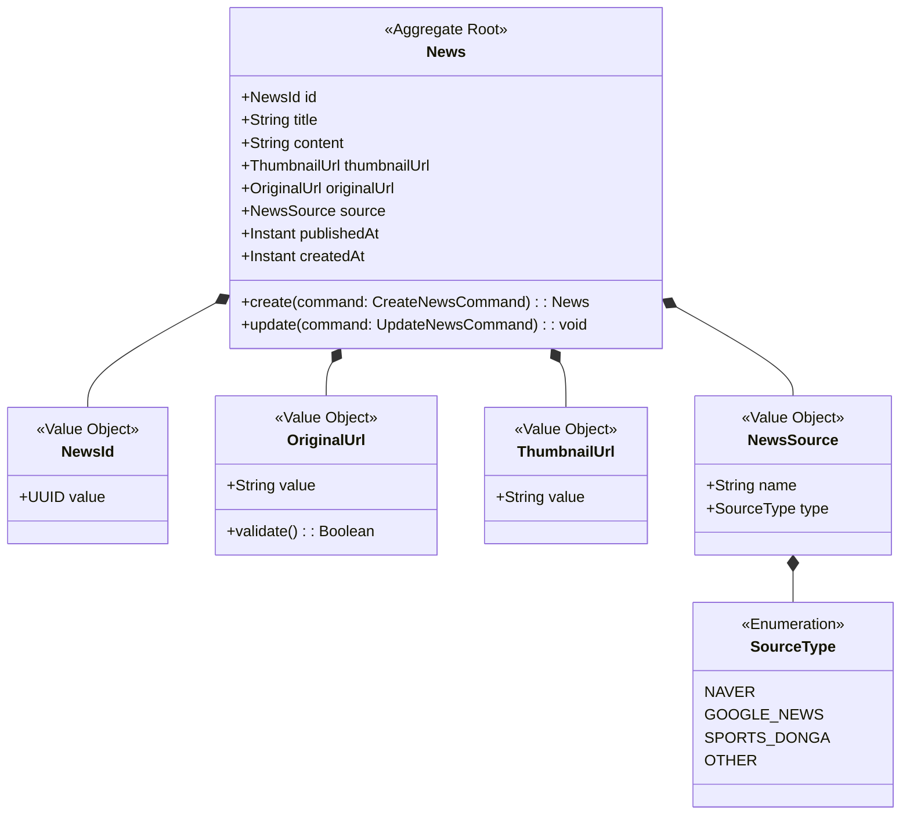
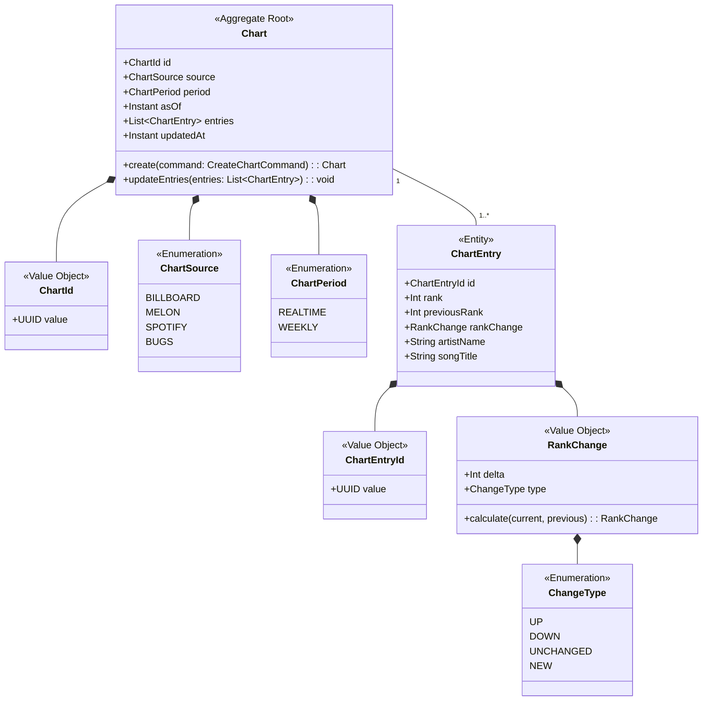
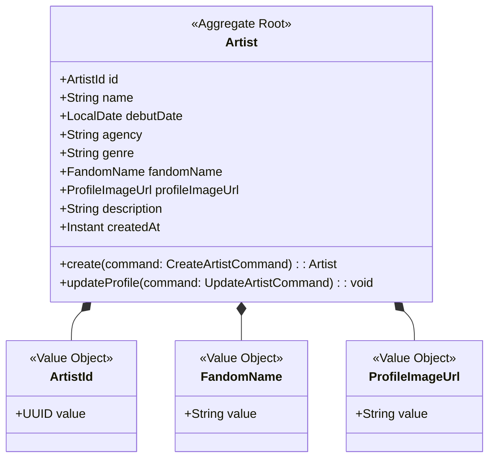

# Content Context 정의서

## Context 정보

| 항목 | 내용 |
|------|------|
| **Context명** | 콘텐츠 |
| **영문명** | Content |
| **도메인 분류** | Supporting |
| **담당 팀** | Backend Team |
| **작성일** | 2026-01-17 |

## 개요

Content Context는 FanPulse 서비스의 K-POP 관련 콘텐츠(뉴스, 차트 순위, 아티스트 정보)를 관리합니다. 외부 소스에서 크롤링한 데이터를 내부 도메인 모델로 변환하여 저장하고, 팬들에게 최신 K-POP 소식을 제공합니다.

## 핵심 책임

1. **뉴스 관리**: K-POP 관련 뉴스 크롤링, 저장, 조회
2. **차트 관리**: 음원 차트 순위 크롤링, 순위 변동 추적
3. **아티스트 정보 관리**: 아티스트 기본 정보, 프로필 관리
4. **데이터 정합성**: 중복 방지, 출처 관리

## Ubiquitous Language

| 한글 | 영문 | 정의 |
|------|------|------|
| 뉴스 | News | K-POP 관련 최신 소식 (크롤링 데이터) |
| 뉴스 출처 | NewsSource | 뉴스의 원본 매체 (Naver, Google News 등) |
| 차트 | Chart | 음원 순위표 (Billboard, Melon 등) |
| 차트 엔트리 | ChartEntry | 특정 시점의 차트 순위 정보 |
| 순위 변동 | RankChange | 이전 대비 순위의 변화 |
| 차트 기간 | ChartPeriod | 차트 집계 기간 (REALTIME, WEEKLY) |
| 아티스트 | Artist | K-POP 가수 또는 그룹 |
| 팬덤명 | FandomName | 아티스트 팬클럽의 공식 명칭 |

## Aggregate 목록

| Aggregate | 설명 | Root Entity |
|-----------|------|-------------|
| News | K-POP 뉴스 콘텐츠 관리 | News |
| Chart | 음원 차트 순위 관리 | Chart |
| Artist | 아티스트 정보 관리 | Artist |

---

## Aggregate 상세

### News Aggregate



**불변식 (Invariants)**:
1. 동일한 originalUrl을 가진 뉴스는 중복 생성될 수 없다
2. title은 필수값이며 255자를 초과할 수 없다
3. publishedAt은 현재 시간을 초과할 수 없다

**핵심 행위**:
- `create()`: 크롤링된 뉴스 생성, NewsCreated 이벤트 발행
- `update()`: 뉴스 내용 업데이트 (썸네일 등)

**구현 예시**:
```kotlin
class News private constructor(
    val id: NewsId,
    val title: String,
    val content: String,
    val thumbnailUrl: ThumbnailUrl?,
    val originalUrl: OriginalUrl,
    val source: NewsSource,
    val publishedAt: Instant,
    val createdAt: Instant
) {
    companion object {
        fun create(command: CreateNewsCommand): News {
            require(command.title.length <= 255) {
                "Title must not exceed 255 characters"
            }
            require(!command.publishedAt.isAfter(Instant.now())) {
                "Published date cannot be in the future"
            }
            return News(
                id = NewsId.generate(),
                title = command.title,
                content = command.content,
                thumbnailUrl = command.thumbnailUrl?.let { ThumbnailUrl(it) },
                originalUrl = OriginalUrl(command.originalUrl),
                source = NewsSource(command.source, command.sourceType),
                publishedAt = command.publishedAt,
                createdAt = Instant.now()
            )
        }
    }
}
```

---

### Chart Aggregate



**불변식 (Invariants)**:
1. 동일한 source + period + asOf 조합은 유일해야 한다
2. 차트 엔트리의 rank는 1 이상이어야 한다
3. entries 목록은 rank 기준으로 정렬되어야 한다

**핵심 행위**:
- `create()`: 새 차트 생성
- `updateEntries()`: 차트 순위 업데이트, 순위 변동 계산

**구현 예시**:
```kotlin
@JvmInline
value class RankChange private constructor(val delta: Int) {
    val type: ChangeType
        get() = when {
            delta < 0 -> ChangeType.UP      // 순위 상승 (delta 음수)
            delta > 0 -> ChangeType.DOWN    // 순위 하락 (delta 양수)
            else -> ChangeType.UNCHANGED
        }

    companion object {
        fun calculate(currentRank: Int, previousRank: Int?): RankChange {
            return if (previousRank == null) {
                RankChange(0) // NEW entry
            } else {
                RankChange(currentRank - previousRank)
            }
        }

        fun newEntry(): RankChange = RankChange(0)
    }
}
```

---

### Artist Aggregate



**불변식 (Invariants)**:
1. name은 필수값이며 100자를 초과할 수 없다
2. agency는 100자를 초과할 수 없다
3. debutDate는 현재 날짜를 초과할 수 없다

**핵심 행위**:
- `create()`: 새 아티스트 등록
- `updateProfile()`: 아티스트 정보 수정

---

## Domain Events

| 이벤트명 | 설명 | Aggregate |
|---------|------|-----------|
| NewsCreated | 새 뉴스 생성 | News |
| ChartUpdated | 차트 순위 업데이트 | Chart |
| ArtistCreated | 새 아티스트 등록 | Artist |
| ArtistUpdated | 아티스트 정보 수정 | Artist |

### 이벤트 스키마

```kotlin
/**
 * 뉴스 생성 이벤트
 * 구독자: Search (검색 인덱스 업데이트), Notification (선택적)
 */
data class NewsCreated(
    override val eventId: UUID = UUID.randomUUID(),
    override val occurredAt: Instant = Instant.now(),
    val newsId: UUID,
    val title: String,
    val source: String,
    val publishedAt: Instant
) : DomainEvent {
    override val eventType: String = "NewsCreated"
    override val aggregateId: UUID = newsId
    override val aggregateType: String = "News"
}

/**
 * 차트 업데이트 이벤트
 * 구독자: Search (검색 인덱스 업데이트)
 */
data class ChartUpdated(
    override val eventId: UUID = UUID.randomUUID(),
    override val occurredAt: Instant = Instant.now(),
    val chartId: UUID,
    val source: String,
    val period: String,
    val topEntries: List<ChartEntrySnapshot>
) : DomainEvent {
    override val eventType: String = "ChartUpdated"
    override val aggregateId: UUID = chartId
    override val aggregateType: String = "Chart"
}

data class ChartEntrySnapshot(
    val rank: Int,
    val artistName: String,
    val songTitle: String,
    val rankChange: Int
)
```

---

## 외부 의존성

### Upstream (이 Context가 의존하는)

| Context | 관계 패턴 | 설명 |
|---------|----------|------|
| External (News Sources) | ACL | Naver News, Google News 등에서 뉴스 크롤링 |
| External (Chart Sources) | ACL | Billboard, Melon 등에서 차트 크롤링 |

### Downstream (이 Context에 의존하는)

| Context | 관계 패턴 | 설명 |
|---------|----------|------|
| Community | PL | 아티스트 정보 조회 (팬 페이지용) |
| Streaming | PL | 아티스트 정보 조회 (라이브 연결용) |
| Search | ACL | 뉴스/차트 검색 인덱싱 |

---

## Anti-Corruption Layer

### NewsAclTranslator

**위치**: Infrastructure Layer

**변환 대상**:
| External Model | Domain Model |
|---------------|--------------|
| CrawledNewsDto.title | News.title |
| CrawledNewsDto.content | News.content (sanitized) |
| CrawledNewsDto.url | News.originalUrl |
| CrawledNewsDto.thumbnail_url | News.thumbnailUrl |
| CrawledNewsDto.source | News.source (NewsSource VO) |
| CrawledNewsDto.published_at | News.publishedAt |

**구현**:
```kotlin
class NewsAclTranslator {
    fun translate(external: CrawledNewsDto): News {
        return News.create(
            CreateNewsCommand(
                title = external.title,
                content = sanitize(external.content),
                thumbnailUrl = external.thumbnailUrl,
                originalUrl = external.url,
                source = external.source,
                sourceType = mapSourceType(external.source),
                publishedAt = parseDate(external.publishedAt)
            )
        )
    }

    private fun sanitize(content: String): String {
        // HTML 태그 제거, 특수문자 처리
        return content
            .replace(Regex("<[^>]*>"), "")
            .trim()
    }

    private fun mapSourceType(source: String): SourceType {
        return when {
            source.contains("naver", ignoreCase = true) -> SourceType.NAVER
            source.contains("google", ignoreCase = true) -> SourceType.GOOGLE_NEWS
            source.contains("sports", ignoreCase = true) -> SourceType.SPORTS_DONGA
            else -> SourceType.OTHER
        }
    }
}
```

### ChartAclTranslator

**위치**: Infrastructure Layer

**변환 대상**:
| External Model | Domain Model |
|---------------|--------------|
| CrawledChartDto.rank | ChartEntry.rank |
| CrawledChartDto.previous_rank | ChartEntry.previousRank |
| CrawledChartDto.artist | ChartEntry.artistName |
| CrawledChartDto.song | ChartEntry.songTitle |
| CrawledChartDto.chart_source | Chart.source |
| CrawledChartDto.chart_period | Chart.period |
| CrawledChartDto.as_of | Chart.asOf |

**구현**:
```kotlin
class ChartAclTranslator {
    fun translate(externals: List<CrawledChartDto>): Chart {
        require(externals.isNotEmpty()) { "Chart entries cannot be empty" }

        val first = externals.first()
        val entries = externals.map { dto ->
            ChartEntry(
                id = ChartEntryId.generate(),
                rank = dto.rank,
                previousRank = dto.previousRank,
                rankChange = RankChange.calculate(dto.rank, dto.previousRank),
                artistName = dto.artist,
                songTitle = dto.song
            )
        }.sortedBy { it.rank }

        return Chart(
            id = ChartId.generate(),
            source = ChartSource.valueOf(first.chartSource.uppercase()),
            period = ChartPeriod.valueOf(first.chartPeriod.uppercase()),
            asOf = first.asOf,
            entries = entries,
            updatedAt = Instant.now()
        )
    }
}
```

---

## 기술 스택

- **언어/프레임워크**: Kotlin / Spring Boot
- **데이터베이스**: PostgreSQL
- **크롤링**: Python (별도 크롤러 서비스)
- **스케줄링**: Spring @Scheduled

---

## API 경계

### 제공 API (Published)

| 엔드포인트 | 메서드 | 설명 |
|-----------|--------|------|
| `/api/v1/news` | GET | 뉴스 목록 조회 |
| `/api/v1/news/{id}` | GET | 뉴스 상세 조회 |
| `/api/v1/charts` | GET | 차트 목록 조회 |
| `/api/v1/charts/{source}` | GET | 특정 소스 차트 조회 |
| `/api/v1/charts/{source}/history` | GET | 차트 히스토리 조회 |
| `/api/v1/artists` | GET | 아티스트 목록 조회 |
| `/api/v1/artists/{id}` | GET | 아티스트 상세 조회 |

### Published Language (공개 모델)

```kotlin
// 다른 Context에 제공하는 아티스트 정보
data class ArtistInfo(
    val artistId: UUID,
    val name: String,
    val profileImageUrl: String?,
    val fandomName: String?
)

// 뉴스 목록 응답
data class NewsListResponse(
    val content: List<NewsSummary>,
    val page: Int,
    val size: Int,
    val totalElements: Long,
    val totalPages: Int
)

data class NewsSummary(
    val id: UUID,
    val title: String,
    val thumbnailUrl: String?,
    val source: String,
    val publishedAt: Instant
)
```

---

## 디렉토리 구조

```
backend/src/main/kotlin/com/fanpulse/
├── domain/
│   ├── content/
│   │   ├── news/
│   │   │   ├── News.kt                   # Aggregate Root
│   │   │   ├── NewsId.kt                 # Value Object
│   │   │   ├── NewsSource.kt             # Value Object
│   │   │   ├── OriginalUrl.kt            # Value Object
│   │   │   └── port/
│   │   │       └── NewsPort.kt           # Repository Port
│   │   ├── chart/
│   │   │   ├── Chart.kt                  # Aggregate Root
│   │   │   ├── ChartEntry.kt             # Entity
│   │   │   ├── ChartSource.kt            # Enum
│   │   │   ├── ChartPeriod.kt            # Enum
│   │   │   ├── RankChange.kt             # Value Object
│   │   │   └── port/
│   │   │       └── ChartPort.kt          # Repository Port
│   │   └── artist/
│   │       ├── Artist.kt                 # Aggregate Root
│   │       ├── ArtistId.kt               # Value Object
│   │       └── port/
│   │           └── ArtistPort.kt         # Repository Port
│   └── common/
│       ├── DomainEvent.kt
│       └── DomainEventPublisher.kt
│
├── application/service/
│   ├── NewsService.kt
│   ├── ChartService.kt
│   └── ArtistService.kt
│
└── infrastructure/
    ├── acl/
    │   ├── NewsAclTranslator.kt
    │   └── ChartAclTranslator.kt
    ├── persistence/
    │   ├── NewsJpaRepository.kt
    │   ├── ChartJpaRepository.kt
    │   └── ArtistJpaRepository.kt
    └── event/
        └── ContentEventPublisher.kt
```

---

## 변경 이력

| 버전 | 날짜 | 변경 내용 | 작성자 |
|------|------|----------|--------|
| 1.0.0 | 2026-01-17 | 최초 작성 - News, Chart, Artist Aggregate 정의 | 정지원 |
