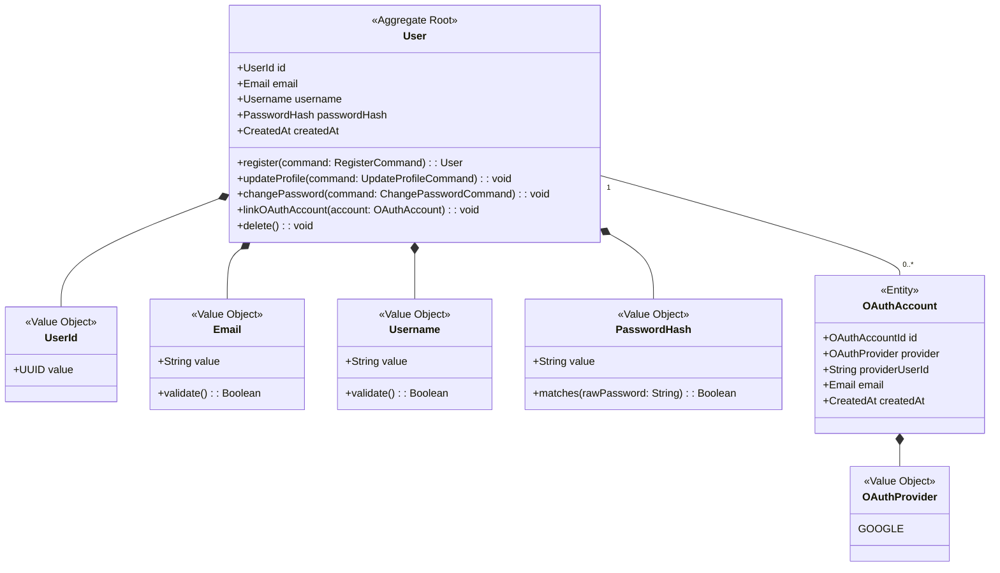
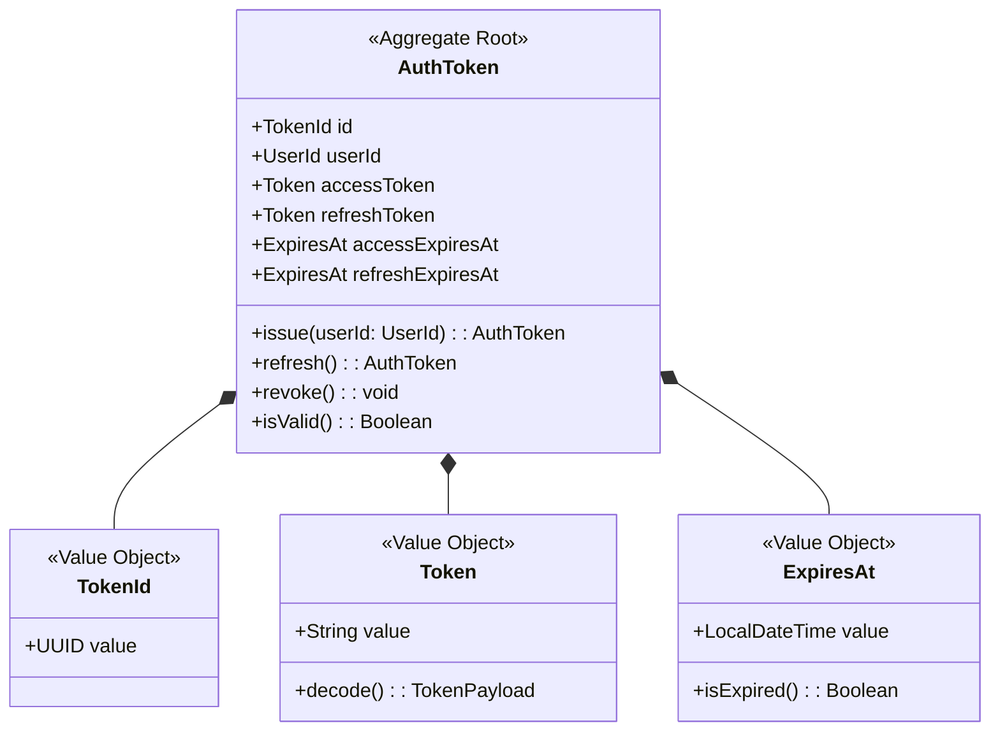
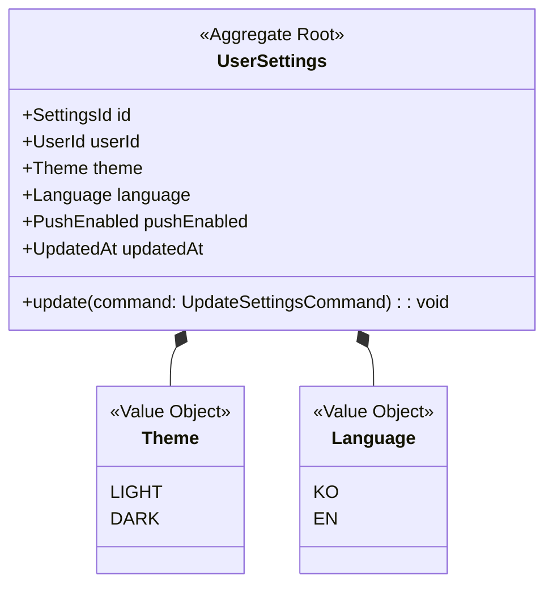

# Identity Context 정의서

## Context 정보

| 항목 | 내용 |
|------|------|
| **Context명** | 인증 |
| **영문명** | Identity |
| **도메인 분류** | Supporting |
| **담당 팀** | Backend Team |
| **작성일** | 2025-12-28 |

## 개요

Identity Context는 FanPulse 서비스의 사용자 인증 및 계정 관리를 담당합니다. 이메일/비밀번호 기반 인증과 OAuth(Google) 소셜 로그인을 지원하며, JWT 토큰 기반으로 세션을 관리합니다. 모든 다른 Context의 인증 제공자 역할을 합니다.

## 핵심 책임

1. **사용자 등록 및 관리**: 회원가입, 프로필 수정, 비밀번호 변경
2. **인증 처리**: 로그인, 로그아웃, 토큰 발급/갱신/폐기
3. **OAuth 연동**: Google 소셜 로그인 처리
4. **사용자 설정 관리**: 테마, 언어, 푸시 알림 설정

## Ubiquitous Language

| 한글 | 영문 | 정의 |
|------|------|------|
| 사용자 | User | 서비스에 가입한 회원 |
| 인증 토큰 | AuthToken | JWT 기반 액세스/리프레시 토큰 |
| OAuth 계정 | OAuthAccount | 소셜 로그인으로 연동된 외부 계정 |
| 사용자 설정 | UserSettings | 개인화 설정 (테마, 언어, 알림) |
| 비밀번호 해시 | PasswordHash | 암호화된 비밀번호 |
| 세션 | Session | 로그인 상태가 유지되는 기간 |

## Aggregate 목록

| Aggregate | 설명 | Root Entity |
|-----------|------|-------------|
| User | 사용자 계정 및 인증 정보 관리 | User |
| AuthToken | 인증 토큰 발급 및 관리 | AuthToken |
| UserSettings | 사용자 개인화 설정 관리 | UserSettings |

---

## Aggregate 상세

### User Aggregate



**불변식 (Invariants)**:
1. 이메일은 고유해야 한다
2. 닉네임은 2~50자 사이여야 한다
3. 비밀번호는 최소 8자, 영문/숫자 포함해야 한다
4. OAuth 계정은 동일 provider당 하나만 연동 가능

**핵심 행위**:
- `register()`: 새 사용자 등록, UserRegistered 이벤트 발행
- `updateProfile()`: 프로필 정보 수정
- `changePassword()`: 비밀번호 변경
- `linkOAuthAccount()`: OAuth 계정 연동
- `delete()`: 회원 탈퇴 (소프트 삭제)

---

### AuthToken Aggregate



**불변식 (Invariants)**:
1. 액세스 토큰은 발급 후 1시간 유효
2. 리프레시 토큰은 발급 후 7일 유효
3. 폐기된 토큰은 사용 불가

**핵심 행위**:
- `issue()`: 새 토큰 쌍 발급
- `refresh()`: 리프레시 토큰으로 액세스 토큰 갱신
- `revoke()`: 토큰 폐기 (로그아웃)
- `isValid()`: 토큰 유효성 검증

---

### UserSettings Aggregate



**불변식 (Invariants)**:
1. 사용자당 하나의 설정만 존재 (1:1 관계)
2. 테마는 light 또는 dark만 가능
3. 언어는 ko 또는 en만 가능

---

## Domain Events

| 이벤트명 | 설명 | Aggregate |
|---------|------|-----------|
| UserRegistered | 새 사용자 가입 완료 | User |
| UserLoggedIn | 사용자 로그인 성공 | AuthToken |
| UserLoggedOut | 사용자 로그아웃 | AuthToken |
| OAuthAccountLinked | OAuth 계정 연동 완료 | User |
| PasswordChanged | 비밀번호 변경 완료 | User |
| UserDeleted | 회원 탈퇴 완료 | User |
| SettingsUpdated | 사용자 설정 변경 | UserSettings |

### 이벤트 스키마

```kotlin
data class UserRegistered(
    val userId: UUID,
    val email: String,
    val username: String,
    val registrationType: String, // EMAIL, OAUTH
    val occurredAt: Instant
) : DomainEvent

data class UserLoggedIn(
    val userId: UUID,
    val loginType: String, // EMAIL, GOOGLE
    val occurredAt: Instant
) : DomainEvent
```

## 외부 의존성

### Upstream (이 Context가 의존하는)

| Context | 관계 패턴 | 설명 |
|---------|----------|------|
| Google OAuth | ACL | Google ID Token 검증 및 사용자 정보 변환 |

### Downstream (이 Context에 의존하는)

| Context | 관계 패턴 | 설명 |
|---------|----------|------|
| Voting | OHS/PL | 사용자 인증 및 정보 제공 |
| Community | OHS/PL | 사용자 인증 및 정보 제공 |
| Streaming | OHS/PL | 사용자 인증 및 정보 제공 |
| Reward | OHS/PL | 사용자 인증 및 정보 제공 |
| Membership | OHS/PL | 사용자 인증 및 정보 제공 |
| Concert | OHS/PL | 사용자 인증 및 정보 제공 |
| Support | OHS/PL | 사용자 인증 및 정보 제공 |
| Notification | Event | UserRegistered 이벤트 구독 |

## 기술 스택

- **언어/프레임워크**: Kotlin / Spring Boot
- **데이터베이스**: PostgreSQL
- **캐시**: Redis (토큰 블랙리스트)
- **인증**: JWT, OAuth 2.0

## API 경계

### 제공 API (Published)

| 엔드포인트 | 메서드 | 설명 |
|-----------|--------|------|
| `/api/v1/auth/signup` | POST | 회원가입 |
| `/api/v1/auth/login` | POST | 이메일 로그인 |
| `/api/v1/auth/google` | POST | Google OAuth 로그인 |
| `/api/v1/auth/refresh` | POST | 토큰 갱신 |
| `/api/v1/auth/logout` | POST | 로그아웃 |
| `/api/v1/me` | GET | 내 정보 조회 |
| `/api/v1/me` | PATCH | 프로필 수정 |
| `/api/v1/me/password` | PATCH | 비밀번호 변경 |
| `/api/v1/me/settings` | GET | 설정 조회 |
| `/api/v1/me/settings` | PATCH | 설정 변경 |

### Published Language (공개 모델)

```kotlin
// 다른 Context에 제공하는 사용자 정보
data class UserInfo(
    val userId: UUID,
    val email: String,
    val username: String,
    val isVip: Boolean,
    val profileImageUrl: String?
)

// JWT 토큰 페이로드
data class TokenPayload(
    val sub: UUID,      // userId
    val email: String,
    val username: String,
    val isVip: Boolean,
    val iat: Long,      // issued at
    val exp: Long       // expires at
)
```

## 변경 이력

| 버전 | 날짜 | 변경 내용 | 작성자 |
|------|------|----------|--------|
| 1.0.0 | 2025-12-28 | 최초 작성 | 정지원 |
