# Infrastructure Context 정의서

## Context 정보

| 항목 | 내용 |
|------|------|
| **Context명** | 인프라스트럭처 |
| **영문명** | Infrastructure |
| **도메인 분류** | Generic (기술적) |
| **담당 팀** | Backend Team |
| **작성일** | 2026-01-07 |
| **관련 이슈** | GitHub Issue #19 |

## 개요

Infrastructure Context는 FanPulse 서비스의 기술적 인프라를 담당합니다. 데이터베이스 스키마 관리, 마이그레이션, 시딩 등 애플리케이션의 기반을 형성하는 기술적 요소를 관리합니다.

## 핵심 책임

1. **스키마 버전 관리**: Flyway를 통한 데이터베이스 스키마 버전 관리
2. **마이그레이션 실행**: 스키마 변경 사항의 안전한 적용
3. **데이터 시딩**: 초기 데이터 및 마스터 데이터 관리
4. **롤백 지원**: 문제 발생 시 이전 버전으로 안전한 복구

## 데이터베이스 설계 분석

### 영향받는 Bounded Contexts

| Context | 테이블 | 마이그레이션 우선순위 |
|---------|--------|----------------------|
| Identity | users, auth_tokens, oauth_accounts, user_settings | 1 (최우선) |
| Voting | polls, vote_options, votes, voting_power | 2 |
| Reward | points, point_transactions, rewards | 3 |
| Membership | memberships | 3 |
| Notification | notifications | 4 |
| Streaming | streaming_events, chat_messages, live_hearts | 4 |
| Content | artists, crawled_news, crawled_charts, crawled_charts_history, crawled_concerts, crawled_ads | 5 |
| Support | support_tickets, faq, notices | 6 |
| 공통 | media, likes, user_favorites, saved_posts, ticket_reservations, search_history, user_daily_missions | 7 |

### 테이블 의존성 그래프

```mermaid
graph TD
    subgraph "Level 0 - 독립 테이블"
        users[users]
        artists[artists]
        polls[polls]
        faq[faq]
        notices[notices]
        rewards[rewards]
    end

    subgraph "Level 1 - users 의존"
        auth_tokens[auth_tokens]
        oauth_accounts[oauth_accounts]
        user_settings[user_settings]
        voting_power[voting_power]
        points[points]
        memberships[memberships]
        notifications[notifications]
        media[media]
        user_favorites[user_favorites]
        saved_posts[saved_posts]
        support_tickets[support_tickets]
        search_history[search_history]
        user_daily_missions[user_daily_missions]
    end

    subgraph "Level 2 - 복합 의존"
        vote_options[vote_options]
        votes[votes]
        point_transactions[point_transactions]
        streaming_events[streaming_events]
        likes[likes]
    end

    subgraph "Level 3 - 다중 의존"
        chat_messages[chat_messages]
        live_hearts[live_hearts]
        ticket_reservations[ticket_reservations]
    end

    subgraph "Level 4 - 크롤링 데이터"
        crawled_news[crawled_news]
        crawled_charts[crawled_charts]
        crawled_charts_history[crawled_charts_history]
        crawled_concerts[crawled_concerts]
        crawled_ads[crawled_ads]
    end

    users --> auth_tokens
    users --> oauth_accounts
    users --> user_settings
    users --> voting_power
    users --> points
    users --> memberships
    users --> notifications
    users --> media
    users --> user_favorites
    users --> saved_posts
    users --> support_tickets
    users --> search_history
    users --> user_daily_missions

    artists --> user_favorites
    artists --> streaming_events

    polls --> vote_options
    vote_options --> votes
    polls --> votes
    users --> votes

    points --> point_transactions
    users --> point_transactions

    streaming_events --> chat_messages
    users --> chat_messages
    streaming_events --> live_hearts
    users --> live_hearts

    users --> likes

    crawled_concerts --> ticket_reservations
    users --> ticket_reservations
```



## 마이그레이션 전략

### Phase 1: Core Tables (V1__init_core.sql)

| 순서 | 테이블 | FK 의존성 | 비고 |
|------|--------|-----------|------|
| 1 | users | - | 모든 테이블의 기준점 |
| 2 | artists | - | 독립 마스터 테이블 |
| 3 | polls | - | 독립 테이블 |
| 4 | rewards | - | 독립 마스터 테이블 |

### Phase 2: Identity Tables (V2__init_identity.sql)

| 순서 | 테이블 | FK 의존성 | 비고 |
|------|--------|-----------|------|
| 1 | auth_tokens | users | 인증 토큰 |
| 2 | oauth_accounts | users | OAuth 연동 |
| 3 | user_settings | users | 1:1 관계 |

### Phase 3: Voting Tables (V3__init_voting.sql)

| 순서 | 테이블 | FK 의존성 | 비고 |
|------|--------|-----------|------|
| 1 | vote_options | polls | 투표 옵션 |
| 2 | voting_power | users | 투표권 |
| 3 | votes | users, polls, vote_options | 투표 기록 |

### Phase 4: Reward & Membership (V4__init_reward.sql)

| 순서 | 테이블 | FK 의존성 | 비고 |
|------|--------|-----------|------|
| 1 | points | users | 포인트 잔액 |
| 2 | point_transactions | users, points | 포인트 내역 |
| 3 | memberships | users | VIP 멤버십 |
| 4 | user_daily_missions | users | 일일 미션 |

### Phase 5: Streaming (V5__init_streaming.sql)

| 순서 | 테이블 | FK 의존성 | 비고 |
|------|--------|-----------|------|
| 1 | streaming_events | artists | 라이브 이벤트 |
| 2 | chat_messages | streaming_events, users | 채팅 |
| 3 | live_hearts | streaming_events, users | 하트 |

### Phase 6: Content & Crawling (V6__init_content.sql)

| 순서 | 테이블 | FK 의존성 | 비고 |
|------|--------|-----------|------|
| 1 | crawled_news | - | 크롤링 뉴스 |
| 2 | crawled_charts | - | 차트 순위 |
| 3 | crawled_charts_history | - | 차트 히스토리 |
| 4 | crawled_concerts | - | 콘서트 정보 |
| 5 | crawled_ads | - | 광고 상품 |

### Phase 7: Community & Social (V7__init_social.sql)

| 순서 | 테이블 | FK 의존성 | 비고 |
|------|--------|-----------|------|
| 1 | notifications | users | 알림 |
| 2 | media | users | 미디어 |
| 3 | likes | users | 좋아요 |
| 4 | user_favorites | users, artists | 팔로우 |
| 5 | saved_posts | users | 저장 게시물 |

### Phase 8: Support (V8__init_support.sql)

| 순서 | 테이블 | FK 의존성 | 비고 |
|------|--------|-----------|------|
| 1 | faq | - | FAQ |
| 2 | notices | - | 공지사항 |
| 3 | support_tickets | users | 1:1 문의 |
| 4 | search_history | users | 검색 기록 |

### Phase 9: Concert Reservation (V9__init_reservation.sql)

| 순서 | 테이블 | FK 의존성 | 비고 |
|------|--------|-----------|------|
| 1 | ticket_reservations | users, crawled_concerts | 예매 내역 |

## 인덱스 설계

### 성능 최적화 인덱스

| 테이블 | 인덱스 | 용도 |
|--------|--------|------|
| users | idx_users_email | 로그인 조회 |
| users | idx_users_username | 닉네임 검색 |
| auth_tokens | idx_auth_tokens_access | 토큰 검증 |
| auth_tokens | idx_auth_tokens_refresh | 토큰 갱신 |
| votes | idx_votes_user_poll | 중복 투표 검사 |
| votes | idx_votes_poll_created | 투표 결과 조회 |
| notifications | idx_notifications_user_unread | 안읽은 알림 조회 |
| streaming_events | idx_streaming_status | 라이브 방송 조회 |
| crawled_charts | idx_charts_source_period | 차트 조회 |

## 데이터 시딩 전략

### 마스터 데이터 (V100__seed_master_data.sql)

| 테이블 | 시딩 데이터 | 비고 |
|--------|------------|------|
| faq | 기본 FAQ 항목 | 카테고리별 10개 |
| rewards | 기본 리워드 상품 | 포인트 교환 상품 |

### 테스트 데이터 (로컬/개발 환경 전용)

| 테이블 | 시딩 데이터 | 비고 |
|--------|------------|------|
| users | 테스트 사용자 | 개발 환경 전용 |
| artists | 샘플 아티스트 | BTS, BLACKPINK 등 |
| polls | 샘플 투표 | 테스트용 |

## 기술 스택

- **마이그레이션 도구**: Flyway 10.x
- **데이터베이스**: PostgreSQL 14+
- **언어/프레임워크**: Kotlin / Spring Boot 3.2
- **UUID 생성**: PostgreSQL uuid-ossp extension

## Flyway 설정

```yaml
spring:
  flyway:
    enabled: true
    baseline-on-migrate: true
    baseline-version: 0
    locations: classpath:db/migration
    validate-on-migrate: true
    out-of-order: false
```

## 롤백 전략

각 마이그레이션 스크립트에 대응하는 롤백 스크립트 작성:
- `U1__undo_init_core.sql`
- `U2__undo_init_identity.sql`
- ... 등

## 변경 이력

| 버전 | 날짜 | 변경 내용 | 작성자 |
|------|------|----------|--------|
| 1.0.0 | 2026-01-07 | 최초 작성 - GitHub Issue #19 기반 | Claude |
