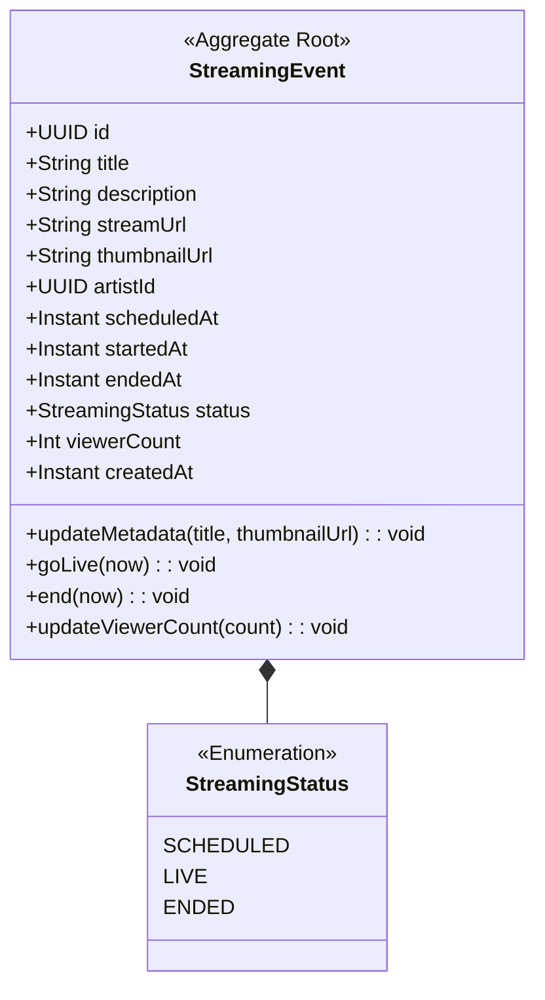

# Streaming Context 정의서

## Context 정보

| 항목 | 내용 |
|------|------|
| **Context명** | 스트리밍 |
| **영문명** | Streaming |
| **도메인 분류** | Core |
| **담당 팀** | Backend Team |
| **작성일** | 2026-01-11 |

## 개요

Streaming Context는 FanPulse의 핵심 기능인 K-pop 아티스트 라이브 스트리밍 시청 경험을 담당합니다. YouTube, Weverse Live 등 외부 플랫폼의 라이브 방송을 임베드하여 팬들에게 제공하고, 메타데이터(제목, 썸네일, 상태)를 자동으로 갱신하여 최신 정보를 유지합니다.

## 핵심 책임

1. **스트리밍 이벤트 관리**: 라이브 방송 등록, 상태 관리 (SCHEDULED → LIVE → ENDED)
2. **메타데이터 갱신**: YouTube oEmbed API를 통한 제목/썸네일 자동 갱신
3. **스케줄링**: 예정된 라이브 방송 목록 관리, 알림 연동
4. **시청자 집계**: 라이브 시청자 수 트래킹 (YouTube Data API 연동 시)

## Ubiquitous Language

| 한글 | 영문 | 정의 |
|------|------|------|
| 스트리밍 이벤트 | StreamingEvent | 라이브 방송 정보를 담는 핵심 엔티티 |
| 방송 상태 | StreamingStatus | 방송의 현재 상태 (SCHEDULED/LIVE/ENDED) |
| 메타데이터 갱신 | MetadataRefresh | 외부 API로부터 제목, 썸네일 등을 업데이트하는 행위 |
| 라이브 전환 | GoLive | SCHEDULED에서 LIVE 상태로 전환하는 행위 |
| 방송 종료 | End | LIVE에서 ENDED 상태로 전환하는 행위 |
| Video ID | VideoId | YouTube URL에서 추출한 11자리 영상 식별자 |
| oEmbed | oEmbed | 외부 콘텐츠 메타데이터를 가져오는 표준 프로토콜 |

## Aggregate 목록

| Aggregate | 설명 | Root Entity |
|-----------|------|-------------|
| StreamingEvent | 라이브 방송 이벤트 관리 | StreamingEvent |

---

## Aggregate 상세

### StreamingEvent Aggregate



**불변식 (Invariants)**:
1. SCHEDULED 상태에서만 LIVE로 전환 가능
2. LIVE 상태에서만 ENDED로 전환 가능
3. 시청자 수는 음수가 될 수 없다
4. streamUrl은 필수값이며 유효한 임베드 URL이어야 한다

**핵심 행위**:
- `updateMetadata()`: 외부 API에서 가져온 제목/썸네일 업데이트
- `goLive()`: 라이브 전환, 상태 검증 후 LIVE로 변경
- `end()`: 방송 종료, 상태 검증 후 ENDED로 변경
- `updateViewerCount()`: 시청자 수 업데이트

**구현 예시**:
```kotlin
class StreamingEvent {
    var status: StreamingStatus = status
        private set

    var title: String = title
        private set

    var thumbnailUrl: String? = thumbnailUrl
        private set

    fun updateMetadata(newTitle: String, newThumbnailUrl: String?) {
        this.title = newTitle
        if (newThumbnailUrl != null) {
            this.thumbnailUrl = newThumbnailUrl
        }
    }

    fun goLive(now: Instant = Instant.now()) {
        require(status == StreamingStatus.SCHEDULED) {
            "Cannot go live from status: $status"
        }
        status = StreamingStatus.LIVE
        startedAt = now
    }

    fun end(now: Instant = Instant.now()) {
        require(status == StreamingStatus.LIVE) {
            "Cannot end from status: $status"
        }
        status = StreamingStatus.ENDED
        endedAt = now
    }
}
```

---

## Domain Events

| 이벤트명 | 설명 | Aggregate |
|---------|------|-----------|
| StreamingEventMetadataUpdated | 메타데이터 갱신 완료 | StreamingEvent |
| StreamingEventStarted | 라이브 방송 시작 | StreamingEvent |
| StreamingEventEnded | 라이브 방송 종료 | StreamingEvent |

### 이벤트 스키마

```kotlin
/**
 * 메타데이터 갱신 이벤트
 * 구독자: Search (검색 인덱스 업데이트)
 */
data class StreamingEventMetadataUpdated(
    override val eventId: UUID = UUID.randomUUID(),
    override val occurredAt: Instant = Instant.now(),
    val streamingEventId: UUID,
    val previousTitle: String,
    val newTitle: String,
    val previousThumbnailUrl: String?,
    val newThumbnailUrl: String?,
    val titleChanged: Boolean,
    val thumbnailChanged: Boolean
) : DomainEvent {
    override val eventType: String = "StreamingEventMetadataUpdated"
    override val aggregateId: UUID = streamingEventId
    override val aggregateType: String = "StreamingEvent"
}

/**
 * 라이브 시작 이벤트
 * 구독자: Notification (팬들에게 라이브 시작 알림)
 */
data class StreamingEventStarted(
    override val eventId: UUID = UUID.randomUUID(),
    override val occurredAt: Instant = Instant.now(),
    val streamingEventId: UUID,
    val artistId: UUID,
    val title: String,
    val streamUrl: String
) : DomainEvent {
    override val eventType: String = "StreamingEventStarted"
    override val aggregateId: UUID = streamingEventId
    override val aggregateType: String = "StreamingEvent"
}

/**
 * 라이브 종료 이벤트
 * 구독자: Notification (방송 종료 알림), Search (상태 업데이트)
 */
data class StreamingEventEnded(
    override val eventId: UUID = UUID.randomUUID(),
    override val occurredAt: Instant = Instant.now(),
    val streamingEventId: UUID,
    val artistId: UUID,
    val title: String,
    val durationMinutes: Long
) : DomainEvent {
    override val eventType: String = "StreamingEventEnded"
    override val aggregateId: UUID = streamingEventId
    override val aggregateType: String = "StreamingEvent"
}
```

---

## 외부 의존성

### Upstream (이 Context가 의존하는)

| Context | 관계 패턴 | 설명 |
|---------|----------|------|
| Identity | OHS/PL | 사용자 인증 및 정보 조회 |
| External (YouTube) | ACL | oEmbed API를 통한 메타데이터 조회 |

### Downstream (이 Context에 의존하는)

| Context | 관계 패턴 | 설명 |
|---------|----------|------|
| Notification | Event | StreamingEventStarted → 라이브 알림 전송 |
| Search | ACL | 스트리밍 이벤트 검색 인덱싱 |

---

## Anti-Corruption Layer

### YouTubeOEmbedAclTranslator

**위치**: Infrastructure Layer

**변환 대상**:
| External Model | Domain Model |
|---------------|--------------|
| oEmbed.title | StreamingEvent.title |
| oEmbed.thumbnail_url | StreamingEvent.thumbnailUrl |
| oEmbed.author_name | (참고용, 저장하지 않음) |

**구현**:
```kotlin
data class YouTubeMetadata(
    val title: String,
    val thumbnailUrl: String,
    val authorName: String,
    val providerName: String
)

interface YouTubeOEmbedClient {
    fun fetchMetadata(videoId: String): YouTubeMetadata?
}
```

### Video ID 추출

YouTube 임베드 URL에서 Video ID 추출:
```kotlin
object YouTubeVideoIdExtractor {
    private val EMBED_REGEX = Regex("youtube\\.com/embed/([a-zA-Z0-9_-]{11})")

    fun extract(streamUrl: String): String? {
        return EMBED_REGEX.find(streamUrl)?.groupValues?.get(1)
    }
}
```

---

## 기술 스택

- **언어/프레임워크**: Kotlin / Spring Boot
- **데이터베이스**: PostgreSQL
- **외부 API**: YouTube oEmbed API (인증 불필요)
- **스케줄링**: Spring @Scheduled
- **회복성**: Resilience4j Circuit Breaker
- **메트릭**: Micrometer + Prometheus

---

## 스케줄러 설정

### MetadataRefreshScheduler

| 스케줄 | Cron | 대상 | 설명 |
|--------|------|------|------|
| LIVE 갱신 | `0 0 * * * *` | LIVE 상태만 | 매시 정각 |
| 전체 갱신 | `0 0 0 * * *` | SCHEDULED + LIVE | 매일 자정 |

**설정 예시** (`application.yml`):
```yaml
fanpulse:
  scheduler:
    metadata-refresh:
      enabled: true
      live-cron: "0 0 * * * *"
      all-cron: "0 0 0 * * *"
      batch-size: 50
```

---

## API 경계

### 제공 API (Published)

| 엔드포인트 | 메서드 | 설명 |
|-----------|--------|------|
| `/api/v1/streaming-events` | GET | 스트리밍 이벤트 목록 조회 |
| `/api/v1/streaming-events/{id}` | GET | 스트리밍 이벤트 상세 조회 |
| `/api/v1/streaming-events/live` | GET | 현재 라이브 중인 이벤트 조회 |
| `/api/v1/streaming-events/upcoming` | GET | 예정된 이벤트 목록 조회 |

### 관리자 API

| 엔드포인트 | 메서드 | 설명 |
|-----------|--------|------|
| `/admin/streaming-events/refresh` | POST | 수동 메타데이터 갱신 |

---

## 디렉토리 구조

```
backend/src/main/kotlin/com/fanpulse/
├── domain/
│   ├── streaming/
│   │   ├── StreamingEvent.kt              # Aggregate Root
│   │   ├── StreamingStatus.kt             # Enum
│   │   └── port/
│   │       └── StreamingEventPort.kt      # Repository Port
│   └── common/
│       ├── DomainEvent.kt
│       └── DomainEventPublisher.kt
│
├── application/service/
│   ├── MetadataRefreshService.kt          # Interface
│   ├── MetadataRefreshServiceImpl.kt      # Implementation
│   └── TransactionalMetadataUpdater.kt    # Transaction Isolation
│
└── infrastructure/
    ├── external/youtube/
    │   ├── YouTubeOEmbedClient.kt         # Client Interface
    │   ├── YouTubeOEmbedClientImpl.kt     # Implementation + Circuit Breaker
    │   └── YouTubeVideoIdExtractor.kt     # URL Parser
    ├── scheduler/
    │   └── MetadataRefreshScheduler.kt    # Spring Scheduler
    ├── event/
    │   └── SpringDomainEventPublisher.kt  # Event Publisher
    └── config/
        └── MetadataRefreshConfig.kt       # Configuration
```

---

## 변경 이력

| 버전 | 날짜 | 변경 내용 | 작성자 |
|------|------|----------|--------|
| 1.0.0 | 2026-01-11 | 최초 작성 | Claude |
