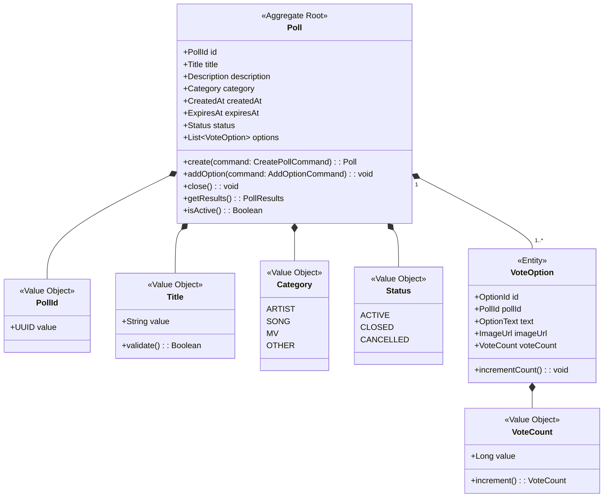
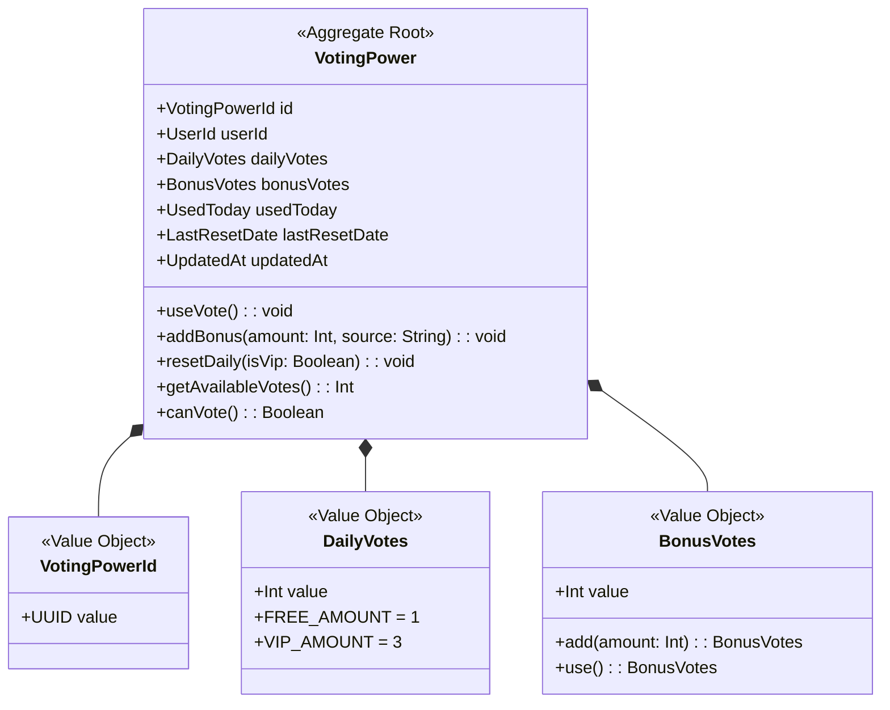
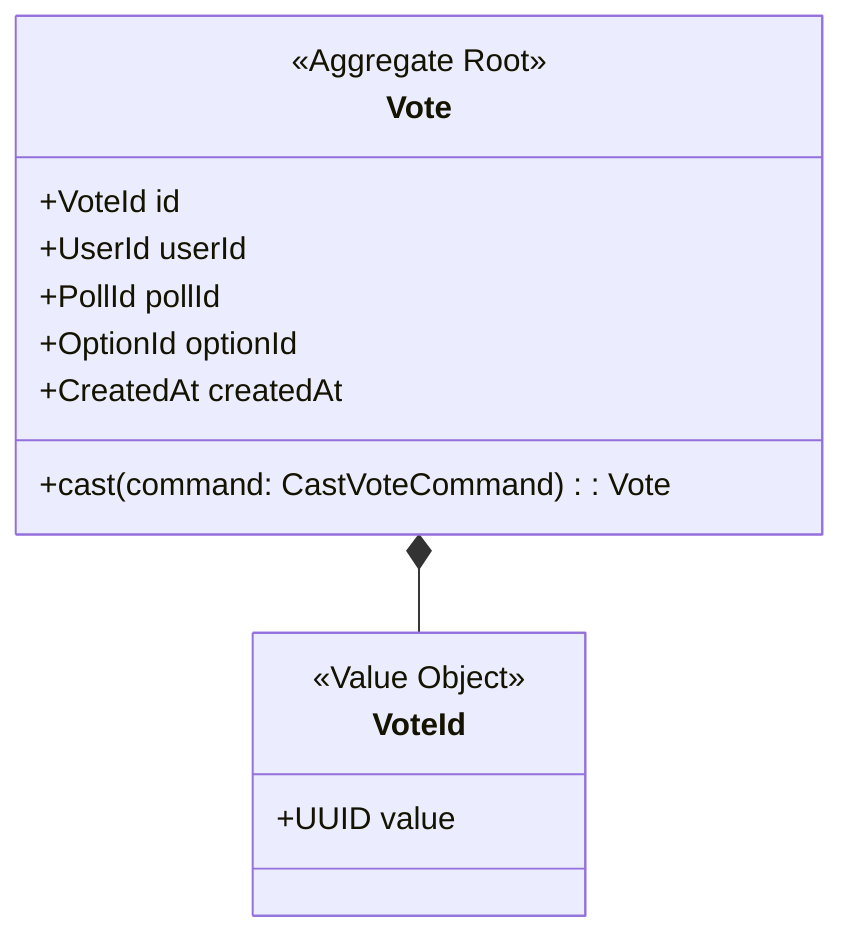

# Voting Context 정의서

## Context 정보

| 항목 | 내용 |
|------|------|
| **Context명** | 투표 |
| **영문명** | Voting |
| **도메인 분류** | Core |
| **담당 팀** | Backend Team |
| **작성일** | 2025-12-28 |

## 개요

Voting Context는 FanPulse의 핵심 기능인 팬 참여형 투표 시스템을 담당합니다. 글로벌 팬들이 아티스트, 노래, MV 등 다양한 카테고리에서 투표에 참여하고, 실시간으로 랭킹을 확인할 수 있습니다. 투표권 관리와 중복 투표 방지를 통해 투표의 공정성을 보장합니다.

## 핵심 책임

1. **투표 관리**: 투표 생성, 옵션 관리, 투표 마감
2. **투표 참여**: 투표권 검증, 투표 처리, 중복 방지
3. **투표권 관리**: 일일 투표권 리셋, 보너스 투표권 부여
4. **결과 집계**: 실시간 투표 현황, 랭킹 계산

## Ubiquitous Language

| 한글 | 영문 | 정의 |
|------|------|------|
| 투표 | Poll | 팬들이 참여할 수 있는 투표 이벤트 |
| 투표 옵션 | VoteOption | 투표에서 선택 가능한 후보 항목 |
| 투표권 | VotingPower | 사용자가 보유한 투표 가능 횟수 |
| 일일 투표권 | DailyVotes | 매일 리셋되는 기본 투표권 (FREE: 1, VIP: 3) |
| 보너스 투표권 | BonusVotes | 광고 시청 등으로 획득한 추가 투표권 |
| 투표하기 | CastVote | 특정 옵션에 투표를 행사하는 행위 |

## Aggregate 목록

| Aggregate | 설명 | Root Entity |
|-----------|------|-------------|
| Poll | 투표 이벤트 및 옵션 관리 | Poll |
| VotingPower | 사용자별 투표권 관리 | VotingPower |
| Vote | 개별 투표 기록 | Vote |

---

## Aggregate 상세

### Poll Aggregate



**불변식 (Invariants)**:
1. 투표는 최소 2개 이상의 옵션을 가져야 한다
2. 마감된 투표에는 옵션을 추가할 수 없다
3. 마감일은 현재 시간 이후여야 한다
4. 투표 제목은 5~100자 사이여야 한다

**핵심 행위**:
- `create()`: 새 투표 생성, PollCreated 이벤트 발행
- `addOption()`: 투표 옵션 추가
- `close()`: 투표 마감, PollClosed 이벤트 발행
- `getResults()`: 현재 투표 결과 조회
- `isActive()`: 투표 진행 중 여부 확인

---

### VotingPower Aggregate



**불변식 (Invariants)**:
1. 사용자당 하나의 VotingPower만 존재 (1:1 관계)
2. 사용 투표권은 보유 투표권을 초과할 수 없다
3. 일일 투표권은 자정에 리셋된다
4. 보너스 투표권은 음수가 될 수 없다

**핵심 행위**:
- `useVote()`: 투표권 1개 사용 (보너스 우선 사용)
- `addBonus()`: 보너스 투표권 추가
- `resetDaily()`: 일일 투표권 리셋 (VIP 여부에 따라 다름)
- `getAvailableVotes()`: 사용 가능한 총 투표권 계산
- `canVote()`: 투표 가능 여부 확인

---

### Vote Aggregate



**불변식 (Invariants)**:
1. 동일 투표에 같은 사용자가 중복 투표 불가 (투표당 1회)
2. 마감된 투표에는 참여 불가
3. 존재하지 않는 옵션에는 투표 불가

**핵심 행위**:
- `cast()`: 투표 행사, VoteCasted 이벤트 발행

---

## Domain Events

| 이벤트명 | 설명 | Aggregate |
|---------|------|-----------|
| PollCreated | 새 투표 생성 | Poll |
| PollClosed | 투표 마감 | Poll |
| VoteCasted | 투표 완료 | Vote |
| BonusVotesAdded | 보너스 투표권 추가 | VotingPower |
| DailyVotesReset | 일일 투표권 리셋 | VotingPower |

### 이벤트 스키마

```kotlin
data class VoteCasted(
    val voteId: UUID,
    val userId: UUID,
    val pollId: UUID,
    val optionId: UUID,
    val occurredAt: Instant
) : DomainEvent

data class PollClosed(
    val pollId: UUID,
    val title: String,
    val winnerOptionId: UUID,
    val totalVotes: Long,
    val occurredAt: Instant
) : DomainEvent

data class BonusVotesAdded(
    val userId: UUID,
    val amount: Int,
    val source: String, // AD_WATCH, EVENT, ADMIN
    val occurredAt: Instant
) : DomainEvent
```

## 외부 의존성

### Upstream (이 Context가 의존하는)

| Context | 관계 패턴 | 설명 |
|---------|----------|------|
| Identity | OHS/PL | 사용자 인증 및 정보 조회 |
| Membership | OHS | VIP 여부 확인 (투표권 개수 결정) |

### Downstream (이 Context에 의존하는)

| Context | 관계 패턴 | 설명 |
|---------|----------|------|
| Reward | Event | VoteCasted → 포인트 적립 |
| Notification | Event | VoteCasted, PollClosed → 알림 전송 |

## 기술 스택

- **언어/프레임워크**: Kotlin / Spring Boot
- **데이터베이스**: PostgreSQL
- **캐시**: Redis (투표 현황 캐싱)
- **메시징**: Kafka (이벤트 발행)

## API 경계

### 제공 API (Published)

| 엔드포인트 | 메서드 | 설명 |
|-----------|--------|------|
| `/api/v1/polls` | GET | 투표 목록 조회 |
| `/api/v1/polls/{id}` | GET | 투표 상세 조회 |
| `/api/v1/polls/{id}/vote` | POST | 투표 참여 |
| `/api/v1/polls/{id}/results` | GET | 투표 결과 조회 |
| `/api/v1/voting-power` | GET | 내 투표권 조회 |

### 소비 API (Consumed)

| 엔드포인트 | 제공 Context | 설명 |
|-----------|-------------|------|
| `/api/v1/membership/{userId}/status` | Membership | VIP 상태 확인 |

## Domain Service

### VoteService

투표 참여 시 여러 Aggregate를 조율하는 도메인 서비스

```kotlin
class VoteService(
    private val pollRepository: PollRepository,
    private val voteRepository: VoteRepository,
    private val votingPowerRepository: VotingPowerRepository,
    private val eventPublisher: DomainEventPublisher
) {
    fun castVote(command: CastVoteCommand): Vote {
        // 1. 투표 조회 및 유효성 검증
        val poll = pollRepository.findById(command.pollId)
            ?: throw PollNotFoundException()

        if (!poll.isActive()) {
            throw PollNotActiveException()
        }

        // 2. 중복 투표 검증
        if (voteRepository.existsByUserIdAndPollId(command.userId, command.pollId)) {
            throw AlreadyVotedException()
        }

        // 3. 투표권 검증 및 사용
        val votingPower = votingPowerRepository.findByUserId(command.userId)
            ?: throw VotingPowerNotFoundException()

        if (!votingPower.canVote()) {
            throw InsufficientVotingPowerException()
        }

        votingPower.useVote()

        // 4. 투표 처리
        val vote = Vote.cast(command)
        poll.options.find { it.id == command.optionId }
            ?.incrementCount()
            ?: throw OptionNotFoundException()

        // 5. 저장 및 이벤트 발행
        voteRepository.save(vote)
        votingPowerRepository.save(votingPower)
        pollRepository.save(poll)

        eventPublisher.publish(VoteCasted(
            voteId = vote.id.value,
            userId = command.userId,
            pollId = command.pollId,
            optionId = command.optionId,
            occurredAt = Instant.now()
        ))

        return vote
    }
}
```

## 변경 이력

| 버전 | 날짜 | 변경 내용 | 작성자 |
|------|------|----------|--------|
| 1.0.0 | 2025-12-28 | 최초 작성 | 정지원 |
