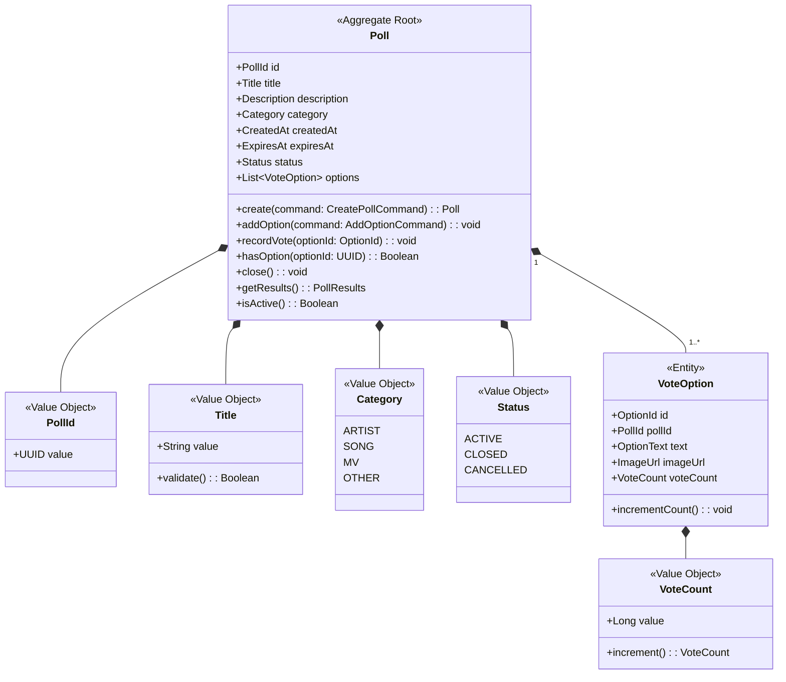
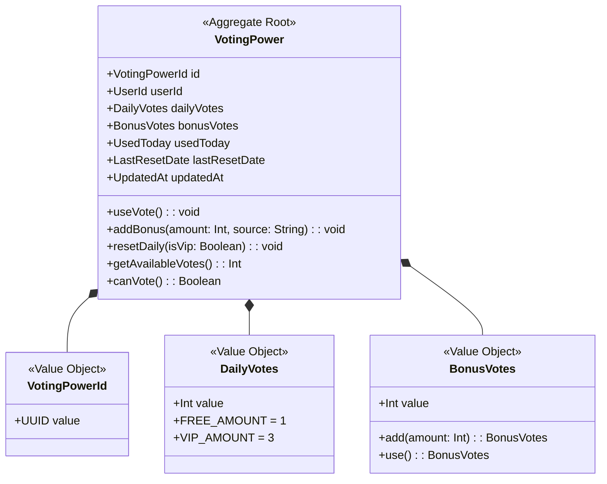
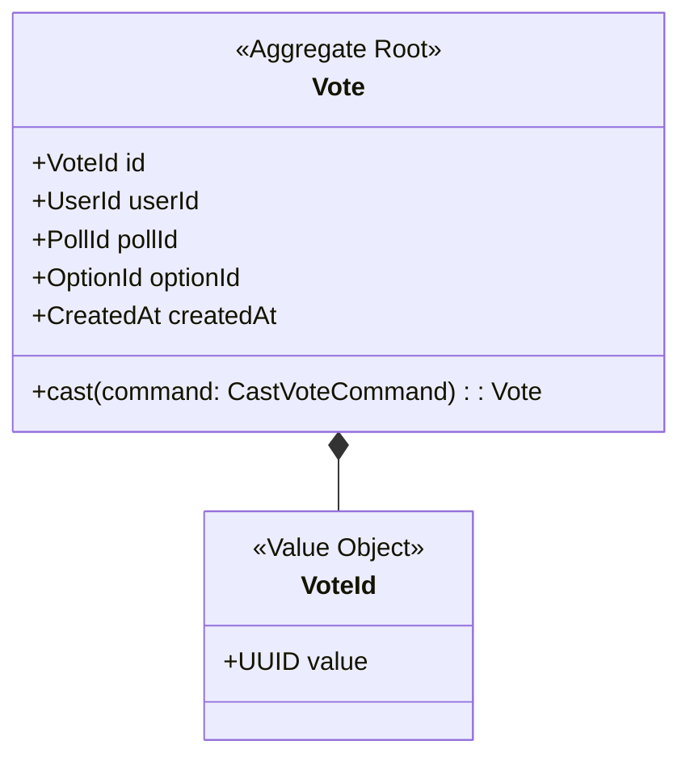

# Voting Context 정의서

## Context 정보

| 항목 | 내용 |
|------|------|
| **Context명** | 투표 |
| **영문명** | Voting |
| **도메인 분류** | Core |
| **담당 팀** | Backend Team |
| **작성일** | 2025-12-28 |

## 개요

Voting Context는 FanPulse의 핵심 기능인 팬 참여형 투표 시스템을 담당합니다. 글로벌 팬들이 아티스트, 노래, MV 등 다양한 카테고리에서 투표에 참여하고, 실시간으로 랭킹을 확인할 수 있습니다. 투표권 관리와 중복 투표 방지를 통해 투표의 공정성을 보장합니다.

## 핵심 책임

1. **투표 관리**: 투표 생성, 옵션 관리, 투표 마감
2. **투표 참여**: 투표권 검증, 투표 처리, 중복 방지
3. **투표권 관리**: 일일 투표권 리셋, 보너스 투표권 부여
4. **결과 집계**: 실시간 투표 현황, 랭킹 계산

## Ubiquitous Language

| 한글 | 영문 | 정의 |
|------|------|------|
| 투표 | Poll | 팬들이 참여할 수 있는 투표 이벤트 |
| 투표 옵션 | VoteOption | 투표에서 선택 가능한 후보 항목 |
| 투표권 | VotingPower | 사용자가 보유한 투표 가능 횟수 |
| 일일 투표권 | DailyVotes | 매일 리셋되는 기본 투표권 (FREE: 1, VIP: 3) |
| 보너스 투표권 | BonusVotes | 광고 시청 등으로 획득한 추가 투표권 |
| 투표하기 | CastVote | 특정 옵션에 투표를 행사하는 행위 |

## Aggregate 목록

| Aggregate | 설명 | Root Entity |
|-----------|------|-------------|
| Poll | 투표 이벤트 및 옵션 관리 | Poll |
| VotingPower | 사용자별 투표권 관리 | VotingPower |
| Vote | 개별 투표 기록 | Vote |

---

## Aggregate 상세

### Poll Aggregate



**불변식 (Invariants)**:
1. 투표는 최소 2개 이상의 옵션을 가져야 한다
2. 마감된 투표에는 옵션을 추가할 수 없다
3. 마감일은 현재 시간 이후여야 한다
4. 투표 제목은 5~100자 사이여야 한다

**핵심 행위**:
- `create()`: 새 투표 생성, PollCreated 이벤트 발행
- `addOption()`: 투표 옵션 추가
- `recordVote(optionId)`: 투표 기록 (Aggregate Root를 통한 캡슐화)
- `close()`: 투표 마감, PollClosed 이벤트 발행
- `getResults()`: 현재 투표 결과 조회
- `isActive()`: 투표 진행 중 여부 확인

**recordVote 구현 예시**:
```kotlin
class Poll private constructor(
    val id: PollId,
    val title: Title,
    val description: Description,
    val category: Category,
    val createdAt: Instant,
    val expiresAt: Instant,
    private var status: Status,
    private val options: MutableList<VoteOption>
) {
    /**
     * 투표 기록 - Aggregate Root를 통한 캡슐화
     *
     * 외부에서 VoteOption에 직접 접근하지 않고,
     * Aggregate Root를 통해 투표를 기록합니다.
     *
     * @param optionId 투표할 옵션 ID
     * @throws PollNotActiveException 투표가 활성 상태가 아닌 경우
     * @throws OptionNotFoundException 옵션이 존재하지 않는 경우
     */
    fun recordVote(optionId: OptionId) {
        require(isActive()) { "투표가 활성 상태가 아닙니다" }

        val option = options.find { it.id == optionId }
            ?: throw OptionNotFoundException("옵션을 찾을 수 없습니다: $optionId")

        option.incrementCount()
    }

    fun isActive(): Boolean = status == Status.ACTIVE && Instant.now().isBefore(expiresAt)
}
```

---

### VotingPower Aggregate



**불변식 (Invariants)**:
1. 사용자당 하나의 VotingPower만 존재 (1:1 관계)
2. 사용 투표권은 보유 투표권을 초과할 수 없다
3. 일일 투표권은 자정에 리셋된다
4. 보너스 투표권은 음수가 될 수 없다

**핵심 행위**:
- `useVote()`: 투표권 1개 사용 (보너스 우선 사용)
- `addBonus()`: 보너스 투표권 추가
- `resetDaily()`: 일일 투표권 리셋 (VIP 여부에 따라 다름)
- `getAvailableVotes()`: 사용 가능한 총 투표권 계산
- `canVote()`: 투표 가능 여부 확인

---

### Vote Aggregate



**불변식 (Invariants)**:
1. 동일 투표에 같은 사용자가 중복 투표 불가 (투표당 1회)
2. 마감된 투표에는 참여 불가
3. 존재하지 않는 옵션에는 투표 불가

**핵심 행위**:
- `cast()`: 투표 행사, VoteCasted 이벤트 발행

---

## Domain Events

| 이벤트명 | 설명 | Aggregate |
|---------|------|-----------|
| PollCreated | 새 투표 생성 | Poll |
| PollClosed | 투표 마감 | Poll |
| VoteCasted | 투표 완료 | Vote |
| BonusVotesAdded | 보너스 투표권 추가 | VotingPower |
| DailyVotesReset | 일일 투표권 리셋 | VotingPower |

### 이벤트 스키마

```kotlin
/**
 * 새 투표 생성 이벤트
 * 구독자: Notification (팬들에게 새 투표 알림), Search (검색 인덱싱)
 */
data class PollCreated(
    override val eventId: UUID = UUID.randomUUID(),
    override val occurredAt: Instant = Instant.now(),
    val pollId: UUID,
    val title: String,
    val description: String,
    val category: String,           // ARTIST, SONG, MV, OTHER
    val optionCount: Int,
    val options: List<OptionInfo>,  // 옵션 목록 (미리보기용)
    val expiresAt: Instant,
    val createdBy: UUID             // 생성자 (관리자) ID
) : DomainEvent {
    override val eventType: String = "PollCreated"
    override val aggregateId: UUID = pollId
    override val aggregateType: String = "Poll"
    override val metadata: Map<String, Any> = emptyMap()

    data class OptionInfo(
        val optionId: UUID,
        val text: String,
        val imageUrl: String?
    )
}

data class VoteCasted(
    override val eventId: UUID = UUID.randomUUID(),
    override val occurredAt: Instant = Instant.now(),
    val voteId: UUID,
    val userId: UUID,
    val pollId: UUID,
    val optionId: UUID
) : DomainEvent {
    override val eventType: String = "VoteCasted"
    override val aggregateId: UUID = voteId
    override val aggregateType: String = "Vote"
    override val metadata: Map<String, Any> = emptyMap()
}

data class PollClosed(
    override val eventId: UUID = UUID.randomUUID(),
    override val occurredAt: Instant = Instant.now(),
    val pollId: UUID,
    val title: String,
    val winnerOptionId: UUID,
    val winnerOptionText: String,
    val totalVotes: Long,
    val results: List<OptionResult>  // 전체 결과
) : DomainEvent {
    override val eventType: String = "PollClosed"
    override val aggregateId: UUID = pollId
    override val aggregateType: String = "Poll"
    override val metadata: Map<String, Any> = emptyMap()

    data class OptionResult(
        val optionId: UUID,
        val text: String,
        val voteCount: Long,
        val percentage: Double
    )
}

data class BonusVotesAdded(
    override val eventId: UUID = UUID.randomUUID(),
    override val occurredAt: Instant = Instant.now(),
    val userId: UUID,
    val amount: Int,
    val source: String,             // AD_WATCH, EVENT, ADMIN
    val previousBonusVotes: Int,
    val newBonusVotes: Int
) : DomainEvent {
    override val eventType: String = "BonusVotesAdded"
    override val aggregateId: UUID = userId
    override val aggregateType: String = "VotingPower"
    override val metadata: Map<String, Any> = emptyMap()
}

/**
 * 일일 투표권 리셋 이벤트
 * 매일 자정(KST)에 스케줄러에 의해 발생
 * 구독자: Notification (투표권 리셋 알림)
 */
data class DailyVotesReset(
    override val eventId: UUID = UUID.randomUUID(),
    override val occurredAt: Instant = Instant.now(),
    val userId: UUID,
    val previousDailyVotes: Int,    // 리셋 전 남은 일일 투표권
    val newDailyVotes: Int,         // 리셋 후 일일 투표권 (FREE: 1, VIP: 3)
    val isVip: Boolean,
    val resetDate: LocalDate        // 리셋 기준 날짜
) : DomainEvent {
    override val eventType: String = "DailyVotesReset"
    override val aggregateId: UUID = userId
    override val aggregateType: String = "VotingPower"
    override val metadata: Map<String, Any> = mapOf(
        "isVip" to isVip,
        "resetDate" to resetDate.toString()
    )
}
```

### DomainEvent 인터페이스

```kotlin
/**
 * 모든 도메인 이벤트의 기본 인터페이스
 */
interface DomainEvent {
    val eventId: UUID
    val eventType: String
    val aggregateId: UUID
    val aggregateType: String
    val occurredAt: Instant
    val metadata: Map<String, Any>
}
```

## 외부 의존성

### Upstream (이 Context가 의존하는)

| Context | 관계 패턴 | 설명 |
|---------|----------|------|
| Identity | OHS/PL | 사용자 인증 및 정보 조회 |
| Membership | OHS | VIP 여부 확인 (투표권 개수 결정) |

### Downstream (이 Context에 의존하는)

| Context | 관계 패턴 | 설명 |
|---------|----------|------|
| Reward | Event | VoteCasted → 포인트 적립 |
| Notification | Event | VoteCasted, PollClosed → 알림 전송 |

## 기술 스택

- **언어/프레임워크**: Kotlin / Spring Boot
- **데이터베이스**: PostgreSQL
- **캐시**: Redis (투표 현황 캐싱)
- **메시징**: Kafka (이벤트 발행)

## API 경계

### 제공 API (Published)

| 엔드포인트 | 메서드 | 설명 |
|-----------|--------|------|
| `/api/v1/polls` | GET | 투표 목록 조회 |
| `/api/v1/polls/{id}` | GET | 투표 상세 조회 |
| `/api/v1/polls/{id}/vote` | POST | 투표 참여 |
| `/api/v1/polls/{id}/results` | GET | 투표 결과 조회 |
| `/api/v1/voting-power` | GET | 내 투표권 조회 |

### 소비 API (Consumed)

| 엔드포인트 | 제공 Context | 설명 |
|-----------|-------------|------|
| `/api/v1/membership/{userId}/status` | Membership | VIP 상태 확인 |

## Factory

### VoteFactory

Vote 생성 검증 로직을 캡슐화하는 Factory 클래스

```kotlin
/**
 * Vote 생성을 담당하는 Factory
 *
 * 책임:
 * - 중복 투표 검증
 * - Poll 활성 상태 검증
 * - 옵션 존재 여부 검증
 * - Vote 객체 생성
 *
 * 장점:
 * - 생성 검증 로직이 한 곳에 집중
 * - VoteService의 책임 감소
 * - 테스트 용이성 향상
 */
class VoteFactory(
    private val voteRepository: VoteRepository
) {
    /**
     * Vote 생성
     *
     * @param command 투표 명령
     * @param poll 대상 투표 (활성 상태여야 함)
     * @param votingPower 사용자 투표권 (투표 가능해야 함)
     * @return 생성된 Vote
     * @throws AlreadyVotedException 이미 투표한 경우
     * @throws PollNotActiveException 투표가 활성 상태가 아닌 경우
     * @throws OptionNotFoundException 옵션이 존재하지 않는 경우
     * @throws InsufficientVotingPowerException 투표권이 부족한 경우
     */
    fun create(
        command: CastVoteCommand,
        poll: Poll,
        votingPower: VotingPower
    ): Vote {
        // 1. 중복 투표 검증
        validateNoDuplicateVote(command.userId, command.pollId)

        // 2. Poll 상태 검증
        validatePollIsActive(poll)

        // 3. 옵션 존재 검증
        validateOptionExists(poll, command.optionId)

        // 4. 투표권 검증
        validateCanVote(votingPower)

        // 5. Vote 생성
        return Vote.create(
            id = VoteId(UUID.randomUUID()),
            userId = command.userId,
            pollId = command.pollId,
            optionId = command.optionId,
            createdAt = Instant.now()
        )
    }

    private fun validateNoDuplicateVote(userId: UUID, pollId: UUID) {
        if (voteRepository.existsByUserIdAndPollId(userId, pollId)) {
            throw AlreadyVotedException("이미 해당 투표에 참여하셨습니다")
        }
    }

    private fun validatePollIsActive(poll: Poll) {
        if (!poll.isActive()) {
            throw PollNotActiveException("투표가 종료되었거나 활성 상태가 아닙니다")
        }
    }

    private fun validateOptionExists(poll: Poll, optionId: UUID) {
        if (!poll.hasOption(optionId)) {
            throw OptionNotFoundException("존재하지 않는 옵션입니다: $optionId")
        }
    }

    private fun validateCanVote(votingPower: VotingPower) {
        if (!votingPower.canVote()) {
            throw InsufficientVotingPowerException("투표권이 부족합니다")
        }
    }
}
```

---

## Domain Service

### VoteService

투표 참여 시 여러 Aggregate를 조율하는 도메인 서비스

```kotlin
/**
 * 투표 참여 조율 서비스
 *
 * 책임:
 * - Aggregate 조회
 * - VoteFactory를 통한 Vote 생성
 * - 투표권 차감
 * - 투표 기록
 * - 저장 및 이벤트 발행
 *
 * VoteFactory로 분리된 책임:
 * - 중복 투표 검증
 * - Poll/옵션/투표권 유효성 검증
 */
class VoteService(
    private val pollRepository: PollRepository,
    private val voteRepository: VoteRepository,
    private val votingPowerRepository: VotingPowerRepository,
    private val voteFactory: VoteFactory,
    private val eventPublisher: DomainEventPublisher
) {
    fun castVote(command: CastVoteCommand): Vote {
        // 1. Aggregate 조회
        val poll = pollRepository.findById(command.pollId)
            ?: throw PollNotFoundException("투표를 찾을 수 없습니다: ${command.pollId}")

        val votingPower = votingPowerRepository.findByUserId(command.userId)
            ?: throw VotingPowerNotFoundException("투표권 정보를 찾을 수 없습니다")

        // 2. Factory를 통한 Vote 생성 (검증 포함)
        val vote = voteFactory.create(command, poll, votingPower)

        // 3. 투표권 차감
        votingPower.useVote()

        // 4. 투표 기록 (Aggregate Root를 통한 캡슐화)
        poll.recordVote(command.optionId)

        // 5. 저장
        voteRepository.save(vote)
        votingPowerRepository.save(votingPower)
        pollRepository.save(poll)

        // 6. 이벤트 발행
        eventPublisher.publish(
            VoteCasted(
                voteId = vote.id.value,
                userId = command.userId,
                pollId = command.pollId,
                optionId = command.optionId
            )
        )

        return vote
    }
}
```

### Poll.hasOption 메서드 추가

```kotlin
// Poll Aggregate Root에 추가
fun hasOption(optionId: UUID): Boolean {
    return options.any { it.id.value == optionId }
}
```

## 변경 이력

| 버전 | 날짜 | 변경 내용 | 작성자 |
|------|------|----------|--------|
| 1.0.0 | 2025-12-28 | 최초 작성 | 정지원 |
| 1.1.0 | 2026-01-04 | Poll.recordVote() 메서드 추가 - Aggregate Root 캡슐화 개선 | Claude |
| 1.2.0 | 2026-01-04 | PollCreated, DailyVotesReset 이벤트 스키마 추가, DomainEvent 인터페이스 정의 | Claude |
| 1.3.0 | 2026-01-04 | VoteFactory 도입 - 생성 검증 로직 캡슐화, Poll.hasOption() 추가 | Claude |
