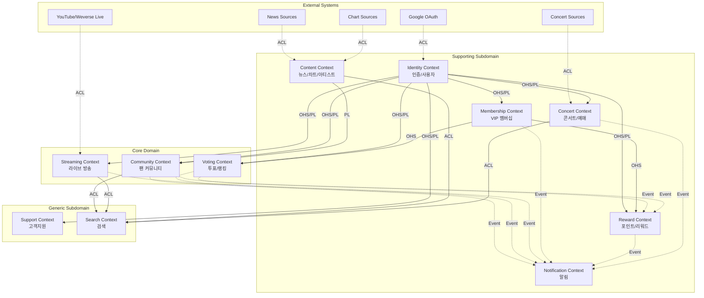
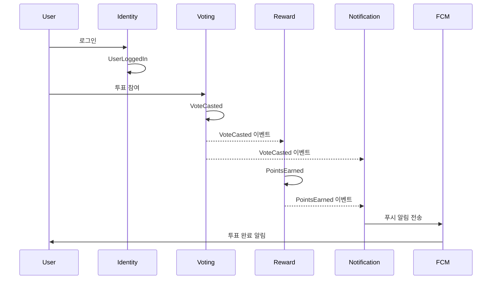
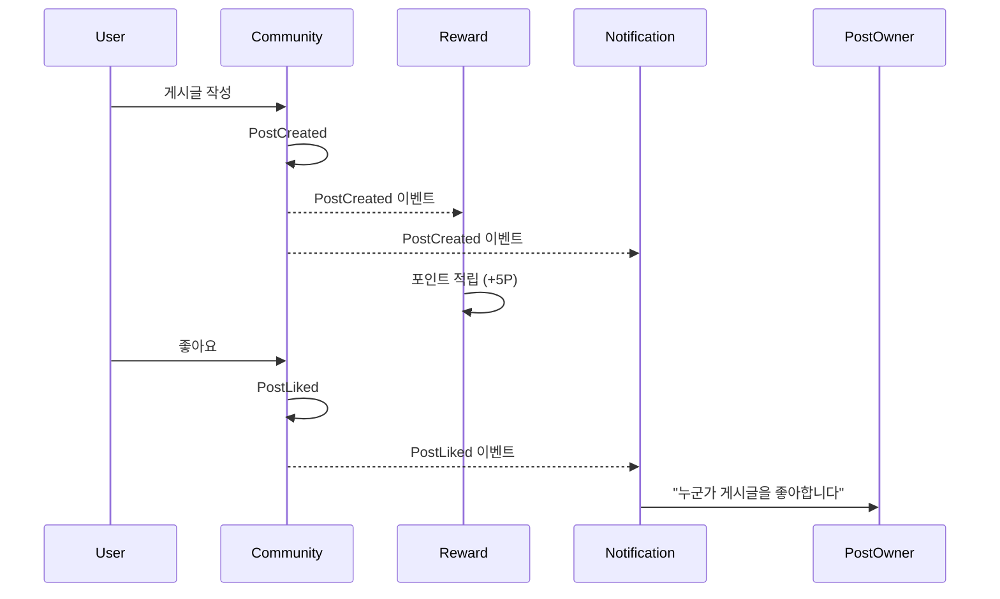

# FanPulse Context Map

## 프로젝트 정보

| 항목 | 내용 |
|------|------|
| **프로젝트명** | FanPulse |
| **작성일** | 2025-12-28 |
| **버전** | 1.0.0 |

## Context 목록

### Core Domain

| Context | 설명 | 담당 팀 |
|---------|------|---------|
| Voting | 팬 참여형 투표, 투표권 관리, 실시간 랭킹 | Backend Team |
| Community | 아티스트별 팬 페이지, 게시글/댓글, 좋아요 | Backend Team |
| Streaming | 라이브 스트리밍, 실시간 채팅, 하트 | Backend Team |

### Supporting Subdomain

| Context | 설명 | 담당 팀 |
|---------|------|---------|
| Identity | 회원가입, 로그인, OAuth, 사용자 설정 | Backend Team |
| Content | 뉴스, 차트 순위, 아티스트 정보 (크롤링) | Backend Team |
| Concert | 콘서트 일정, 티켓 예매 | Backend Team |
| Reward | 포인트 적립/사용, 광고, 굿즈 교환 | Backend Team |
| Membership | VIP 구독, 혜택 관리 | Backend Team |
| Notification | 푸시 알림, 알림 관리 | Backend Team |

### Generic Subdomain

| Context | 설명 | 담당 팀/서비스 |
|---------|------|---------------|
| Support | FAQ, 1:1 문의, 공지사항 | Backend Team |
| Search | 통합 검색, 검색 기록 | Backend Team (Elasticsearch) |

## Context Map 다이어그램



## 관계 상세

### 1. Identity → Core Contexts (Voting, Community, Streaming)

| 항목 | 내용 |
|------|------|
| **패턴** | Open Host Service (OHS) + Published Language (PL) |
| **통신 방식** | REST API (동기) |
| **데이터 흐름** | 사용자 인증 정보, 세션 토큰 |

**상세 설명**:
Identity Context는 모든 Core Context의 인증 제공자입니다. JWT 토큰 기반으로 사용자를 인증하며, 사용자 기본 정보(ID, 닉네임, VIP 여부)를 Published Language로 제공합니다.

**통합 포인트**:
- `GET /api/v1/me` - 현재 사용자 정보 조회
- `Authorization: Bearer <token>` - 모든 인증 요청 헤더

---

### 2. Voting → Notification, Reward

| 항목 | 내용 |
|------|------|
| **패턴** | Event-Driven |
| **통신 방식** | Kafka (비동기) |
| **데이터 흐름** | 투표 완료 이벤트 → 알림/포인트 적립 |

**상세 설명**:
투표가 완료되면 `VoteCasted` 이벤트를 발행합니다. Notification Context는 이를 구독하여 사용자에게 투표 완료 알림을 전송하고, Reward Context는 포인트 적립 처리를 합니다.

**이벤트 스키마**:
```json
{
  "eventType": "VoteCasted",
  "userId": "uuid",
  "pollId": "uuid",
  "optionId": "uuid",
  "timestamp": "2025-12-28T10:00:00Z"
}
```

---

### 3. Community → Notification, Reward

| 항목 | 내용 |
|------|------|
| **패턴** | Event-Driven |
| **통신 방식** | Kafka (비동기) |
| **데이터 흐름** | 게시글/댓글 생성 이벤트 → 알림/포인트 적립 |

**상세 설명**:
게시글 또는 댓글이 생성되면 해당 이벤트를 발행합니다. 좋아요 알림, 댓글 알림 등이 구독자에게 전송되고, 활동에 따른 포인트가 적립됩니다.

**이벤트 스키마**:
```json
{
  "eventType": "PostCreated",
  "userId": "uuid",
  "postId": "uuid",
  "artistId": "uuid",
  "timestamp": "2025-12-28T10:00:00Z"
}
```

---

### 4. Membership → Voting, Reward

| 항목 | 내용 |
|------|------|
| **패턴** | Open Host Service (OHS) |
| **통신 방식** | REST API (동기) |
| **데이터 흐름** | VIP 상태 조회 → 혜택 적용 |

**상세 설명**:
Voting Context와 Reward Context는 사용자의 VIP 멤버십 상태를 조회하여 추가 혜택을 적용합니다. VIP 사용자는 일일 투표권 3회, 포인트 20% 추가 적립 등의 혜택을 받습니다.

**통합 포인트**:
- `GET /api/v1/membership/{userId}/status` - 멤버십 상태 조회

---

### 5. External → Content (News/Chart/Concert)

| 항목 | 내용 |
|------|------|
| **패턴** | Anti-Corruption Layer (ACL) |
| **통신 방식** | 배치 크롤링 + DB Upsert |
| **데이터 흐름** | 외부 뉴스/차트/콘서트 정보 → 내부 도메인 모델 |

**상세 설명**:
외부 소스(뉴스 사이트, Billboard, Melon, 공연 정보 사이트)에서 데이터를 크롤링하여 내부 도메인 모델로 변환합니다. ACL을 통해 외부 모델의 변경이 내부 도메인에 영향을 미치지 않도록 격리합니다.

**ACL 변환 예시**:
```kotlin
class NewsAclTranslator {
    fun translate(external: CrawledNewsDto): News {
        return News(
            id = NewsId.generate(),
            title = external.title,
            content = sanitize(external.content),
            source = NewsSource(external.source),
            publishedAt = parseDate(external.publishedAt)
        )
    }
}
```

---

### 6. Content/Community/Concert/Streaming → Search

| 항목 | 내용 |
|------|------|
| **패턴** | Anti-Corruption Layer (ACL) |
| **통신 방식** | Elasticsearch 인덱싱 |
| **데이터 흐름** | 도메인 데이터 → 검색 인덱스 |

**상세 설명**:
각 Context의 검색 대상 데이터는 Search Context의 Elasticsearch 인덱스로 동기화됩니다. ACL을 통해 각 도메인 모델을 검색에 최적화된 형태로 변환합니다.

**인덱스 구조**:
- `fanpulse-news`: 뉴스 검색
- `fanpulse-posts`: 게시글 검색
- `fanpulse-artists`: 아티스트 검색
- `fanpulse-concerts`: 콘서트 검색
- `fanpulse-streaming`: 라이브 검색

---

## 통합 패턴 요약

| Upstream | Downstream | 패턴 | 통신 |
|----------|------------|------|------|
| Identity | Voting | OHS/PL | REST API |
| Identity | Community | OHS/PL | REST API |
| Identity | Streaming | OHS/PL | REST API |
| Identity | Reward | OHS/PL | REST API |
| Identity | Membership | OHS/PL | REST API |
| Identity | Concert | OHS/PL | REST API |
| Identity | Support | OHS/PL | REST API |
| Membership | Voting | OHS | REST API |
| Membership | Reward | OHS | REST API |
| Voting | Notification | Event | Kafka |
| Voting | Reward | Event | Kafka |
| Community | Notification | Event | Kafka |
| Community | Reward | Event | Kafka |
| Streaming | Notification | Event | Kafka |
| Membership | Notification | Event | Kafka |
| Reward | Notification | Event | Kafka |
| Concert | Notification | Event | Kafka |
| Content | Search | ACL | Elasticsearch |
| Community | Search | ACL | Elasticsearch |
| Concert | Search | ACL | Elasticsearch |
| Streaming | Search | ACL | Elasticsearch |
| External (News) | Content | ACL | Crawling |
| External (Chart) | Content | ACL | Crawling |
| External (Concert) | Concert | ACL | Crawling |
| External (Google) | Identity | ACL | OAuth |
| External (YouTube/Weverse Live) | Streaming | ACL | Embed URL |

## 이벤트 흐름





## Anti-Corruption Layer 상세

### NewsAclTranslator

**위치**: Content Context

**변환 대상**:
| External Model | Domain Model |
|---------------|--------------|
| CrawledNewsDto.title | News.title |
| CrawledNewsDto.content | News.content (sanitized) |
| CrawledNewsDto.url | News.originalUrl |
| CrawledNewsDto.source | News.source (NewsSource VO) |
| CrawledNewsDto.published_at | News.publishedAt (LocalDateTime) |

### ChartAclTranslator

**위치**: Content Context

**변환 대상**:
| External Model | Domain Model |
|---------------|--------------|
| CrawledChartDto.rank | ChartEntry.rank |
| CrawledChartDto.previous_rank | ChartEntry.previousRank |
| CrawledChartDto.rank_delta | ChartEntry.rankChange (계산됨) |
| CrawledChartDto.artist | ChartEntry.artistName |
| CrawledChartDto.song | ChartEntry.songTitle |
| CrawledChartDto.chart_source | ChartEntry.source (ChartSource enum) |

### GoogleOAuthAclTranslator

**위치**: Identity Context

**변환 대상**:
| External Model | Domain Model |
|---------------|--------------|
| GoogleIdToken.sub | OAuthAccount.providerUserId |
| GoogleIdToken.email | User.email |
| GoogleIdToken.name | User.username (초기값) |
| "GOOGLE" | OAuthAccount.provider |

**구현 예시**:
```kotlin
class GoogleOAuthAclTranslator {
    fun translate(idToken: GoogleIdToken): OAuthAccount {
        return OAuthAccount(
            id = OAuthAccountId.generate(),
            provider = OAuthProvider.GOOGLE,
            providerUserId = idToken.sub,
            email = Email(idToken.email)
        )
    }

    fun extractUserInfo(idToken: GoogleIdToken): UserRegistrationCommand {
        return UserRegistrationCommand(
            email = Email(idToken.email),
            username = Username(idToken.name ?: "User${idToken.sub.take(6)}"),
            authType = AuthType.OAUTH
        )
    }
}
```

## 변경 이력

| 버전 | 날짜 | 변경 내용 | 작성자 |
|------|------|----------|--------|
| 1.0.0 | 2025-12-28 | 최초 작성 | 정지원 |
