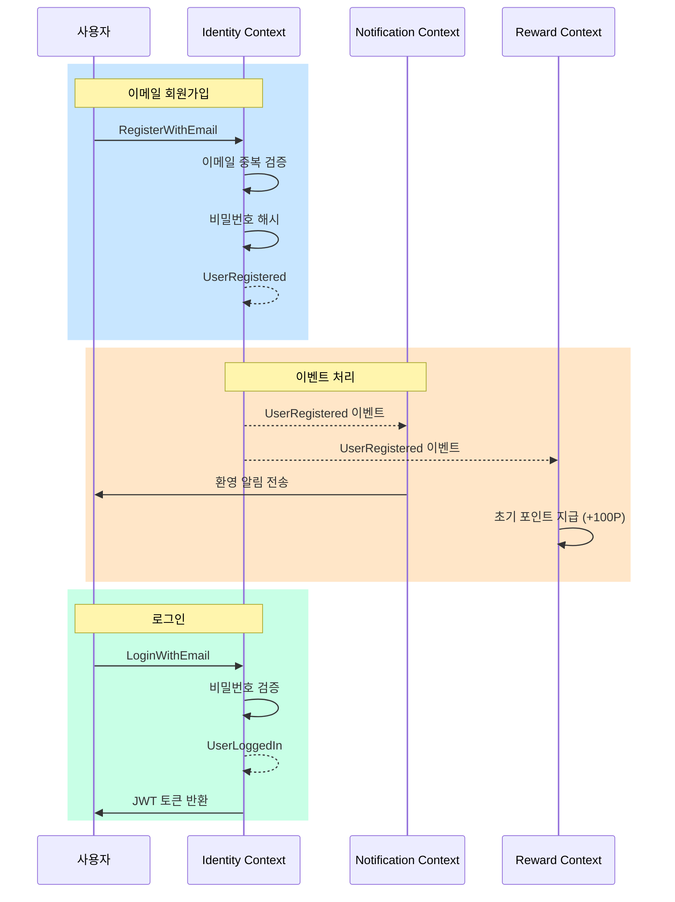
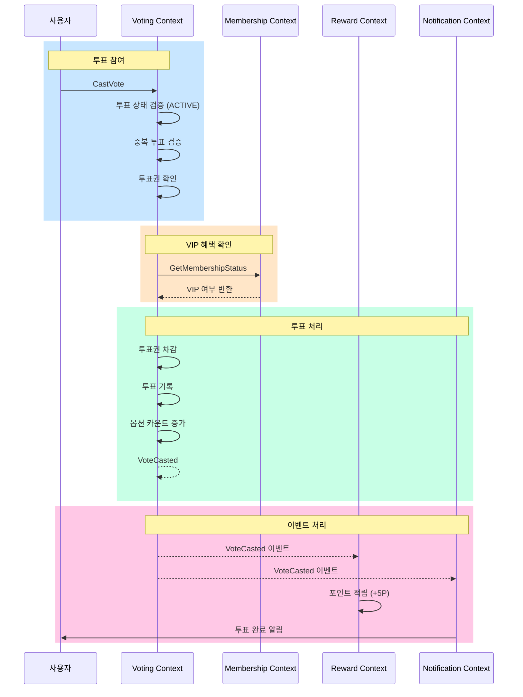
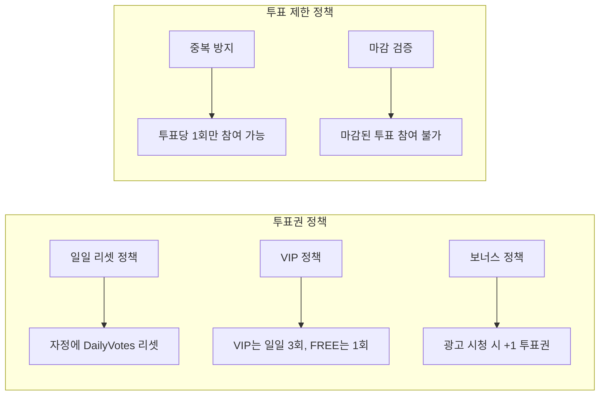
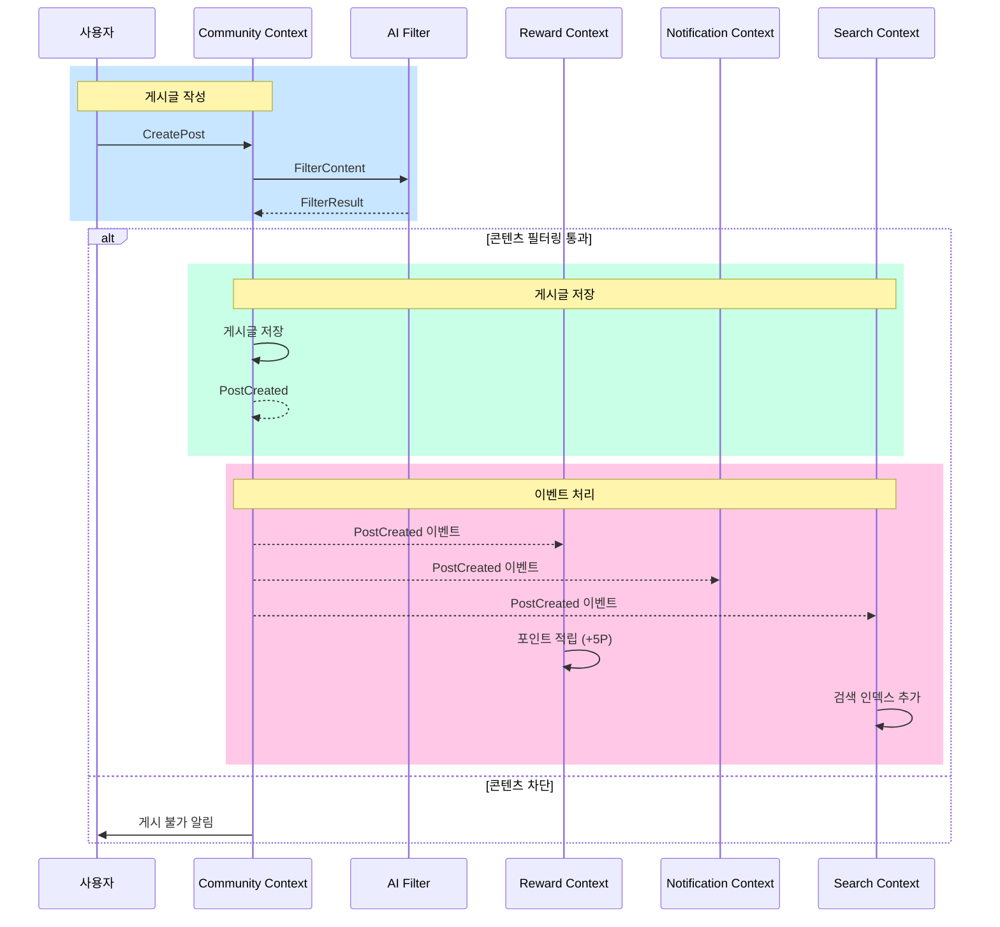
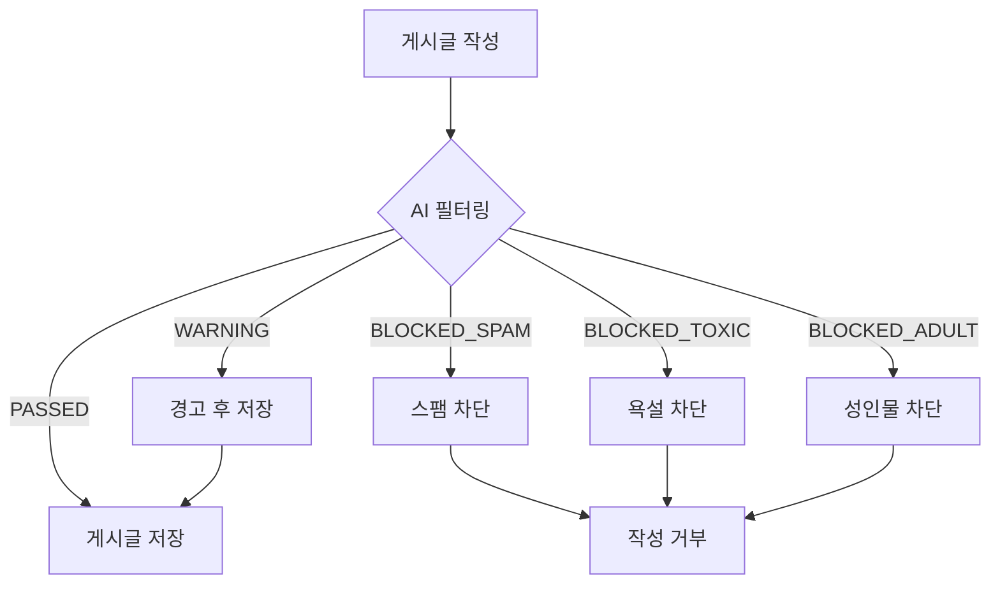
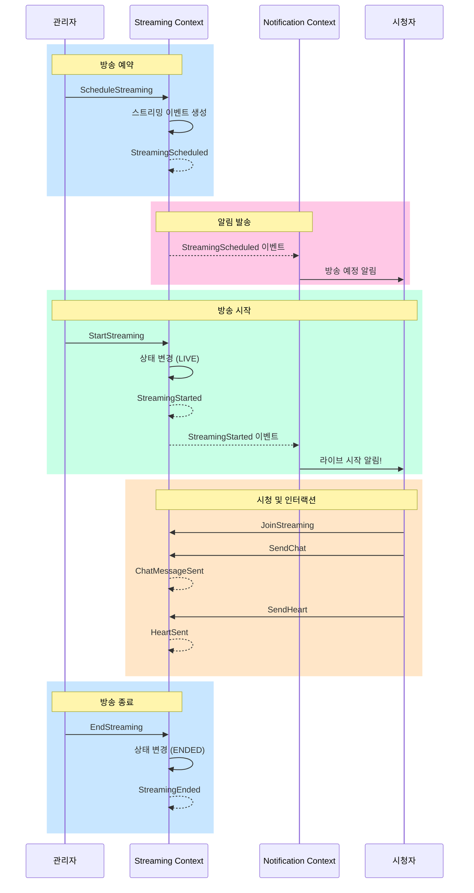
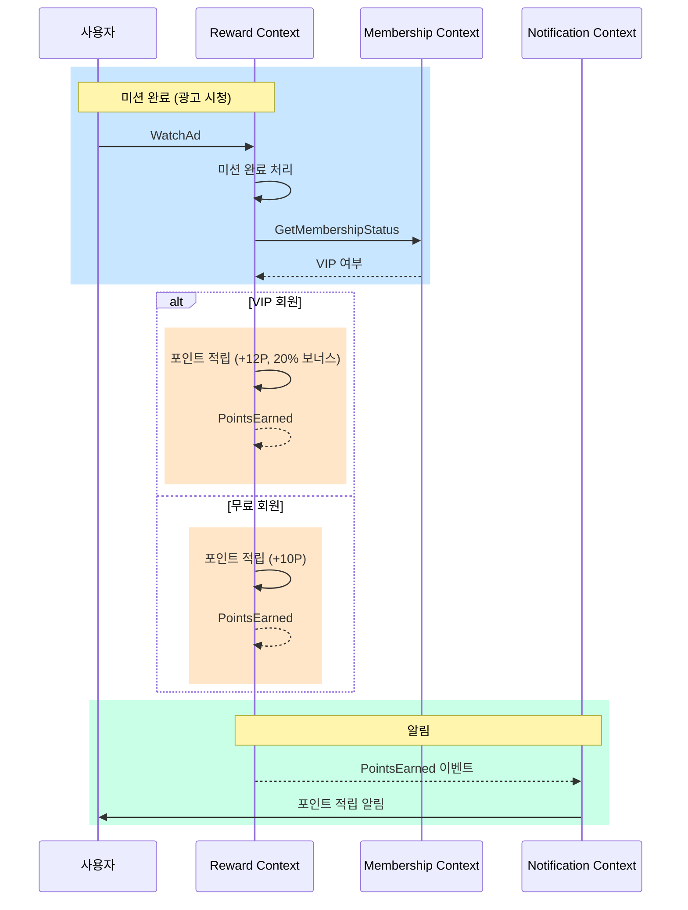
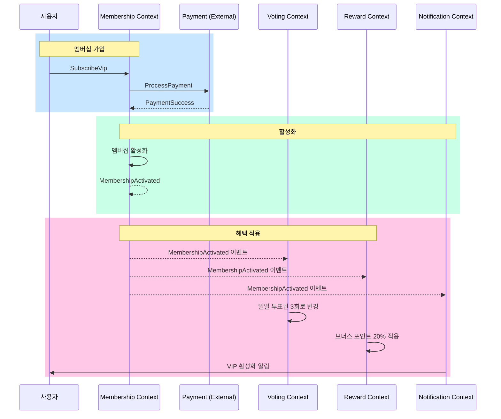

# FanPulse Event Storming 결과

## 프로젝트 정보

| 항목 | 내용 |
|------|------|
| **프로젝트명** | FanPulse |
| **작성일** | 2025-12-28 |
| **버전** | 1.0.0 |

---

## 1. Event Storming 개요

Event Storming은 도메인 이벤트를 중심으로 비즈니스 프로세스를 시각화하는 방법론입니다. 이 문서는 FanPulse의 주요 비즈니스 흐름을 이벤트 중심으로 정리합니다.

### 범례

| 색상 | 의미 |
|------|------|
| 주황색 | Domain Event (과거형) |
| 파란색 | Command (명령) |
| 노란색 | Aggregate |
| 분홍색 | External System |
| 보라색 | Policy (정책) |
| 초록색 | Read Model |

---

## 2. 사용자 가입 및 인증 흐름



### 이벤트 목록

| 이벤트 | 트리거 | 구독자 | 처리 |
|--------|--------|--------|------|
| UserRegistered | 회원가입 완료 | Notification, Reward | 환영 알림, 초기 포인트 |
| UserLoggedIn | 로그인 성공 | - | 세션 기록 |
| PasswordChanged | 비밀번호 변경 | Notification | 보안 알림 |
| UserDeleted | 회원 탈퇴 | All | 연관 데이터 정리 |

---

## 3. 투표 참여 흐름



### 투표 정책 (Policy)



### 이벤트 목록

| 이벤트 | 트리거 | 구독자 | 처리 |
|--------|--------|--------|------|
| VoteCasted | 투표 완료 | Reward, Notification | 포인트 적립, 알림 |
| PollCreated | 투표 생성 | Notification | 신규 투표 알림 |
| PollClosed | 투표 마감 | Notification | 결과 발표 알림 |
| BonusVotesAdded | 보너스 획득 | - | 투표권 추가 |
| DailyVotesReset | 자정 리셋 | - | 일일 투표권 초기화 |

---

## 4. 게시글 작성 흐름



### 콘텐츠 필터링 정책



### 이벤트 목록

| 이벤트 | 트리거 | 구독자 | 처리 |
|--------|--------|--------|------|
| PostCreated | 게시글 작성 | Reward, Notification, Search | 포인트, 알림, 인덱싱 |
| PostUpdated | 게시글 수정 | Search | 인덱스 업데이트 |
| PostDeleted | 게시글 삭제 | Search | 인덱스 삭제 |
| CommentCreated | 댓글 작성 | Reward, Notification | 포인트, 알림 |
| PostLiked | 좋아요 | Notification | 작성자에게 알림 |

---

## 5. 라이브 스트리밍 흐름



### 이벤트 목록

| 이벤트 | 트리거 | 구독자 | 처리 |
|--------|--------|--------|------|
| StreamingScheduled | 방송 예약 | Notification | 예정 알림 |
| StreamingStarted | 방송 시작 | Notification | 라이브 알림 |
| StreamingEnded | 방송 종료 | - | VOD 변환 (향후) |
| ChatMessageSent | 채팅 전송 | - | 실시간 브로드캐스트 |
| HeartSent | 하트 전송 | - | 하트 애니메이션 |

---

## 6. 포인트 적립/사용 흐름



### 포인트 적립 정책

| 활동 | 기본 포인트 | VIP 보너스 | 일일 한도 |
|------|------------|-----------|----------|
| 광고 시청 (30초) | +10P | +2P (20%) | 5회 |
| 설문 조사 | +50P | +10P (20%) | 3회 |
| 앱 설치 | +100P | +20P (20%) | 2회 |
| 일일 체크인 | +20P | +4P (20%) | 1회 |
| 게시글 작성 | +5P | +1P (20%) | 4회 (20P) |
| 댓글 작성 | +1P | - | 10회 (10P) |
| 투표 참여 | +5P | +1P (20%) | 무제한 |

### 이벤트 목록

| 이벤트 | 트리거 | 구독자 | 처리 |
|--------|--------|--------|------|
| PointsEarned | 포인트 적립 | Notification | 적립 알림 |
| PointsSpent | 포인트 사용 | Notification | 사용 알림 |
| RewardRedeemed | 리워드 교환 | Notification | 교환 완료 알림 |

---

## 7. VIP 멤버십 흐름



### VIP 혜택 정책

| 혜택 | 설명 |
|------|------|
| 투표권 증가 | 일일 투표권 1회 → 3회 |
| 포인트 보너스 | 모든 미션 포인트 +20% |
| 월간 보너스 | 매월 1,000P 추가 지급 |
| 독점 콘텐츠 | 비하인드 영상, 라이브 채팅 우선 답변 |
| 할인 혜택 | 굿즈/콘서트 10~20% 할인 |
| 우선 지원 | 고객센터 2시간 내 답변 |
| VIP 배지 | 커뮤니티 VIP 배지 표시 |

### 이벤트 목록

| 이벤트 | 트리거 | 구독자 | 처리 |
|--------|--------|--------|------|
| MembershipActivated | VIP 가입 | Voting, Reward, Notification | 혜택 적용 |
| MembershipRenewed | 갱신 성공 | Notification | 갱신 알림 |
| MembershipExpired | 만료 | Voting, Reward, Notification | 혜택 해제 |
| MembershipCancelled | 해지 | Notification | 해지 알림 |

---

## 8. 전체 이벤트 카탈로그

### Identity Context

| 이벤트 | 발행 조건 | 구독자 |
|--------|----------|--------|
| UserRegistered | 회원가입 완료 | Notification, Reward |
| UserLoggedIn | 로그인 성공 | - |
| UserLoggedOut | 로그아웃 | - |
| PasswordChanged | 비밀번호 변경 | Notification |
| OAuthAccountLinked | OAuth 연동 | - |
| UserDeleted | 회원 탈퇴 | All |
| SettingsUpdated | 설정 변경 | - |

### Voting Context

| 이벤트 | 발행 조건 | 구독자 |
|--------|----------|--------|
| PollCreated | 투표 생성 | Notification |
| PollClosed | 투표 마감 | Notification |
| VoteCasted | 투표 완료 | Reward, Notification |
| BonusVotesAdded | 보너스 획득 | - |
| DailyVotesReset | 자정 리셋 | - |

### Community Context

| 이벤트 | 발행 조건 | 구독자 |
|--------|----------|--------|
| PostCreated | 게시글 작성 | Reward, Notification, Search |
| PostUpdated | 게시글 수정 | Search |
| PostDeleted | 게시글 삭제 | Search |
| CommentCreated | 댓글 작성 | Reward, Notification |
| CommentDeleted | 댓글 삭제 | - |
| PostLiked | 게시글 좋아요 | Notification |
| PostUnliked | 좋아요 취소 | - |

### Streaming Context

| 이벤트 | 발행 조건 | 구독자 |
|--------|----------|--------|
| StreamingScheduled | 방송 예약 | Notification |
| StreamingStarted | 방송 시작 | Notification |
| StreamingEnded | 방송 종료 | - |
| ChatMessageSent | 채팅 전송 | - |
| HeartSent | 하트 전송 | - |

### Reward Context

| 이벤트 | 발행 조건 | 구독자 |
|--------|----------|--------|
| PointsEarned | 포인트 적립 | Notification |
| PointsSpent | 포인트 사용 | Notification |
| RewardRedeemed | 리워드 교환 | Notification |

### Membership Context

| 이벤트 | 발행 조건 | 구독자 |
|--------|----------|--------|
| MembershipActivated | VIP 가입 | Voting, Reward, Notification |
| MembershipRenewed | 갱신 성공 | Notification |
| MembershipExpired | 만료 | Voting, Reward, Notification |
| MembershipCancelled | 해지 | Notification |

---

## 9. 이벤트 인프라

### Kafka Topics

| Topic | 발행자 | 구독자 |
|-------|--------|--------|
| `fanpulse.identity.events` | Identity | Notification, Reward |
| `fanpulse.voting.events` | Voting | Notification, Reward |
| `fanpulse.community.events` | Community | Notification, Reward, Search |
| `fanpulse.streaming.events` | Streaming | Notification |
| `fanpulse.reward.events` | Reward | Notification |
| `fanpulse.membership.events` | Membership | Voting, Reward, Notification |

### 이벤트 스키마 표준

```kotlin
interface DomainEvent {
    val eventId: UUID
    val eventType: String
    val aggregateId: UUID
    val aggregateType: String
    val occurredAt: Instant
    val metadata: Map<String, Any>
}

data class EventEnvelope(
    val eventId: UUID,
    val eventType: String,
    val aggregateId: UUID,
    val aggregateType: String,
    val occurredAt: Instant,
    val payload: String, // JSON
    val metadata: Map<String, Any>
)
```

---

## 변경 이력

| 버전 | 날짜 | 변경 내용 | 작성자 |
|------|------|----------|--------|
| 1.0.0 | 2025-12-28 | 최초 작성 - 주요 비즈니스 흐름 정리 | 정지원 |
