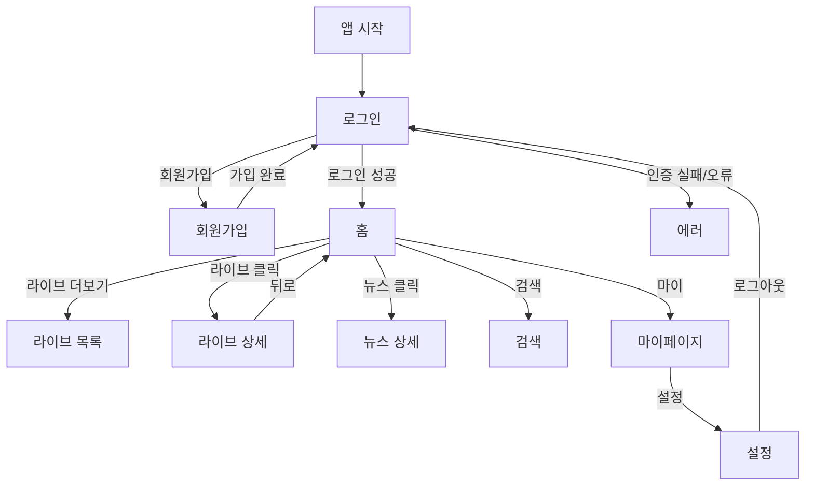

# 📱 FanPulse MVP 화면 정의서 (4주)

> 원본 전체 문서: `화면_정의서.md`  
> 본 문서는 **MVP(4주)** 범위만 발췌/축약합니다.

---

## 1. 화면 목록(MVP)

| 화면 ID | 화면명           | 경로           | 설명                           |
| ------ | ---------------- | -------------- | ------------------------------ |
| H001   | 메인(홈)         | `/`            | Live/News 요약 카드            |
| H002   | 로그인           | `/login`       | 이메일/비밀번호 로그인         |
| H002-1 | 회원가입         | `/login`       | 이메일 기반 회원가입           |
| H010   | 설정             | `/settings`    | 로그아웃/앱 정보(최소)         |
| H006   | 라이브 & 이벤트  | `/live`        | 라이브 목록/상태/썸네일         |
| H011   | 뉴스 상세        | `/news-detail` | 뉴스 상세 보기                 |
| H016   | 마이페이지       | `/mypage`      | 프로필 요약 + 메뉴(최소)       |
| H018   | 검색             | `/search`      | Live/News 통합 검색            |
| H019   | 라이브 상세      | `/live-detail` | 임베드 플레이어로 라이브 시청  |
| H024   | 에러 페이지      | `/error`       | 오류 안내(네트워크/권한/404 등) |

---

## 2. 주요 플로우(MVP)

---

## 3. 화면 정의(요약)

### 3.1 로그인 (H002)
- 이메일/비밀번호 입력 + 로그인
- 회원가입 탭으로 전환(H002-1)
- 실패 시 에러 안내(H024 또는 인라인 에러)

### 3.2 회원가입 (H002-1)
- 이메일/비밀번호/비밀번호 확인
- 약관 동의(필수 1개만으로 최소화 권장)

### 3.3 라이브 & 이벤트 (H006)
- 라이브 목록: 썸네일/제목/아티스트/상태(LIVE/SCHEDULED/ENDED)
- Pull-to-refresh(모바일) / 새로고침(Web)
- 탭/필터는 다음(최소 정렬 1개만)

### 3.4 라이브 상세 (H019)
- 임베드 플레이어(YouTube 등) + 메타데이터
- 채팅/하트 등 인터랙션은 MVP 제외

### 3.5 홈 (H001)
- Live Now/Upcoming 요약 카드(라이브로 이동)
- 최신 뉴스 요약 카드(상세로 이동)

### 3.6 검색 (H018)
- Live/News 통합 검색(최소: 제목/아티스트명 기준)
- 최근 검색어는 로컬 저장

### 3.7 마이페이지/설정 (H016/H010)
- 프로필 요약 + 로그아웃
- 테마/앱 정보는 선택(로컬 저장)
