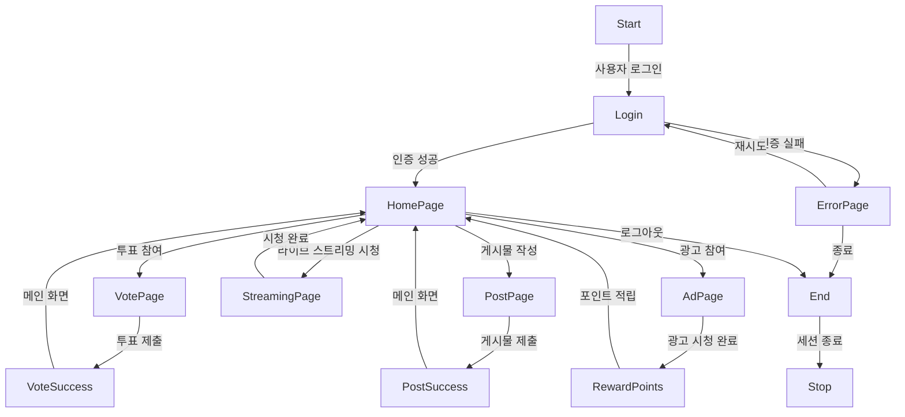
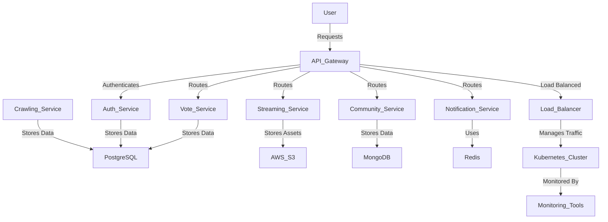

# 😊 FanPulse 프로젝트 기획서

## 1. 프로젝트 개요

**FanPulse**는 글로벌 K-POP 팬들을 위한 인터랙티브 플랫폼으로, 팬들은 방송 이벤트, 콘서트, 투표, 광고 참여 등의 기능을 활용할 수 있습니다.

## 2. 핵심 기능

### 2.1 팬 커뮤니티 & 소셜 피드

-   아티스트별 팬 페이지 개설
-   팬들이 게시물을 공유하고 댓글, 좋아요, 공유 가능
-   AI 기반 콘텐츠 추천 및 자동 필터링

### 2.2 방송 & 콘서트 연계 기능

-   **라이브 스트리밍**: YouTube Live, Weverse Live 등 외부 스트리밍 URL 임베드 지원 (자체 스트리밍 서버 운영 없음)
-   콘서트 티켓 예매 정보 제공 및 외부 예매 사이트 연결

### 2.3 팬 참여형 투표 시스템

-   글로벌 팬들이 참여할 수 있는 투표 기능
-   투표 랭킹 시스템 (예: 인기상, 주간 랭킹 등)
-   투표 중복 방지 및 결과 투명성 보장

### 2.4 광고 및 수익화 기능

-   팬들이 광고를 시청하면 포인트 적립 후 굿즈 구매 가능
-   광고 참여형 이벤트 (예: 특정 브랜드 협찬 투표)

### 2.5 팬덤 멤버십

-   VIP 멤버십 도입 (구독형 모델)
-   특별한 콘텐츠 제공 (비하인드 영상, 굿즈 할인 등)

## 3. 사용자 플로우

## 4. 기술 스택

### 4.1 백엔드 기술 스택

| 구성 요소       | 사용 기술                               |
| --------------- | --------------------------------------- |
| 프로그래밍 언어 | Kotlin                                  |
| 프레임워크      | Spring Boot                             |
| API Gateway     | Spring Cloud Gateway / Kong API Gateway |
| 인증 & 보안     | OAuth 2.0 / JWT                         |
| 데이터베이스    | PostgreSQL + Hibernate                  |
| NoSQL           | MongoDB                                 |
| 캐시 & 메시징   | Redis / Kafka                           |
| 파일 스토리지   | AWS S3                                  |
| 검색 엔진       | Elasticsearch                           |

### 4.2 프론트엔드 기술 스택

#### Android

| 구성 요소     | 사용 기술                        |
| ------------- | -------------------------------- |
| 플랫폼        | Android                          |
| UI 프레임워크 | Jetpack Compose                  |
| 상태 관리     | ViewModel + LiveData             |
| 네트워크      | Retrofit / OkHttp                |
| 인증          | Firebase Authentication / OAuth2 |
| 데이터 저장소 | Room Database / DataStore        |

#### iOS

| 구성 요소     | 사용 기술                           |
| ------------- | ----------------------------------- |
| 플랫폼        | iOS                                 |
| UI 프레임워크 | UIKit                               |
| 상태 관리     | MVVM + InOut 패턴                   |
| 네트워크      | Alamofire                           |
| 인증          | Google OAuth2                       |
| 데이터 저장소 | SwiftData / UserDefaults / Keychain |

### 4.3 인프라 및 운영

| 구성 요소      | 사용 기술                        |
| -------------- | -------------------------------- |
| 서버 배포 방식 | Docker + Kubernetes (AWS EKS)    |
| CI/CD          | GitHub Actions / ArgoCD          |
| 로드 밸런싱    | AWS ALB / Nginx                  |
| 모니터링       | Prometheus + Grafana / ELK Stack |
| 에러 트래킹    | Sentry / AWS CloudWatch          |
| CDN            | AWS CloudFront                   |
| 서비스 메시    | Istio / Linkerd                  |

> **비고**: 크롤링(Web Crawling & Data Pipeline)은 메인 백엔드와 분리된 워커/서비스(예: Python 기반 크롤러 + 스케줄러)로 운영할 수 있으며, 수집 데이터는 PostgreSQL의 `crawled_*` 테이블에 적재합니다.

## 5. 백엔드 아키텍처

## 6. 대규모 트래픽 대응 방안

-   ✅ **로드 밸런싱**: AWS Application Load Balancer (ALB) 활용
-   ✅ **데이터 캐싱**: Redis + CDN (CloudFront) 적용
-   ✅ **비동기 이벤트 처리**: Kafka 기반 이벤트 드리븐 아키텍처
-   ✅ **마이크로서비스 분리**: Vote Service, Streaming Service 등 독립 서비스 운영
-   ✅ **오토 스케일링**: Kubernetes HPA 적용

## 7. AI 기능

### 7.1 뉴스 자동 요약
-   크롤링된 뉴스 기사를 Mistral 계열 LLM(내부 배포)로 요약
-   활용 화면: H001 (메인 화면), H011 (뉴스 상세 페이지)

### 7.2 게시글/댓글 자동 필터링
-   욕설, 스팸, 부적절한 콘텐츠 자동 감지 및 필터링
-   텍스트 분류 모델 활용 (Tensorflow / PyTorch 기반)
-   활용 화면: H003 (팬 커뮤니티), H012 (상세 게시글)

### 7.3 콘텐츠 추천
-   사용자 활동 기반 협업 필터링 (Collaborative Filtering)
-   관심 아티스트, 조회/좋아요 이력 분석
-   활용 화면: H001 (메인 화면), H003 (팬 커뮤니티)

---

이 프로젝트는 Kotlin Spring Boot 백엔드와 Jetpack Compose 기반 Android 프론트엔드로 대규모 트래픽을 효율적으로 처리할 수 있는 구조로 설계되었습니다.

---

## 변경 이력

| 버전  | 날짜       | 변경 내용                                                                                    | 작성자 |
| ----- | ---------- | ------------------------------------------------------------------------------------------------ | ------ |
| 1.0.0 | 2024-12-27 | 프로젝트 기획서 초안                                                                          | 정지원 |
| 1.1.0 | 2025-12-28 | 라이브 스트리밍 아키텍처 확정 - YouTube/Weverse Live 외부 임베드 방식으로 최종 결정 - AWS Media Services 기술 스택에서 제거 | 정지원 |
