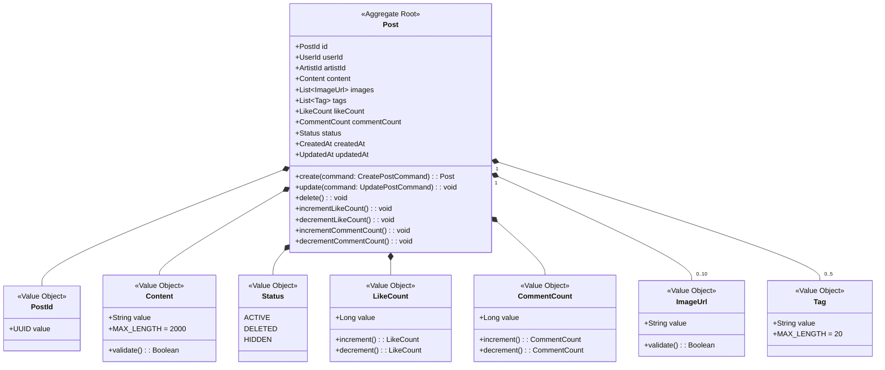
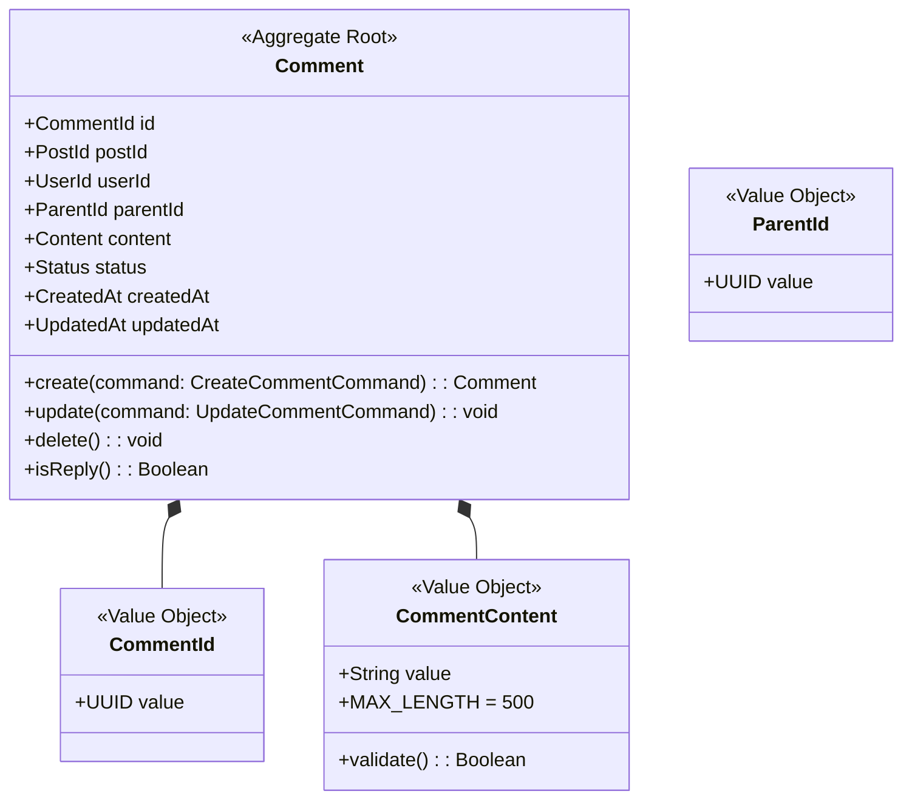
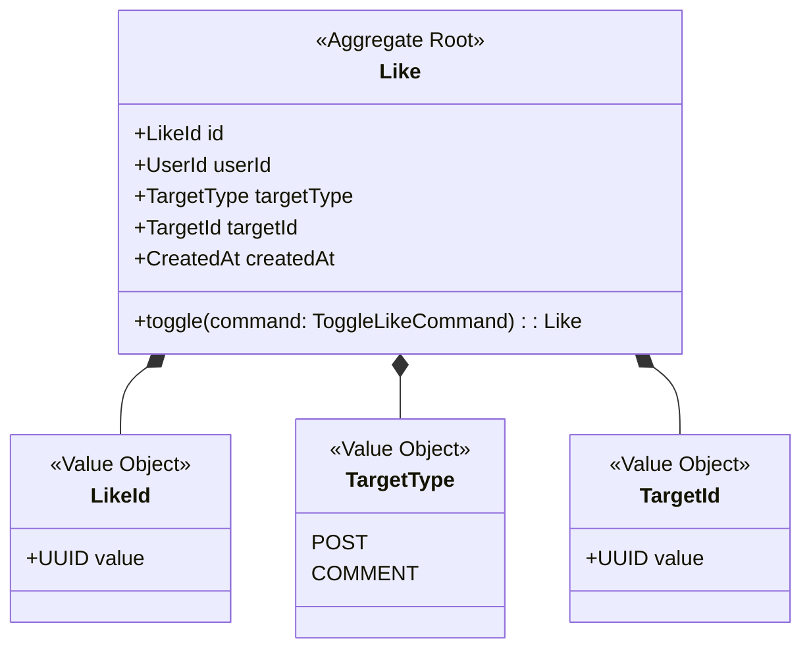

# Community Context 정의서

## Context 정보

| 항목 | 내용 |
|------|------|
| **Context명** | 커뮤니티 |
| **영문명** | Community |
| **도메인 분류** | Core |
| **담당 팀** | Backend Team |
| **작성일** | 2025-12-28 |

## 개요

Community Context는 FanPulse의 팬 커뮤니티 기능을 담당합니다. 아티스트별 팬 페이지에서 게시글과 댓글을 작성하고, 좋아요와 공유를 통해 소통합니다. AI 기반 콘텐츠 필터링으로 부적절한 게시물을 자동으로 감지하고 관리합니다.

## 핵심 책임

1. **게시글 관리**: 게시글 CRUD, 이미지/태그 관리
2. **댓글 관리**: 댓글/대댓글 CRUD
3. **소셜 인터랙션**: 좋아요, 북마크, 공유
4. **콘텐츠 필터링**: AI 기반 부적절 콘텐츠 감지
5. **아티스트별 필터링**: 팬 페이지 기반 콘텐츠 분류

## Ubiquitous Language

| 한글 | 영문 | 정의 |
|------|------|------|
| 게시글 | Post | 팬이 작성한 커뮤니티 게시물 |
| 댓글 | Comment | 게시글에 대한 의견 |
| 대댓글 | Reply | 댓글에 대한 답글 |
| 좋아요 | Like | 게시글/댓글에 대한 호감 표시 |
| 팬 페이지 | FanPage | 특정 아티스트 전용 커뮤니티 공간 |
| 북마크 | Bookmark | 게시글을 저장하는 기능 |

## Aggregate 목록

| Aggregate | 설명 | Root Entity |
|-----------|------|-------------|
| Post | 게시글 및 이미지/태그 관리 | Post |
| Comment | 댓글 및 대댓글 관리 | Comment |
| Like | 좋아요 기록 관리 | Like |

---

## Aggregate 상세

### Post Aggregate



**불변식 (Invariants)**:
1. 게시글 내용은 1~2000자 사이여야 한다
2. 이미지는 최대 10개까지 첨부 가능
3. 태그는 최대 5개, 각 태그는 20자 이하
4. 삭제된 게시글은 수정 불가
5. 좋아요/댓글 카운트는 음수가 될 수 없음

**핵심 행위**:
- `create()`: 게시글 생성, PostCreated 이벤트 발행
- `update()`: 게시글 수정, PostUpdated 이벤트 발행
- `delete()`: 게시글 삭제 (소프트 삭제)
- `incrementLikeCount()`: 좋아요 수 증가
- `incrementCommentCount()`: 댓글 수 증가

---

### Comment Aggregate



**불변식 (Invariants)**:
1. 댓글 내용은 1~500자 사이여야 한다
2. 대댓글은 최대 1단계까지만 (대대댓글 불가)
3. 삭제된 게시글에는 댓글 작성 불가
4. 삭제된 댓글은 수정 불가

**핵심 행위**:
- `create()`: 댓글 생성, CommentCreated 이벤트 발행
- `update()`: 댓글 수정
- `delete()`: 댓글 삭제 (소프트 삭제)
- `isReply()`: 대댓글 여부 확인

---

### Like Aggregate



**불변식 (Invariants)**:
1. 동일 타겟에 같은 사용자가 중복 좋아요 불가
2. 삭제된 게시글/댓글에는 좋아요 불가

**핵심 행위**:
- `toggle()`: 좋아요 추가/취소, PostLiked/CommentLiked 이벤트 발행

---

## Domain Events

| 이벤트명 | 설명 | Aggregate |
|---------|------|-----------|
| PostCreated | 게시글 생성 | Post |
| PostUpdated | 게시글 수정 | Post |
| PostDeleted | 게시글 삭제 | Post |
| CommentCreated | 댓글 생성 | Comment |
| CommentDeleted | 댓글 삭제 | Comment |
| PostLiked | 게시글 좋아요 | Like |
| PostUnliked | 게시글 좋아요 취소 | Like |
| CommentLiked | 댓글 좋아요 | Like |

### 이벤트 스키마

```kotlin
data class PostCreated(
    val postId: UUID,
    val userId: UUID,
    val artistId: UUID,
    val content: String,
    val imageCount: Int,
    val occurredAt: Instant
) : DomainEvent

data class CommentCreated(
    val commentId: UUID,
    val postId: UUID,
    val userId: UUID,
    val parentId: UUID?,
    val isReply: Boolean,
    val occurredAt: Instant
) : DomainEvent

data class PostLiked(
    val likeId: UUID,
    val postId: UUID,
    val userId: UUID,
    val postOwnerId: UUID,
    val occurredAt: Instant
) : DomainEvent
```

## 외부 의존성

### Upstream (이 Context가 의존하는)

| Context | 관계 패턴 | 설명 |
|---------|----------|------|
| Identity | OHS/PL | 사용자 인증 및 정보 조회 |
| Content | PL | 아티스트 정보 조회 (artistId 검증) |

### Downstream (이 Context에 의존하는)

| Context | 관계 패턴 | 설명 |
|---------|----------|------|
| Reward | Event | PostCreated, CommentCreated → 포인트 적립 |
| Notification | Event | PostLiked, CommentCreated → 알림 전송 |
| Search | ACL | 게시글 검색 인덱싱 |

## 기술 스택

- **언어/프레임워크**: Kotlin / Spring Boot
- **데이터베이스**: MongoDB (게시글, 댓글)
- **캐시**: Redis (좋아요 수, 인기 게시글)
- **메시징**: Kafka (이벤트 발행)
- **AI**: TensorFlow (콘텐츠 필터링)

## API 경계

### 제공 API (Published)

| 엔드포인트 | 메서드 | 설명 |
|-----------|--------|------|
| `/api/v1/posts` | GET | 게시글 목록 조회 |
| `/api/v1/posts` | POST | 게시글 작성 |
| `/api/v1/posts/{id}` | GET | 게시글 상세 조회 |
| `/api/v1/posts/{id}` | PATCH | 게시글 수정 |
| `/api/v1/posts/{id}` | DELETE | 게시글 삭제 |
| `/api/v1/posts/{id}/comments` | GET | 댓글 목록 조회 |
| `/api/v1/posts/{id}/comments` | POST | 댓글 작성 |
| `/api/v1/comments/{id}` | PATCH | 댓글 수정 |
| `/api/v1/comments/{id}` | DELETE | 댓글 삭제 |
| `/api/v1/posts/{id}/like` | POST | 게시글 좋아요 토글 |
| `/api/v1/comments/{id}/like` | POST | 댓글 좋아요 토글 |

### Query Parameters

| 파라미터 | 설명 | 예시 |
|---------|------|------|
| `artistId` | 아티스트별 필터링 | `?artistId=uuid` |
| `sort` | 정렬 (latest, popular, following) | `?sort=popular` |
| `cursor` | 페이지네이션 커서 | `?cursor=abc123` |
| `limit` | 조회 개수 | `?limit=20` |

## Domain Service

### ContentFilterService

AI 기반 콘텐츠 필터링 서비스

```kotlin
class ContentFilterService(
    private val aiFilterClient: AiFilterClient
) {
    fun filter(content: String): FilterResult {
        val analysis = aiFilterClient.analyze(content)

        return when {
            analysis.spamScore > 0.9 -> FilterResult.BLOCKED_SPAM
            analysis.toxicityScore > 0.8 -> FilterResult.BLOCKED_TOXIC
            analysis.adultScore > 0.7 -> FilterResult.BLOCKED_ADULT
            analysis.toxicityScore > 0.5 -> FilterResult.WARNING
            else -> FilterResult.PASSED
        }
    }
}

enum class FilterResult {
    PASSED,
    WARNING,
    BLOCKED_SPAM,
    BLOCKED_TOXIC,
    BLOCKED_ADULT
}
```

## MongoDB 스키마

### posts 컬렉션

```json
{
  "_id": ObjectId,
  "post_id": "UUID",
  "user_id": "UUID",
  "artist_id": "UUID",
  "content": "String",
  "images": ["String"],
  "tags": ["String"],
  "like_count": Long,
  "comment_count": Long,
  "status": "ACTIVE|DELETED|HIDDEN",
  "created_at": ISODate,
  "updated_at": ISODate
}
```

### 인덱스

```javascript
db.posts.createIndex({ "post_id": 1 }, { unique: true })
db.posts.createIndex({ "user_id": 1, "created_at": -1 })
db.posts.createIndex({ "artist_id": 1, "created_at": -1 })
db.posts.createIndex({ "tags": 1 })
db.posts.createIndex({ "like_count": -1 })
```

## 변경 이력

| 버전 | 날짜 | 변경 내용 |
|------|------|----------|
| 1.0.0 | 2025-12-28 | 최초 작성 |
