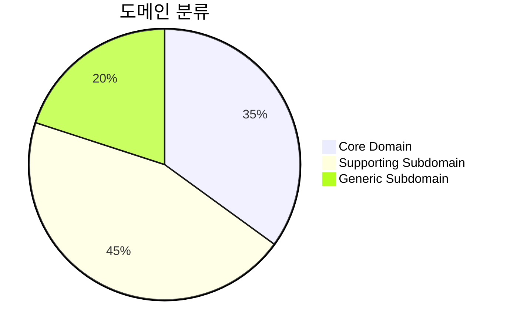
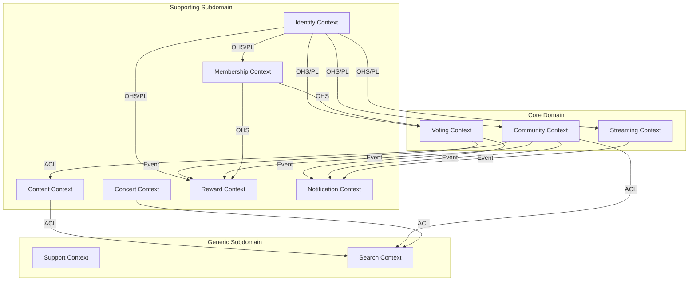
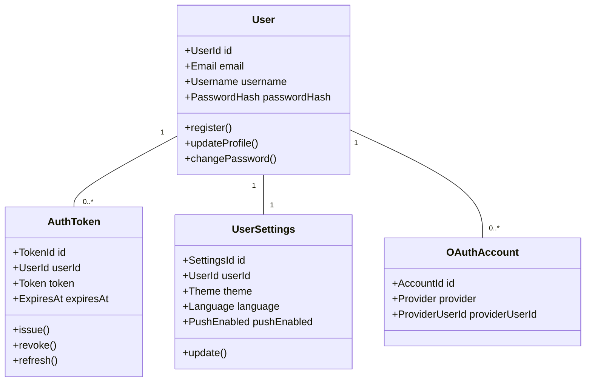
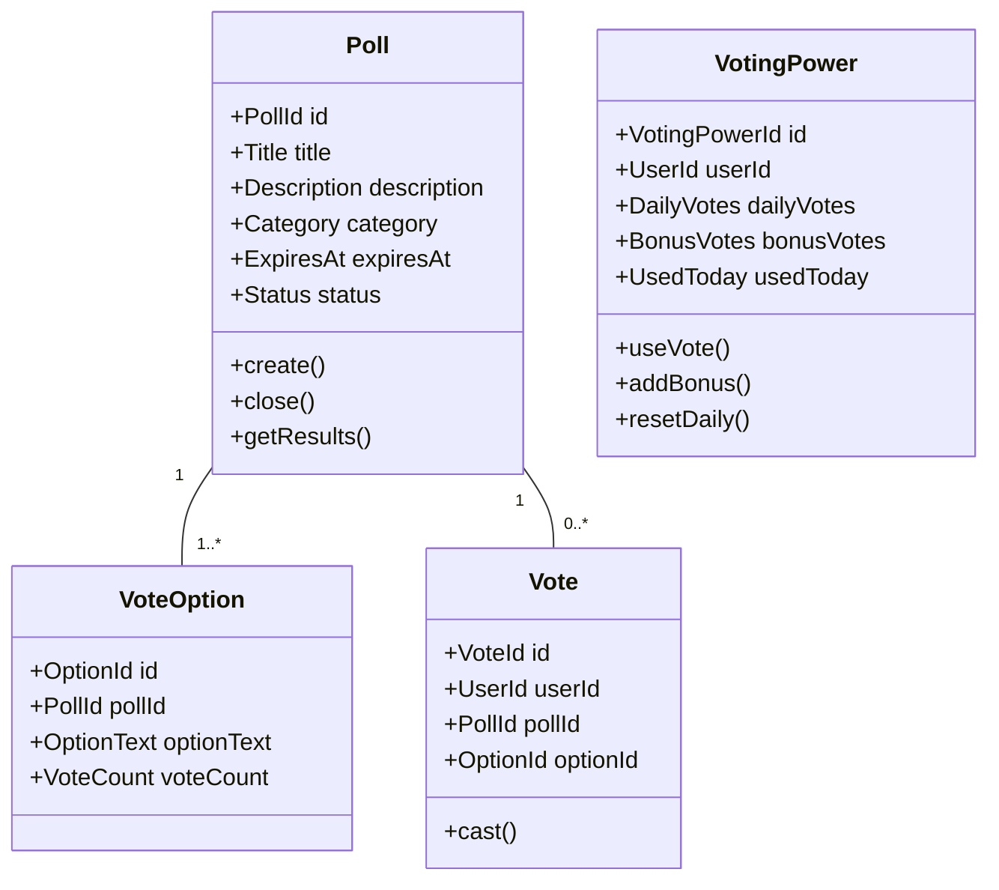
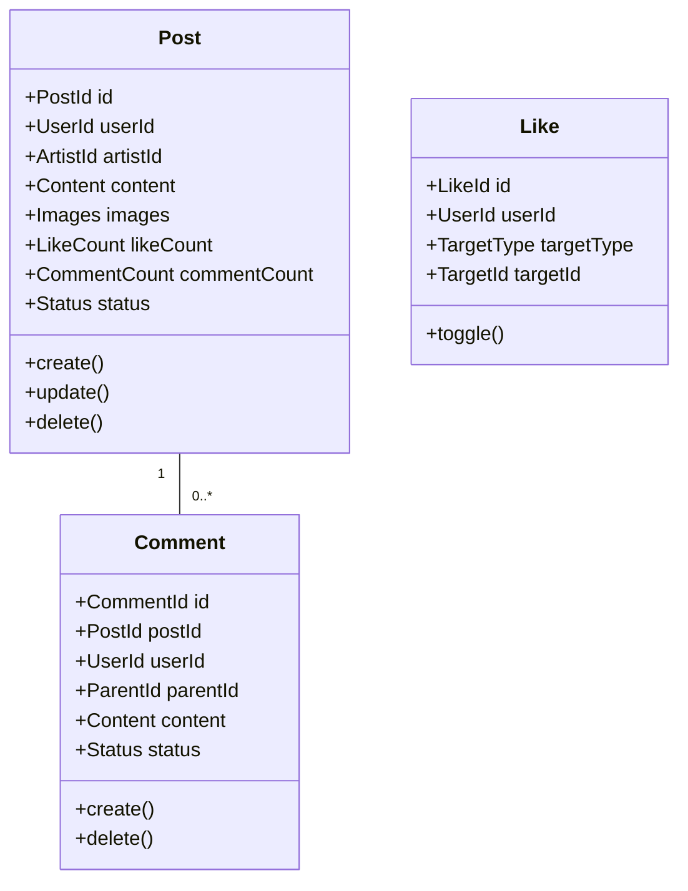
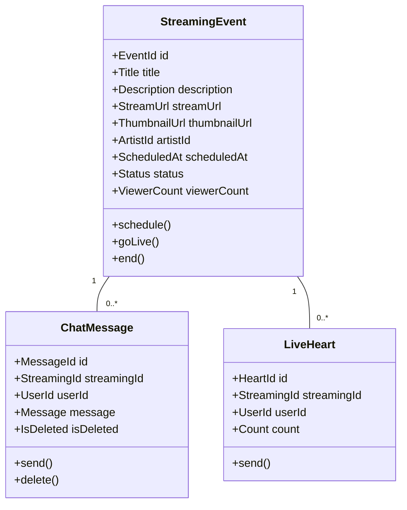
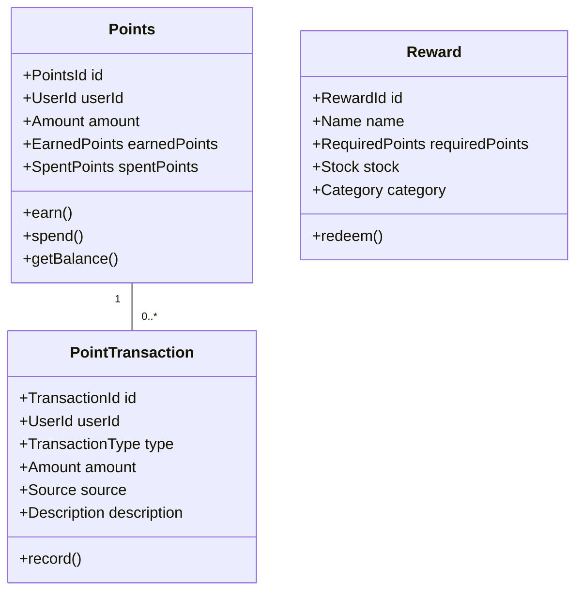
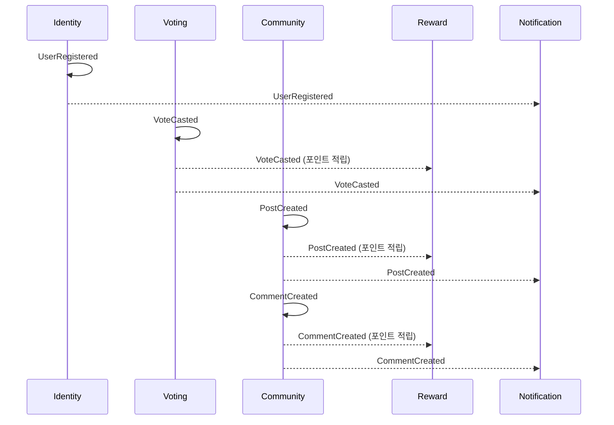

# FanPulse 도메인 모델 문서

## 프로젝트 정보

| 항목 | 내용 |
|------|------|
| **프로젝트** | FanPulse |
| **작성일** | 2025-12-28 |
| **버전** | 1.0.0 |

---

## 1. 도메인 개요

### 비즈니스 목표

FanPulse는 글로벌 K-POP 팬들을 위한 인터랙티브 플랫폼으로, 팬들이 아티스트와 더 가깝게 소통하고 다양한 팬 활동에 참여할 수 있는 통합 경험을 제공합니다.

### 핵심 기능

1. **팬 참여형 투표 시스템**: 글로벌 팬들이 참여하는 실시간 투표 및 랭킹
2. **팬 커뮤니티**: 아티스트별 팬 페이지에서 게시물 공유 및 소통
3. **라이브 스트리밍**: 실시간 방송 시청 및 채팅 참여
4. **콘텐츠 허브**: K-POP 뉴스, 차트 순위, 콘서트 일정 통합 제공
5. **리워드 시스템**: 광고 참여로 포인트 적립 및 굿즈 교환
6. **VIP 멤버십**: 프리미엄 혜택 및 독점 콘텐츠 제공

---

## 2. 도메인 분류

### Core Domain

| 도메인 | 설명 | 우선순위 |
|--------|------|---------|
| Voting (투표) | 팬 참여형 투표 시스템, 투표권 관리, 실시간 랭킹 | 높음 |
| Community (커뮤니티) | 아티스트별 팬 페이지, 게시글/댓글, AI 필터링 | 높음 |
| Streaming (스트리밍) | 라이브 방송, 실시간 채팅, 하트 보내기 | 높음 |

### Supporting Subdomain

| 도메인 | 설명 | 우선순위 |
|--------|------|---------|
| Identity (인증) | 회원가입, 로그인, OAuth, 사용자 설정 | 중간 |
| Content (콘텐츠) | 뉴스, 차트 순위, 아티스트 정보 | 중간 |
| Concert (콘서트) | 콘서트 일정, 티켓 예매 | 중간 |
| Reward (리워드) | 포인트 적립/사용, 광고 참여, 굿즈 교환 | 중간 |
| Membership (멤버십) | VIP 구독, 혜택 관리 | 중간 |
| Notification (알림) | 푸시 알림, 알림 관리 | 중간 |

### Generic Subdomain

| 도메인 | 설명 | 전략 |
|--------|------|------|
| Support (고객지원) | FAQ, 1:1 문의, 공지사항 | 자체 구현 (단순) |
| Search (검색) | 통합 검색, 검색 기록 | Elasticsearch 활용 |

---

## 3. Bounded Context

### Context Map

### Context 상세

| Context | 분류 | 핵심 책임 | Aggregates |
|---------|------|----------|------------|
| Identity | Supporting | 사용자 인증, 세션 관리, 사용자 설정 | User, AuthToken, UserSettings |
| Voting | Core | 투표 생성/참여, 투표권 관리, 랭킹 | Poll, VotingPower, Vote |
| Community | Core | 게시글/댓글 관리, 좋아요, AI 필터링 | Post, Comment, Like |
| Streaming | Core | 라이브 이벤트 관리, 채팅, 하트 | StreamingEvent, ChatMessage, Heart |
| Content | Supporting | 뉴스/차트/아티스트 정보 관리 | News, Chart, Artist |
| Concert | Supporting | 콘서트 일정 관리, 티켓 예매 | Concert, TicketReservation |
| Reward | Supporting | 포인트 적립/사용, 굿즈 교환 | Points, PointTransaction, Reward |
| Membership | Supporting | VIP 구독, 혜택 관리 | Membership, Subscription |
| Notification | Supporting | 알림 생성/전송, 읽음 처리 | Notification |
| Support | Generic | FAQ, 문의, 공지사항 관리 | SupportTicket, FAQ, Notice |
| Search | Generic | 통합 검색, 검색 기록 | SearchHistory |

---

## 4. Aggregate 모델

### Identity Context

### Voting Context

### Community Context

### Streaming Context

### Reward Context

---

## 5. Domain Events

### 이벤트 흐름

### 이벤트 목록

| 이벤트 | Context | Aggregate | 구독자 | 용도 |
|--------|---------|-----------|--------|------|
| UserRegistered | Identity | User | Notification, Reward | 환영 알림, 초기 포인트 지급 |
| UserLoggedIn | Identity | AuthToken | - | 로그인 기록 |
| VoteCasted | Voting | Vote | Reward, Notification | 포인트 적립, 투표 알림 |
| PollClosed | Voting | Poll | Notification | 결과 알림 |
| PostCreated | Community | Post | Reward, Notification | 포인트 적립, 알림 |
| CommentCreated | Community | Comment | Reward, Notification | 포인트 적립, 알림 |
| PostLiked | Community | Like | Notification | 좋아요 알림 |
| StreamingStarted | Streaming | StreamingEvent | Notification | 라이브 시작 알림 |
| StreamingEnded | Streaming | StreamingEvent | - | 라이브 종료 처리 |
| PointsEarned | Reward | Points | Notification | 포인트 적립 알림 |
| RewardRedeemed | Reward | Reward | Notification | 교환 완료 알림 |
| MembershipActivated | Membership | Membership | Voting, Reward | VIP 혜택 적용 |
| MembershipExpired | Membership | Membership | Notification | 만료 알림 |

---

## 6. Ubiquitous Language 요약

### Identity Context

| 용어 | 영문 | 정의 |
|------|------|------|
| 사용자 | User | 서비스에 가입한 회원 |
| 인증 토큰 | Auth Token | 사용자 세션을 유지하기 위한 JWT 토큰 |
| OAuth 계정 | OAuth Account | 소셜 로그인으로 연동된 외부 계정 |
| 사용자 설정 | User Settings | 테마, 언어, 알림 등 개인화 설정 |

### Voting Context

| 용어 | 영문 | 정의 |
|------|------|------|
| 투표 | Poll | 팬들이 참여할 수 있는 투표 이벤트 |
| 투표 옵션 | Vote Option | 투표에서 선택 가능한 후보 항목 |
| 투표권 | Voting Power | 사용자가 보유한 투표 가능 횟수 |
| 일일 투표권 | Daily Votes | 매일 리셋되는 기본 투표권 (FREE: 1, VIP: 3) |
| 보너스 투표권 | Bonus Votes | 광고 시청 등으로 획득한 추가 투표권 |

### Community Context

| 용어 | 영문 | 정의 |
|------|------|------|
| 게시글 | Post | 팬이 작성한 커뮤니티 게시물 |
| 댓글 | Comment | 게시글에 대한 의견 |
| 대댓글 | Reply | 댓글에 대한 답글 |
| 좋아요 | Like | 게시글/댓글에 대한 호감 표시 |
| 팬 페이지 | Fan Page | 특정 아티스트 전용 커뮤니티 공간 |

### Reward Context

| 용어 | 영문 | 정의 |
|------|------|------|
| 포인트 | Points | 활동으로 적립되는 서비스 내 재화 |
| 포인트 거래 | Point Transaction | 포인트 적립/사용 기록 |
| 리워드 | Reward | 포인트로 교환 가능한 상품 |
| 미션 | Mission | 포인트를 획득할 수 있는 활동 |

---

## 7. 통합 패턴

| Upstream | Downstream | 패턴 | 통신 방식 |
|----------|------------|------|----------|
| Identity | Voting | OHS/PL | REST API |
| Identity | Community | OHS/PL | REST API |
| Identity | Streaming | OHS/PL | REST API |
| Identity | Reward | OHS/PL | REST API |
| Voting | Notification | Event (Kafka) | Async |
| Voting | Reward | Event (Kafka) | Async |
| Community | Notification | Event (Kafka) | Async |
| Community | Reward | Event (Kafka) | Async |
| Membership | Voting | OHS/PL | REST API |
| Membership | Reward | OHS/PL | REST API |
| Content | Search | ACL | Elasticsearch |

---

## 8. 기술 매핑

| Bounded Context | 서비스 | 데이터베이스 | 메시징 |
|-----------------|--------|-------------|--------|
| Identity | Auth Service | PostgreSQL | - |
| Voting | Vote Service | PostgreSQL | Kafka |
| Community | Community Service | MongoDB | Kafka |
| Streaming | Streaming Service | PostgreSQL | Kafka, WebSocket |
| Content | Content Service | PostgreSQL | - |
| Concert | Concert Service | PostgreSQL | - |
| Reward | Reward Service | PostgreSQL | Kafka |
| Membership | Membership Service | PostgreSQL | Kafka |
| Notification | Notification Service | Redis | Kafka, FCM |
| Support | Support Service | PostgreSQL | - |
| Search | Search Service | Elasticsearch | - |

---

## 9. 관련 문서

- [Context Map](./context-map.md)
- [Ubiquitous Language 용어집](./ubiquitous-language.md)
- [Event Storming 결과](./event-storming.md)
- Bounded Context 정의서
  - [Identity Context](./bounded-contexts/identity.md)
  - [Voting Context](./bounded-contexts/voting.md)
  - [Community Context](./bounded-contexts/community.md)
  - [Streaming Context](./bounded-contexts/streaming.md)
  - [Content Context](./bounded-contexts/content.md)
  - [Reward Context](./bounded-contexts/reward.md)
  - [Membership Context](./bounded-contexts/membership.md)

---

## 변경 이력

| 버전 | 날짜 | 변경 내용 |
|------|------|----------|
| 1.0.0 | 2025-12-28 | 최초 작성 - 전체 문서 기반 도메인 분석 |
