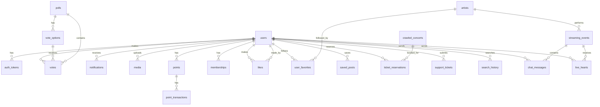

# 💽 FanPulse 데이터베이스 정의서

## 1. 개요

본 문서는 **FanPulse** 서비스의 데이터 모델을 정의하며, 기존 데이터 모델과 크롤링 데이터 모델을 포함합니다.

---

## 2. 주요 테이블 및 관계

-   **users**: 사용자 정보 관리 (로그인, 회원가입)
-   **auth_tokens**: 사용자 인증 토큰 저장
-   **polls, vote_options, votes**: 투표 시스템 구현 (polls → vote_options → votes 순서)
-   **notifications**: 사용자 알림 기능
-   **media**: 이미지 및 동영상 저장
-   **points, point_transactions**: 포인트 적립 및 사용 기록
-   **memberships**: VIP 멤버십 관리
-   **likes**: 게시글/댓글 좋아요 기능
-   **streaming_events**: 라이브 스트리밍 이벤트
-   **crawled_news, crawled_charts, crawled_concerts**: 크롤링된 데이터

> **주의**: posts와 comments는 MongoDB 컬렉션으로 관리됩니다. (4번 섹션 참고)

## 2.1 데이터 모델

### 사용자 테이블 (users)

| 컬럼명        | 데이터 타입             | 설명               |
| ------------- | ----------------------- | ------------------ |
| id (PK)       | UUID                    | 사용자 고유 식별자 |
| username      | VARCHAR(50) UNIQUE      | 사용자명           |
| email         | VARCHAR(100) UNIQUE     | 이메일 주소        |
| password_hash | TEXT                    | 비밀번호 해시      |
| created_at    | TIMESTAMP DEFAULT NOW() | 가입 일시          |

### 인증 토큰 테이블 (auth_tokens)

| 컬럼명       | 데이터 타입 | 설명                  |
| ------------ | ----------- | --------------------- |
| id (PK)      | UUID        | 인증 토큰 고유 식별자 |
| user_id (FK) | UUID        | 사용자 ID             |
| token        | TEXT UNIQUE | 인증 토큰             |
| expires_at   | TIMESTAMP   | 만료 시간             |

### 투표 테이블 (votes)

| 컬럼명              | 데이터 타입             | 설명                |
| ------------------- | ----------------------- | ------------------- |
| id (PK)             | UUID                    | 투표 고유 식별자    |
| user_id (FK)        | UUID                    | 사용자 ID           |
| vote_option_id (FK) | UUID                    | 선택한 투표 옵션 ID |
| poll_id (FK)        | UUID                    | 관련된 투표 ID      |
| created_at          | TIMESTAMP DEFAULT NOW() | 투표 일시           |

### 투표 옵션 테이블 (vote_options)

| 컬럼명       | 데이터 타입 | 설명             |
| ------------ | ----------- | ---------------- |
| id (PK)      | UUID        | 옵션 고유 식별자 |
| poll_id (FK) | UUID        | 관련된 투표 ID   |
| option_text  | TEXT        | 옵션 내용        |

### 투표 진행 테이블 (polls)

| 컬럼명      | 데이터 타입             | 설명             |
| ----------- | ----------------------- | ---------------- |
| id (PK)     | UUID                    | 투표 고유 식별자 |
| title       | VARCHAR(100)            | 투표 제목        |
| description | TEXT                    | 설명             |
| created_at  | TIMESTAMP DEFAULT NOW() | 생성 일시        |
| expires_at  | TIMESTAMP               | 만료 일시        |

### 알림 테이블 (notifications)

| 컬럼명       | 데이터 타입             | 설명             |
| ------------ | ----------------------- | ---------------- |
| id (PK)      | UUID                    | 알림 고유 식별자 |
| user_id (FK) | UUID                    | 사용자 ID        |
| message      | TEXT                    | 알림 내용        |
| is_read      | BOOLEAN DEFAULT FALSE   | 읽음 여부        |
| created_at   | TIMESTAMP DEFAULT NOW() | 생성 일시        |

### 미디어 테이블 (media)

| 컬럼명       | 데이터 타입             | 설명                            |
| ------------ | ----------------------- | ------------------------------- |
| id (PK)      | UUID                    | 미디어 고유 식별자              |
| user_id (FK) | UUID                    | 업로더 ID                       |
| media_url    | TEXT                    | 미디어 URL                      |
| media_type   | VARCHAR(50)             | 미디어 타입 (이미지, 동영상 등) |
| uploaded_at  | TIMESTAMP DEFAULT NOW() | 업로드 일시                     |

### 포인트 테이블 (points)

| 컬럼명        | 데이터 타입             | 설명                    |
| ------------- | ----------------------- | ----------------------- |
| id (PK)       | UUID                    | 포인트 기록 고유 식별자 |
| user_id (FK)  | UUID                    | 사용자 ID               |
| amount        | INT DEFAULT 0           | 현재 포인트 잔액        |
| earned_points | INT DEFAULT 0           | 누적 획득 포인트        |
| spent_points  | INT DEFAULT 0           | 누적 사용 포인트        |
| updated_at    | TIMESTAMP DEFAULT NOW() | 마지막 업데이트 일시    |

### 포인트 기록 테이블 (point_transactions)

| 컬럼명           | 데이터 타입             | 설명                                |
| ---------------- | ----------------------- | ----------------------------------- |
| id (PK)          | UUID                    | 거래 고유 식별자                    |
| user_id (FK)     | UUID                    | 사용자 ID                           |
| transaction_type | VARCHAR(20)             | 거래 유형 (EARN, SPEND)             |
| amount           | INT                     | 포인트 양                           |
| source           | VARCHAR(50)             | 포인트 출처 (광고시청, 굿즈구매 등) |
| description      | TEXT                    | 거래 설명                           |
| created_at       | TIMESTAMP DEFAULT NOW() | 거래 일시                           |

### 멤버십 테이블 (memberships)

| 컬럼명          | 데이터 타입             | 설명                    |
| --------------- | ----------------------- | ----------------------- |
| id (PK)         | UUID                    | 멤버십 고유 식별자      |
| user_id (FK)    | UUID                    | 사용자 ID               |
| membership_type | VARCHAR(20)             | 멤버십 유형 (FREE, VIP) |
| start_date      | TIMESTAMP               | 시작일                  |
| end_date        | TIMESTAMP               | 만료일                  |
| is_active       | BOOLEAN DEFAULT TRUE    | 활성 여부               |
| created_at      | TIMESTAMP DEFAULT NOW() | 가입일                  |

### 좋아요 테이블 (likes)

| 컬럼명       | 데이터 타입             | 설명                              |
| ------------ | ----------------------- | --------------------------------- |
| id (PK)      | UUID                    | 좋아요 고유 식별자                |
| user_id (FK) | UUID                    | 사용자 ID                         |
| target_type  | VARCHAR(20)             | 대상 타입 (POST, COMMENT)         |
| target_id    | UUID                    | 대상 ID (post_id 또는 comment_id) |
| created_at   | TIMESTAMP DEFAULT NOW() | 좋아요 누른 일시                  |

### 라이브 스트리밍 이벤트 테이블 (streaming_events)

| 컬럼명        | 데이터 타입             | 설명                          |
| ------------- | ----------------------- | ----------------------------- |
| id (PK)       | UUID                    | 스트리밍 이벤트 고유 식별자   |
| title         | VARCHAR(255)            | 스트리밍 제목                 |
| description   | TEXT                    | 설명                          |
| stream_url    | TEXT                    | 스트리밍 URL                  |
| thumbnail_url | TEXT                    | 썸네일 이미지 URL             |
| artist_id     | UUID                    | 아티스트 ID                   |
| scheduled_at  | TIMESTAMP               | 예정 시간                     |
| started_at    | TIMESTAMP               | 실제 시작 시간                |
| ended_at      | TIMESTAMP               | 종료 시간                     |
| status        | VARCHAR(20)             | 상태 (SCHEDULED, LIVE, ENDED) |
| viewer_count  | INT DEFAULT 0           | 실시간 시청자 수              |
| created_at    | TIMESTAMP DEFAULT NOW() | 생성일                        |

### 크롤링된 뉴스 데이터 테이블 (crawled_news)

| 컬럼명       | 데이터 타입             | 설명                               |
| ------------ | ----------------------- | ---------------------------------- |
| id (PK)      | UUID                    | 뉴스 고유 식별자                   |
| title        | VARCHAR(255)            | 뉴스 제목                          |
| content      | TEXT                    | 뉴스 본문 요약                     |
| url          | VARCHAR(500)            | 뉴스 원본 링크                     |
| source       | VARCHAR(100)            | 뉴스 출처 (예: Naver, Google News) |
| published_at | TIMESTAMP               | 뉴스 게시 날짜                     |
| created_at   | TIMESTAMP DEFAULT NOW() | 저장된 시간                        |

### 크롤링된 차트 순위 데이터 테이블 (crawled_charts)

| 컬럼명       | 데이터 타입  | 설명                             |
| ------------ | ------------ | -------------------------------- |
| id (PK)      | UUID         | 순위 고유 식별자                 |
| rank         | INT          | 차트 순위                        |
| artist       | VARCHAR(255) | 아티스트 이름                    |
| song         | VARCHAR(255) | 곡 제목                          |
| chart_source | VARCHAR(100) | 차트 출처 (예: Billboard, Melon) |
| updated_at   | TIMESTAMP    | 최신 업데이트                    |

### 크롤링된 콘서트 일정 데이터 테이블 (crawled_concerts)

| 컬럼명      | 데이터 타입             | 설명             |
| ----------- | ----------------------- | ---------------- |
| id (PK)     | UUID                    | 공연 고유 식별자 |
| event_name  | VARCHAR(255)            | 공연명           |
| artist      | VARCHAR(255)            | 공연 아티스트    |
| venue       | VARCHAR(255)            | 공연 장소        |
| date        | TIMESTAMP               | 공연 날짜        |
| ticket_link | VARCHAR(500)            | 티켓 예매 링크   |
| created_at  | TIMESTAMP DEFAULT NOW() | 저장된 시간      |

### 아티스트 테이블 (artists)

> **활용 화면**: H014 (아티스트 상세 페이지), H003 (팬 커뮤니티)

| 컬럼명            | 데이터 타입             | 설명                 |
| ----------------- | ----------------------- | -------------------- |
| id (PK)           | UUID                    | 아티스트 고유 식별자 |
| name              | VARCHAR(100)            | 아티스트/그룹명      |
| debut_date        | DATE                    | 데뷔 날짜            |
| agency            | VARCHAR(100)            | 소속사               |
| genre             | VARCHAR(50)             | 장르                 |
| fandom_name       | VARCHAR(50)             | 팬덤 명칭            |
| profile_image_url | TEXT                    | 프로필 이미지 URL    |
| description       | TEXT                    | 소개글               |
| created_at        | TIMESTAMP DEFAULT NOW() | 생성일               |

### 사용자 팔로우 테이블 (user_favorites)

> **활용 화면**: H020 (좋아요한 아티스트)

| 컬럼명         | 데이터 타입             | 설명               |
| -------------- | ----------------------- | ------------------ |
| id (PK)        | UUID                    | 팔로우 고유 식별자 |
| user_id (FK)   | UUID                    | 사용자 ID          |
| artist_id (FK) | UUID                    | 아티스트 ID        |
| created_at     | TIMESTAMP DEFAULT NOW() | 팔로우 일시        |

### 저장한 게시물 테이블 (saved_posts)

> **활용 화면**: H021 (저장한 게시물)

| 컬럼명       | 데이터 타입             | 설명                         |
| ------------ | ----------------------- | ---------------------------- |
| id (PK)      | UUID                    | 저장 고유 식별자             |
| user_id (FK) | UUID                    | 사용자 ID                    |
| post_id      | VARCHAR(24)             | 게시글 ID (MongoDB ObjectId) |
| created_at   | TIMESTAMP DEFAULT NOW() | 저장 일시                    |

### 예매 내역 테이블 (ticket_reservations)

> **활용 화면**: H022 (예매 내역)

| 컬럼명          | 데이터 타입             | 설명                                      |
| --------------- | ----------------------- | ----------------------------------------- |
| id (PK)         | UUID                    | 예매 고유 식별자                          |
| user_id (FK)    | UUID                    | 사용자 ID                                 |
| concert_id (FK) | UUID                    | 콘서트 ID (crawled_concerts)              |
| status          | VARCHAR(20)             | 예매 상태 (RESERVED, CANCELLED, REFUNDED) |
| ticket_count    | INT                     | 예매 티켓 수                              |
| total_price     | DECIMAL(10,2)           | 총 결제 금액                              |
| qr_code         | TEXT                    | 티켓 QR 코드                              |
| reserved_at     | TIMESTAMP DEFAULT NOW() | 예매 일시                                 |
| updated_at      | TIMESTAMP               | 상태 변경 일시                            |

### 고객센터 문의 테이블 (support_tickets)

> **활용 화면**: H023 (고객센터)

| 컬럼명       | 데이터 타입             | 설명                                       |
| ------------ | ----------------------- | ------------------------------------------ |
| id (PK)      | UUID                    | 문의 고유 식별자                           |
| user_id (FK) | UUID                    | 사용자 ID                                  |
| title        | VARCHAR(200)            | 문의 제목                                  |
| content      | TEXT                    | 문의 내용                                  |
| status       | VARCHAR(20)             | 처리 상태 (PENDING, IN_PROGRESS, RESOLVED) |
| created_at   | TIMESTAMP DEFAULT NOW() | 문의 일시                                  |
| resolved_at  | TIMESTAMP               | 처리 완료 일시                             |

### FAQ 테이블 (faq)

> **활용 화면**: H023 (고객센터)

| 컬럼명        | 데이터 타입             | 설명                             |
| ------------- | ----------------------- | -------------------------------- |
| id (PK)       | UUID                    | FAQ 고유 식별자                  |
| question      | VARCHAR(500)            | 질문                             |
| answer        | TEXT                    | 답변                             |
| category      | VARCHAR(50)             | 카테고리 (계정, 결제, 서비스 등) |
| display_order | INT                     | 노출 순서                        |
| is_active     | BOOLEAN DEFAULT TRUE    | 활성 여부                        |
| created_at    | TIMESTAMP DEFAULT NOW() | 생성일                           |

### 검색 기록 테이블 (search_history)

> **활용 화면**: H018 (검색 화면)

| 컬럼명       | 데이터 타입             | 설명                  |
| ------------ | ----------------------- | --------------------- |
| id (PK)      | UUID                    | 검색 기록 고유 식별자 |
| user_id (FK) | UUID                    | 사용자 ID             |
| keyword      | VARCHAR(100)            | 검색 키워드           |
| created_at   | TIMESTAMP DEFAULT NOW() | 검색 일시             |

### 크롤링된 광고 상품 테이블 (crawled_ads)

> **활용 화면**: H008 (광고 & 리워드)

| 컬럼명       | 데이터 타입             | 설명                            |
| ------------ | ----------------------- | ------------------------------- |
| id (PK)      | UUID                    | 광고 상품 고유 식별자           |
| product_name | VARCHAR(200)            | 상품명                          |
| description  | TEXT                    | 상품 설명                       |
| price        | DECIMAL(10,2)           | 가격                            |
| image_url    | TEXT                    | 상품 이미지 URL                 |
| source       | VARCHAR(50)             | 출처 (Ktown4u, Weverse Shop 등) |
| product_url  | TEXT                    | 상품 링크                       |
| is_event     | BOOLEAN DEFAULT FALSE   | 이벤트 상품 여부                |
| crawled_at   | TIMESTAMP DEFAULT NOW() | 크롤링 일시                     |

### 포인트 교환 상품 테이블 (rewards)

> **활용 화면**: H008 (광고 & 리워드)

| 컬럼명          | 데이터 타입             | 설명                               |
| --------------- | ----------------------- | ---------------------------------- |
| id (PK)         | UUID                    | 상품 고유 식별자                   |
| name            | VARCHAR(200)            | 상품명                             |
| description     | TEXT                    | 상품 설명                          |
| required_points | INT                     | 필요 포인트                        |
| image_url       | TEXT                    | 상품 이미지 URL                    |
| category        | VARCHAR(50)             | 카테고리 (굿즈, 멤버십, 할인권 등) |
| stock           | INT                     | 재고 수량 (-1: 무제한)             |
| is_active       | BOOLEAN DEFAULT TRUE    | 활성 여부                          |
| created_at      | TIMESTAMP DEFAULT NOW() | 생성일                             |

### 라이브 채팅 메시지 테이블 (chat_messages)

> **활용 화면**: H019 (라이브 상세)

| 컬럼명            | 데이터 타입             | 설명                    |
| ----------------- | ----------------------- | ----------------------- |
| id (PK)           | UUID                    | 메시지 고유 식별자      |
| streaming_id (FK) | UUID                    | 스트리밍 이벤트 ID      |
| user_id (FK)      | UUID                    | 발신자 ID               |
| message           | VARCHAR(500)            | 채팅 메시지 내용        |
| is_deleted        | BOOLEAN DEFAULT FALSE   | 삭제 여부 (관리자 삭제) |
| created_at        | TIMESTAMP DEFAULT NOW() | 전송 일시               |

### 라이브 하트 기록 테이블 (live_hearts)

> **활용 화면**: H019 (라이브 상세)

| 컬럼명            | 데이터 타입             | 설명                  |
| ----------------- | ----------------------- | --------------------- |
| id (PK)           | UUID                    | 하트 기록 고유 식별자 |
| streaming_id (FK) | UUID                    | 스트리밍 이벤트 ID    |
| user_id (FK)      | UUID                    | 사용자 ID             |
| count             | INT DEFAULT 1           | 하트 개수             |
| created_at        | TIMESTAMP DEFAULT NOW() | 전송 일시             |

> **TODO**: `payment_history` (결제 내역) 테이블은 PG사 선정 후 추가 예정

---

## 3. 테이블 간 관계도 (ERD)



---

## 4. MongoDB 컬렉션 설계 (커뮤니티)

### 팬 커뮤니티 컬렉션 (posts)

#### 4.1 컬렉션 개요

-   컬렉션명: `posts`
-   설명: 팬 커뮤니티 게시글을 저장하는 컬렉션
-   비고: 댓글은 `comments` 컬렉션에서 분리 관리 (고댓글·대댓글 확장, 페이징 고려)

#### 4.2 필드 정의

| 필드명          | 타입         | 설명                                 | 비고                      |
| --------------- | ------------ | ------------------------------------ | ------------------------- |
| `_id`           | ObjectId     | MongoDB 기본 PK                      |                           |
| `post_id`       | UUID(String) | 게시글 고유 식별자 (서비스 공통 ID)  | RDB/다른 서비스와 연동용  |
| `user_id`       | UUID(String) | 작성자 ID                            | `users.id` 참조           |
| `artist_id`     | UUID(String) | 아티스트 ID                          | 아티스트별 커뮤니티용     |
| `content`       | String       | 게시글 내용                          |                           |
| `images`        | [String]     | 이미지 URL 리스트                    | 기존 `image_url`을 배열로 |
| `like_count`    | NumberInt    | 좋아요 수                            | 집계용 필드 (optional)    |
| `comment_count` | NumberInt    | 댓글 수                              | 목록 화면 최적화용        |
| `tags`          | [String]     | 태그 리스트                          | 검색/필터용 (optional)    |
| `status`        | String       | 게시글 상태 (`active`, `deleted` 등) | 소프트 삭제용 (optional)  |
| `created_at`    | Date         | 작성 일시                            |                           |
| `updated_at`    | Date         | 수정 일시                            | optional                  |

#### 4.3 예시 도큐먼트

```json
{
  "_id": ObjectId("67a1b0f2c9e4a5d123456789"),
  "post_id": "3f1b9e3a-8d7a-4e3c-9c2b-92a6b7c0fd10",
  "user_id": "0f2a8b51-47c0-4b0c-9c2b-1a2b3c4d5e6f",
  "artist_id": "9a7b6c5d-4e3f-2a1b-0c9d-8e7f6a5b4c3d",
  "content": "오늘 컴백 쇼케이스 다녀온 후기 올려요! 🔥",
  "images": [
    "https://cdn.fanpulse.app/posts/3f1b9e3a/photo1.jpg",
    "https://cdn.fanpulse.app/posts/3f1b9e3a/photo2.jpg"
  ],
  "like_count": 124,
  "comment_count": 37,
  "tags": ["컴백", "쇼케이스", "서울콘"],
  "status": "active",
  "created_at": ISODate("2025-02-25T10:15:00Z"),
  "updated_at": ISODate("2025-02-25T11:02:30Z")
}
```

#### 4.4 인덱스 설계

**기본 인덱스**

-   `{ post_id: 1 }` – 서비스 레벨에서 UUID로 조회할 때
-   `{ user_id: 1, created_at: -1 }` – 특정 유저 게시글 목록
-   `{ artist_id: 1, created_at: -1 }` – 아티스트별 최신 게시글 목록

**추가 인덱스(선택)**

-   `{ tags: 1 }` – 태그 검색용
-   `{ like_count: -1 }` – 인기글 정렬용

### 댓글 컬렉션 (comments)

#### 5.1 컬렉션 개요

-   컬렉션명: `comments`
-   설명: 게시글에 달린 댓글을 저장하는 컬렉션
-   비고: `post_id`로 `posts` 컬렉션과 연결 (중첩 도큐먼트 대신 분리 설계)

#### 5.2 필드 정의

| 필드명       | 타입         | 설명                               | 비고                        |
| ------------ | ------------ | ---------------------------------- | --------------------------- |
| `_id`        | ObjectId     | MongoDB 기본 PK                    |                             |
| `comment_id` | UUID(String) | 댓글 고유 식별자 (서비스 공통 ID)  | 선택이지만 통일성 위해 추천 |
| `post_id`    | UUID(String) | 관련된 게시글 ID (`posts.post_id`) | FK 역할                     |
| `user_id`    | UUID(String) | 작성자 ID                          | `users.id` 참조             |
| `parent_id`  | UUID(String) | 부모 댓글 ID (대댓글일 경우)       | 기본 null, 대댓글 기능 대비 |
| `content`    | String       | 댓글 내용                          |                             |
| `status`     | String       | 댓글 상태 (`active`, `deleted` 등) | 소프트 삭제용(optional)     |
| `created_at` | Date         | 작성 일시                          |                             |
| `updated_at` | Date         | 수정 일시                          | optional                    |

#### 5.3 예시 도큐먼트

```json
{
  "_id": ObjectId("67a1b2c3d4e5f67890123456"),
  "comment_id": "e2f3c4b5-a6d7-8e9f-0a1b-2c3d4e5f6a7b",
  "post_id": "3f1b9e3a-8d7a-4e3c-9c2b-92a6b7c0fd10",
  "user_id": "7b6c5d4e-3f2a-1b0c-9d8e-7f6a5b4c3d2e",
  "parent_id": null,
  "content": "후기 감사합니다!! 현장 분위기 어땠어요? 😆",
  "status": "active",
  "created_at": ISODate("2025-02-25T10:20:00Z"),
  "updated_at": ISODate("2025-02-25T10:20:00Z")
}
```

#### 5.4 인덱스 설계

**기본 인덱스**

-   `{ post_id: 1, created_at: 1 }` – 게시글별 댓글 페이징 조회
-   `{ user_id: 1, created_at: -1 }` – 특정 유저의 댓글 내역

**추가 인덱스(선택)**

-   `{ parent_id: 1, created_at: 1 }` – 대댓글 트리 구조 조회 시
