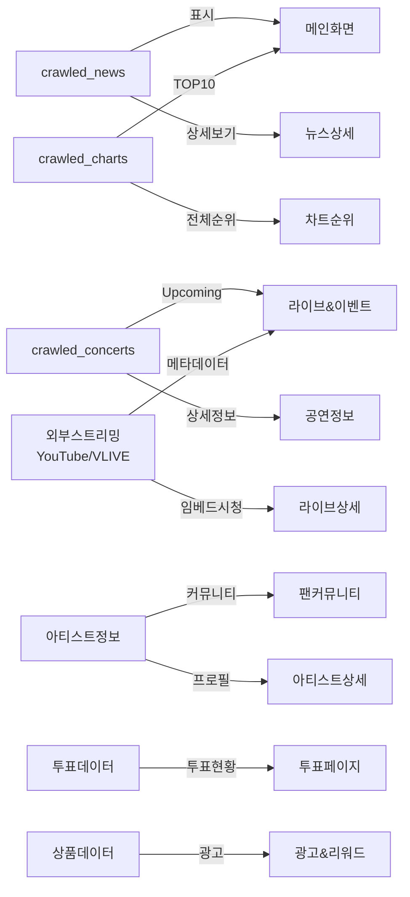

# 😝 크롤링

## 📌 크롤링할 데이터 종류

### 1️⃣ K-POP 관련 최신 뉴스 및 트렌드

-   **출처**: Naver 뉴스, Google 뉴스, Twitter Trends, Reddit (r/kpop)
-   **목적**: 팬들이 관심을 가질 만한 최신 K-POP 소식, 컴백 일정, 이슈 등을 제공
-   **수집할 데이터**:
    -   뉴스 제목, 기사 링크, 요약 내용, 출판 날짜
    -   트위터 해시태그 트렌드, 좋아요/리트윗 수

### 2️⃣ 아티스트 및 그룹 정보

-   **출처**: Wikipedia, Melon, Genie, Spotify, Last.fm API
-   **목적**: 팬들이 좋아하는 아티스트 정보를 쉽게 접근하도록 제공
-   **수집할 데이터**:
    -   아티스트 이름, 데뷔 연도, 소속사, 장르
    -   인기 곡 목록, 앨범 정보, 활동 기간
    -   팬덤 명칭 및 상징색

### 3️⃣ 실시간 투표 및 차트 순위

-   **출처**: Mnet, Melon, Bugs, Billboard, Oricon
-   **목적**: 팬들이 관심 있어 할 실시간 투표 결과 및 음악 차트 제공
-   **수집할 데이터**:
    -   투표 후보, 현재 득표 수, 투표 종료 시간
    -   차트 1\~10위 아티스트 및 곡 정보
    -   순위 변동 추세

### 4️⃣ 팬 커뮤니티 및 게시글 인기 순위

-   **출처**: Theqoo, Instiz, Reddit, Twitter, TikTok
-   **목적**: 팬 커뮤니티에서 인기 있는 게시물 및 의견 수집
-   **수집할 데이터**:
    -   게시물 제목, 좋아요 수, 댓글 수, 작성 시간
    -   특정 키워드(예: "컴백", "콘서트") 포함 여부

### 5️⃣ K-POP 콘서트 및 이벤트 일정

-   **출처**: Ticketmaster, Melon Ticket, Interpark, Yes24
-   **목적**: 팬들에게 콘서트 및 팬미팅 정보를 제공
-   **수집할 데이터**:
    -   공연 이름, 날짜, 장소, 티켓 예매 정보
    -   공연장 좌석 배치도 및 가격

### 6️⃣ K-POP 관련 굿즈 및 상품

-   **출처**: Ktown4u, Weverse Shop, Yes24, Aladin
-   **목적**: 팬들이 원하는 굿즈 및 한정판 제품 정보 제공
-   **수집할 데이터**:
    -   상품명, 가격, 출시일, 한정판 여부
    -   재고 상태, 구매 링크

### 7️⃣ 라이브 스트리밍 데이터 (외부 임베드)

-   **출처**: YouTube Live, V LIVE, Weverse Live
-   **목적**: 아티스트 실시간 방송 정보를 수집하여 앱 내 임베드 제공
-   **수집할 데이터**:
    -   스트리밍 URL (임베드용)
    -   방송 제목, 아티스트명, 시작 시간
    -   썸네일 이미지 URL
    -   라이브 여부 (LIVE/ENDED)
-   **참고**: 자체 스트리밍 서버 운영 없이 외부 플랫폼 임베드 방식으로 제공

## 📌 크롤링 방법 및 기술

### 1. 웹 크롤링 라이브러리

-   `Selenium`: 로그인 및 버튼 클릭이 필요한 사이트 크롤링
-   `BeautifulSoup`: HTML 정적 크롤링
-   `Scrapy`: 대량 데이터 수집 자동화
-   `Playwright`: 동적 웹사이트에서 빠른 크롤링

### 2. API 활용

-   Spotify API, Twitter API, YouTube API, Last.fm API → 음악 데이터
-   Mnet, Melon API → 차트 순위 및 투표 데이터
-   Ticketmaster API → 콘서트 정보

### 3. 크롤링 데이터 저장

-   PostgreSQL / MongoDB (데이터 저장 및 분석)
-   Elasticsearch (검색 최적화)

## 📌 크롤링이 필요한 이유

-   ✅ **실시간 투표 결과 & 차트 순위 반영**
-   ✅ **팬 커뮤니티의 인기 게시물 자동 업데이트**
-   ✅ **최신 K-POP 뉴스 및 트렌드 반영**
-   ✅ **콘서트 일정 자동 업데이트 및 티켓 정보 제공**
-   ✅ **팬들이 원하는 굿즈 및 한정판 상품 추적**

---

## 📱 크롤링 데이터 활용 화면

크롤링된 데이터가 **FanPulse 화면 정의서**의 어떤 화면에서 활용되는지 명시합니다.

| 크롤링 데이터 종류                    | 활용 화면                                            | 설명                                                              |
| ------------------------------------- | ---------------------------------------------------- | ----------------------------------------------------------------- |
| 뉴스 데이터 (crawled_news)            | H001 (메인 화면), H011 (뉴스 상세 페이지)            | 메인 화면에 최신 K-POP 뉴스 표시, 클릭 시 상세 페이지로 이동      |
| 차트 순위 데이터 (crawled_charts)     | H001 (메인 화면), H005 (차트 순위)                   | 메인 화면에 실시간 차트 순위 표시, 차트 페이지에서 상세 순위 확인 |
| 콘서트 일정 데이터 (crawled_concerts) | H006 (라이브 & 이벤트), H015 (상세 공연 정보 페이지) | 라이브 페이지 Upcoming 탭에 공연 목록 표시                        |
| 라이브 스트리밍 데이터 (외부 임베드)  | H006 (라이브 & 이벤트), H019 (라이브 상세)           | YouTube Live, V LIVE 등 외부 스트리밍 URL 메타데이터 크롤링       |
| 아티스트 정보                         | H003 (팬 커뮤니티), H014 (아티스트 상세 페이지)      | 아티스트별 커뮤니티 구성, 상세 프로필 및 활동 정보 제공           |
| 실시간 투표 데이터                    | H004 (투표 페이지)                                   | 외부 투표 결과를 크롤링하여 실시간 투표 현황 반영                 |
| K-POP 굿즈 및 상품                    | H008 (광고 & 리워드), H016 (마이페이지)              | 광고 시청 후 포인트 적립, 굿즈 구매 연결                          |

### 크롤링 데이터 흐름도

---

## Milestone: FanPulse 크롤링 파이프라인 구축

-   **설명**: K-POP 관련 데이터를 크롤링하여 FanPulse 데이터베이스에 저장하는 파이프라인 개발
-   **목표**: 뉴스, 차트 순위, 콘서트 일정, 광고 데이터를 수집하고 자동화된 시스템 구축
-   **기간**: 2025-02-25 \~ 2025-03-24 (4주)
-   **종속성**: 데이터베이스 스키마 설계 완료 필요 (백엔드 팀 협업)

---

## GitHub Issue 상세 목록

### [Epic] 뉴스 데이터 크롤링

-   **설명**: Naver, Google News, Reddit에서 K-POP 뉴스 데이터를 수집하여 FanPulse DB에 저장
-   **담당자**: @crawler
-   **예상 소요 기간**: 1주 (2025-02-25 \~ 2025-03-03)

| Issue 제목                    | 설명                                                                               | 라벨                   | 담당자   | 예상 소요 시간 | 상태  |
| ----------------------------- | ---------------------------------------------------------------------------------- | ---------------------- | -------- | -------------- | ----- |
| Naver 뉴스 크롤러 개발        | requests와 BeautifulSoup으로 기사 제목, 링크, 내용, 작성 날짜 수집 후 MongoDB 저장 | feature, high-priority | @crawler | 2일            | To Do |
| Google News RSS 크롤러 개발   | Google News RSS 피드 활용, "K-POP" 키워드로 뉴스 수집 후 MongoDB 저장              | feature                | @crawler | 1일            | To Do |
| 뉴스 데이터 정제 및 중복 제거 | 중복 기사 제거, NLTK로 주요 문장 추출 후 정제된 데이터 저장                        | feature                | @crawler | 1일            | To Do |
| 뉴스 크롤러 스케줄링          | Celery로 1일 1회 자동 실행 설정, Airflow로 모니터링 추가                           | feature, high-priority | @crawler | 1일            | To Do |

---

### [Epic] 음악 차트 크롤링

-   **설명**: Melon, Bugs, Billboard에서 실시간 K-POP 차트 데이터를 수집하고 통합
-   **담당자**: @crawler
-   **예상 소요 기간**: 1주 (2025-03-04 \~ 2025-03-10)

| Issue 제목         | 설명                                                                 | 라벨                   | 담당자   | 예상 소요 시간 | 상태  |
| ------------------ | -------------------------------------------------------------------- | ---------------------- | -------- | -------------- | ----- |
| Melon 차트 크롤링  | Selenium으로 로그인 없이 차트 순위, 곡 제목, 아티스트명 수집 후 저장 | feature, high-priority | @crawler | 2일            | To Do |
| Bugs 차트 크롤링   | requests와 BeautifulSoup으로 Bugs 차트 데이터 수집 후 저장           | feature                | @crawler | 1일            | To Do |
| Billboard API 연동 | Billboard API로 K-POP 차트 데이터 수집 후 저장                       | feature                | @crawler | 1일            | To Do |
| 차트 데이터 통합   | Melon, Bugs, Billboard 데이터를 단일 테이블로 통합 및 정규화         | feature, high-priority | @crawler | 1일            | To Do |

---

### [Epic] 콘서트 일정 크롤링

-   **설명**: Ticketmaster와 Interpark에서 K-POP 콘서트 일정 및 티켓 정보를 수집
-   **담당자**: @crawler
-   **예상 소요 기간**: 1주 (2025-03-11 \~ 2025-03-17)

| Issue 제목            | 설명                                                               | 라벨                   | 담당자   | 예상 소요 시간 | 상태  |
| --------------------- | ------------------------------------------------------------------ | ---------------------- | -------- | -------------- | ----- |
| Ticketmaster API 연동 | Ticketmaster API로 콘서트 이름, 날짜, 장소, 티켓 정보 수집 후 저장 | feature, high-priority | @crawler | 2일            | To Do |
| Interpark 공연 크롤링 | Selenium과 BeautifulSoup으로 Interpark 공연 일정 및 티켓 정보 수집 | feature                | @crawler | 2일            | To Do |
| 공연 데이터 정제      | 중복 공연 제거, 날짜 및 장소 데이터 정규화 후 저장                 | feature                | @crawler | 1일            | To Do |

---

### [Epic] 광고 데이터 크롤링

-   **설명**: Ktown4u와 Weverse Shop에서 광고 및 상품 정보를 수집해 사용자 포인트 적립 지원
-   **담당자**: @crawler
-   **예상 소요 기간**: 1주 (2025-03-18 \~ 2025-03-24)

| Issue 제목               | 설명                                                                | 라벨                   | 담당자   | 예상 소요 시간 | 상태  |
| ------------------------ | ------------------------------------------------------------------- | ---------------------- | -------- | -------------- | ----- |
| Ktown4u 광고 크롤링      | Ktown4u에서 이벤트 및 광고 상품 정보(이름, 가격, 링크) 수집 후 저장 | feature                | @crawler | 2일            | To Do |
| Weverse Shop 광고 크롤링 | Weverse Shop API로 광고 상품 및 이벤트 정보 수집 후 저장            | feature, high-priority | @crawler | 2일            | To Do |
| 광고 크롤러 스케줄링     | Celery로 1일 1회 자동 실행, Airflow로 작업 상태 모니터링            | feature                | @crawler | 1일            | To Do |

---

## 주요 작업 세부 계획

### 1. 크롤링 대상 데이터 및 방법 정의

-   **완료 목표**: 각 Epic별 크롤링 소스 및 도구 선정 (예: API vs Selenium)
-   **작업**: Issue 작성 시 이미 정의 완료

### 2. 크롤링 코드 개발

-   **완료 목표**: Epic별 크롤러 개발 및 단위 테스트
-   **도구**:
    -   requests, BeautifulSoup: 정적 웹 크롤링
    -   Selenium: 동적 웹 크롤링
    -   API: Billboard, Ticketmaster, Weverse Shop

### 3. 데이터 정제 및 저장

-   **완료 목표**: 중복 제거 및 정규화된 데이터를 MongoDB에 저장
-   **작업**: 각 Epic 내 "데이터 정제" Issue 포함
-   **DB 구조** (데이터베이스 정의서 기준):
    -   뉴스 (crawled_news): {title, url, content, source, published_at}
    -   차트 (crawled_charts): {rank, song, artist, chart_source, updated_at}
    -   콘서트 (crawled_concerts): {event_name, artist, venue, date, ticket_link}
    -   광고 (crawled_ads): {product_name, description, price, image_url, source, product_url}

### 4. 스케줄링 및 자동화 구축

-   **완료 목표**: 모든 크롤러를 Celery로 자동화하고 Airflow로 관리
-   **작업**: 각 Epic 내 "스케줄링" Issue 포함

---

## 추가 고려 사항 반영

### ✅ API 크롤링 가능 여부 확인

-   **작업**: API 사용 불가 시 Selenium 대체
    -   예: Weverse Shop API 실패 시 Selenium 전환 (Issue #13에 주석 추가 권장)

### ✅ 데이터 저장 구조 설계

-   **작업**: MongoDB 스키마 설계 후 중복 제거 및 정규화
    -   예: 뉴스 데이터는 title과 link로 중복 체크

### ✅ 트래픽 제한 고려

-   **작업**:
    -   time.sleep(1): 요청 간격 설정
    -   Proxy: IP 차단 방지
    -   User-Agent: 랜덤 헤더 적용 (크롤링 코드에 구현)

### ✅ 자동화 및 유지보수

-   **작업**:
    -   Celery: 작업 실행
    -   Airflow: 스케줄 관리 및 실패 알림 설정

---

## GitHub 관리 전략

### 1. Milestone

-   단일 Milestone: FanPulse 크롤링 파이프라인 구축
-   필요 시 Epic별 세부 Milestone 추가 가능

### 2. 라벨

-   feature: 신규 크롤링 기능
-   high-priority: 핵심 데이터 (뉴스, 차트 등)
-   bug: 크롤링 실패 시 추가

### 3. 담당자

-   @crawler: 크롤링 전담
-   @backend-dev: DB 연동 협업 시 배정

### 4. 프로젝트 보드

-   To Do: 계획된 Issue
-   In Progress: 개발 중
-   Done: 크롤링 및 DB 저장 완료

### 5. PR 관리

-   브랜치 네이밍: feature/crawling-naver-news, feature/schedule-ad-crawler
-   PR에 샘플 데이터 및 실행 로그 첨부
