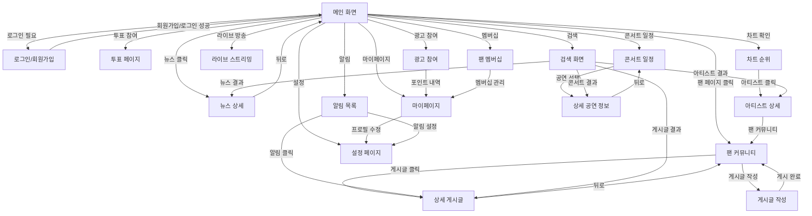

# 😆 FanPulse 화면 정의서

## 1. 개요

본 문서는 **FanPulse** 서비스의 주요 화면을 정의하며, 각 화면의 기능, 레이아웃, 인터랙션을 상세히 설명합니다.

---

## 2. 주요 화면 및 기능

### 2.1 메인 화면 (H001)

**설명**: K-POP 관련 최신 뉴스, 인기 게시글, 차트 순위를 표시하는 홈 화면

| 항목                  | 내용                                                                                                                                       |
| --------------------- | ------------------------------------------------------------------------------------------------------------------------------------------ |
| 화면 ID               | H001                                                                                                                                       |
| 화면명                | 메인 화면                                                                                                                                  |
| 주요 기능             | - 최신 K-POP 뉴스 표시 - 인기 게시글 리스트 제공 - 실시간 차트 순위 표시 - 각 기능으로 이동하는 네비게이션 제공                   |
| 주요 버튼 및 인터랙션 | - **뉴스 카드 클릭** → 뉴스 상세 페이지 (H011) - **인기 게시글 클릭** → 팬 커뮤니티 (H003) - **차트 클릭** → 차트 순위 페이지 (H005) |

---

### 2.2 로그인/회원가입 (H002)

**설명**: OAuth2 기반 SNS 로그인 및 신규 회원 가입을 지원하는 화면

| 항목                  | 내용                                                                                                         |
| --------------------- | ------------------------------------------------------------------------------------------------------------ |
| 화면 ID               | H002                                                                                                         |
| 화면명                | 로그인/회원가입                                                                                              |
| 주요 기능             | - Google, Kakao, Apple 계정 로그인 지원 - 신규 회원 가입 시 기본 프로필 설정                              |
| 주요 버튼 및 인터랙션 | - **SNS 로그인 버튼 클릭** → 인증 후 메인 화면 (H001) - **회원가입 진행** → 가입 완료 후 메인 화면 (H001) |

---

### 2.3 팬 커뮤니티 (H003)

**설명**: 아티스트별 팬 페이지에서 게시물을 작성하고 소통하는 커뮤니티

| 항목                  | 내용                                                                                                    |
| --------------------- | ------------------------------------------------------------------------------------------------------- |
| 화면 ID               | H003                                                                                                    |
| 화면명                | 팬 커뮤니티                                                                                             |
| 주요 기능             | - 아티스트별 커뮤니티 목록 제공 - 게시물 작성 및 댓글 기능 - 인기 게시물 및 최신 게시물 구분 표시 |
| 주요 버튼 및 인터랙션 | - **게시물 클릭** → 상세 게시글 (H012) - **게시글 작성 버튼** → 게시글 작성 페이지 (H013)            |

---

### 2.4 투표 페이지 (H004)

**설명**: 실시간 K-POP 투표 이벤트에 참여할 수 있는 페이지

| 항목                  | 내용                                                               |
| --------------------- | ------------------------------------------------------------------ |
| 화면 ID               | H004                                                               |
| 화면명                | 투표 페이지                                                        |
| 주요 기능             | - 진행 중인 투표 목록 제공 - 투표 참여 및 실시간 결과 확인 가능 |
| 주요 버튼 및 인터랙션 | - **투표 항목 클릭** → 투표 참여 후 결과 반영                      |

---

### 2.5 차트 순위 (H005)

**설명**: Billboard, Melon, Bugs 등 음악 차트 순위를 확인할 수 있는 페이지

| 항목                  | 내용                                                                 |
| --------------------- | -------------------------------------------------------------------- |
| 화면 ID               | H005                                                                 |
| 화면명                | 차트 순위                                                            |
| 주요 기능             | - 실시간 및 주간 차트 제공 - 차트별 곡 및 아티스트 상세 정보 표시 |
| 주요 버튼 및 인터랙션 | - **아티스트 클릭** → 아티스트 상세 페이지 (H014)                    |

---

### 2.6 라이브 스트리밍 (H006)

**설명**: 콘서트 및 방송 실시간 스트리밍을 제공하는 페이지

| 항목                  | 내용                                                       |
| --------------------- | ---------------------------------------------------------- |
| 화면 ID               | H006                                                       |
| 화면명                | 라이브 스트리밍                                            |
| 주요 기능             | - 실시간 공연 및 방송 스트리밍 제공 - 채팅 및 응원 기능 |
| 주요 버튼 및 인터랙션 | - **스트리밍 클릭** → 전체 화면 모드                       |

---

### 2.7 콘서트 일정 (H007)

**설명**: K-POP 콘서트 일정 및 티켓 예매 정보를 제공하는 페이지

| 항목                  | 내용                                                   |
| --------------------- | ------------------------------------------------------ |
| 화면 ID               | H007                                                   |
| 화면명                | 콘서트 일정                                            |
| 주요 기능             | - 공연 일정 목록 제공 - 예매 정보 및 티켓 가격 표시 |
| 주요 버튼 및 인터랙션 | - **공연 선택** → 상세 공연 정보 페이지 (H015)         |

---

### 2.8 광고 참여 (H008)

**설명**: 광고를 시청하고 포인트를 적립할 수 있는 페이지

| 항목                  | 내용                                                                                                                                                      |
| --------------------- | --------------------------------------------------------------------------------------------------------------------------------------------------------- |
| 화면 ID               | H008                                                                                                                                                      |
| 화면명                | 광고 참여                                                                                                                                                 |
| 주요 기능             | - 광고 시청 후 포인트 제공 - 현재 포인트 잔액 표시 - 광고 참여 내역 조회 - 포인트 사용처 안내 (굿즈 구매, VIP 업그레이드 등)                     |
| 주요 버튼 및 인터랙션 | - **광고 시청 완료** → 포인트 적립 후 메인 화면 - **포인트 내역 보기** → 마이페이지 (H016) - **포인트 사용하기** → 굿즈 구매 또는 멤버십 업그레이드 |

---

### 2.9 팬 멤버십 (H009)

**설명**: VIP 구독 서비스 및 전용 콘텐츠 제공

| 항목                  | 내용                                                                                                                                                                               |
| --------------------- | ---------------------------------------------------------------------------------------------------------------------------------------------------------------------------------- |
| 화면 ID               | H009                                                                                                                                                                               |
| 화면명                | 팬 멤버십                                                                                                                                                                          |
| 주요 기능             | - 멤버십 플랜 비교 (FREE vs VIP) - VIP 혜택 상세 안내 (비하인드 영상, 굿즈 할인, 우선 예매 등) - 구독 가입 및 해지 관리 - VIP 전용 콘텐츠 제공 - 현재 멤버십 상태 표시 |
| 주요 버튼 및 인터랙션 | - **구독 신청** → 결제 화면 이동 후 활성화 - **구독 해지** → 해지 확인 후 FREE 등급으로 전환 - **VIP 콘텐츠 보기** → 전용 콘텐츠 페이지                                      |

---

### 2.10 설정 페이지 (H010)

**설명**: 계정 설정, 푸시 알림 관리, 테마 변경 등의 기능을 제공하는 페이지

| 항목                  | 내용                                                          |
| --------------------- | ------------------------------------------------------------- |
| 화면 ID               | H010                                                          |
| 화면명                | 설정 페이지                                                   |
| 주요 기능             | - 계정 정보 변경 및 로그아웃 - 푸시 알림 설정 및 테마 변경 |
| 주요 버튼 및 인터랙션 | - **변경 사항 저장** → 설정 적용 후 메인 화면                 |

---

### 2.11 뉴스 상세 페이지 (H011)

**설명**: 메인 화면에서 클릭한 뉴스의 상세 내용을 표시

| 항목                  | 내용                                                                          |
| --------------------- | ----------------------------------------------------------------------------- |
| 화면 ID               | H011                                                                          |
| 화면명                | 뉴스 상세 페이지                                                              |
| 주요 기능             | - 뉴스 제목, 이미지, 본문 표시 - 게시일자 및 출처 표시 - 원문 링크 제공 |
| 주요 버튼 및 인터랙션 | - **뒤로 버튼** → 메인 화면 (H001)                                            |

---

### 2.12 상세 게시글 (H012)

**설명**: 팬 커뮤니티에서 클릭한 게시글의 상세 내용 및 댓글 목록 표시

| 항목                  | 내용                                                                                       |
| --------------------- | ------------------------------------------------------------------------------------------ |
| 화면 ID               | H012                                                                                       |
| 화면명                | 상세 게시글                                                                                |
| 주요 기능             | - 게시글 작성자, 내용, 이미지 표시 - 좋아요 및 댓글 수 표시 - 댓글 목록 및 작성 기능 |
| 주요 버튼 및 인터랙션 | - **좋아요 버튼** → 좋아요 추가/제거 - **댓글 작성** → 댓글 등록                        |

---

### 2.13 게시글 작성 페이지 (H013)

**설명**: 새로운 게시글을 작성하는 페이지

| 항목                  | 내용                                                                               |
| --------------------- | ---------------------------------------------------------------------------------- |
| 화면 ID               | H013                                                                               |
| 화면명                | 게시글 작성 페이지                                                                 |
| 주요 기능             | - 게시글 내용 입력 - 이미지/동영상 첨부 기능 - 태그 추가 기능                |
| 주요 버튼 및 인터랙션 | - **게시 버튼** → 게시글 등록 후 팬 커뮤니티 (H003) - **취소 버튼** → 이전 화면 |

---

### 2.14 아티스트 상세 페이지 (H014)

**설명**: 선택한 아티스트의 상세 정보 표시

| 항목                  | 내용                                                                                   |
| --------------------- | -------------------------------------------------------------------------------------- |
| 화면 ID               | H014                                                                                   |
| 화면명                | 아티스트 상세 페이지                                                                   |
| 주요 기능             | - 아티스트 프로필, 활동 정보 표시 - 인기곡 목록 제공 - 관련 커뮤니티 게시글 보기 |
| 주요 버튼 및 인터랙션 | - **팬 커뮤니티 보기** → 아티스트별 게시글 (H003)                                      |

---

### 2.15 상세 공연 정보 페이지 (H015)

**설명**: 선택한 콘서트의 상세 정보 및 티켓 예매 정보 제공

| 항목                  | 내용                                                                               |
| --------------------- | ---------------------------------------------------------------------------------- |
| 화면 ID               | H015                                                                               |
| 화면명                | 상세 공연 정보 페이지                                                              |
| 주요 기능             | - 공연명, 날짜, 장소 표시 - 공연 포스터 및 관련 이미지 - 티켓 예매 링크 제공 |
| 주요 버튼 및 인터랙션 | - **티켓 예매** → 외부 예매 사이트 연결 - **공유하기** → SNS 공유 기능          |

---

### 2.16 마이페이지 (H016)

**설명**: 사용자의 프로필, 활동 내역, 포인트 현황을 확인하는 페이지

| 항목                  | 내용                                                                                                                        |
| --------------------- | --------------------------------------------------------------------------------------------------------------------------- |
| 화면 ID               | H016                                                                                                                        |
| 화면명                | 마이페이지                                                                                                                  |
| 주요 기능             | - 사용자 프로필 정보 표시 - 현재 포인트 잔액 및 내역 - 작성한 게시글 목록 - 참여한 투표 내역 - 멤버십 상태 확인 |
| 주요 버튼 및 인터랙션 | - **프로필 수정** → 설정 페이지 (H010) - **포인트 사용하기** → 광고 참여 (H008) - **멤버십 관리** → 팬 멤버십 (H009)  |

---

### 2.17 알림 목록 (H017)

**설명**: 사용자가 받은 알림을 확인하는 페이지

| 항목                  | 내용                                                                                                                                         |
| --------------------- | -------------------------------------------------------------------------------------------------------------------------------------------- |
| 화면 ID               | H017                                                                                                                                         |
| 화면명                | 알림 목록                                                                                                                                    |
| 주요 기능             | - 받은 알림 목록 표시 - 읽음/안읽음 상태 표시 - 알림 유형별 분류 (좋아요, 댓글, 투표, 이벤트 등) - 알림 삭제 기능                   |
| 주요 버튼 및 인터랙션 | - **알림 클릭** → 해당 콘텐츠로 이동 (게시글, 투표 등) - **모두 읽음 처리** → 모든 알림 읽음 표시 - **알림 설정** → 설정 페이지 (H010) |

---

### 2.18 검색 화면 (H018)

**설명**: 아티스트, 게시글, 뉴스 등을 통합 검색하는 페이지

| 항목                  | 내용                                                                                                                                                                                        |
| --------------------- | ------------------------------------------------------------------------------------------------------------------------------------------------------------------------------------------- |
| 화면 ID               | H018                                                                                                                                                                                        |
| 화면명                | 검색 화면                                                                                                                                                                                   |
| 주요 기능             | - 통합 검색 기능 - 검색 결과를 카테고리별 표시 (아티스트, 게시글, 뉴스, 콘서트) - 최근 검색어 히스토리 - 인기 검색어 추천                                                          |
| 주요 버튼 및 인터랙션 | - **아티스트 결과 클릭** → 아티스트 상세 (H014) - **게시글 결과 클릭** → 상세 게시글 (H012) - **뉴스 결과 클릭** → 뉴스 상세 (H011) - **콘서트 결과 클릭** → 상세 공연 정보 (H015) |

---

## 3. 화면 간 연결 흐름

