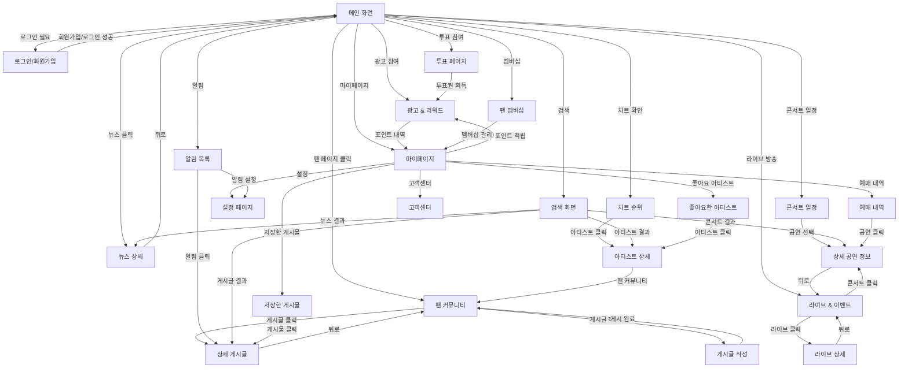

# 😆 FanPulse 화면 정의서

## 1. 개요

본 문서는 **FanPulse** 서비스의 주요 화면을 정의하며, 각 화면의 기능, 레이아웃, 인터랙션을 상세히 설명합니다.

---

## 2. 화면 목록

| 화면 ID | 화면명                | 경로              | 설명                                   |
| ------- | --------------------- | ----------------- | -------------------------------------- |
| H001    | 메인 화면             | `/`               | 최신 뉴스, 인기 게시글, 차트 순위 표시 |
| H002    | 로그인/회원가입       | `/login`          | OAuth2 및 이메일 기반 로그인           |
| H003    | 팬 커뮤니티           | `/community`      | 아티스트별 팬 페이지 및 게시물         |
| H004    | 투표 페이지           | `/voting`         | 실시간 투표 참여 및 결과 확인          |
| H005    | 차트 순위             | `/chart`          | Billboard, Melon 등 차트 순위          |
| H006    | 라이브 & 이벤트       | `/live`           | 실시간 스트리밍 및 콘서트 일정         |
| H007    | 콘서트 일정           | `/concert`        | 공연 일정 및 티켓 예매 정보            |
| H008    | 광고 & 리워드         | `/ads`            | 광고 시청 후 포인트 적립 및 교환       |
| H009    | 팬 멤버십             | `/membership`     | VIP 구독 서비스 및 혜택 안내           |
| H010    | 설정 페이지           | `/settings`       | 계정 설정, 알림, 테마 변경             |
| H011    | 뉴스 상세 페이지      | `/news-detail`    | 뉴스 상세 내용 표시                    |
| H012    | 상세 게시글           | `/post-detail`    | 게시글 상세 내용 및 댓글               |
| H013    | 게시글 작성 페이지    | `/post-create`    | 새로운 게시글 작성                     |
| H014    | 아티스트 상세 페이지  | `/artist-detail`  | 아티스트 프로필 및 활동 정보           |
| H015    | 상세 공연 정보 페이지 | `/concert-detail` | 공연 상세 정보 및 티켓 예매            |
| H016    | 마이페이지            | `/mypage`         | 프로필, 포인트, 활동 내역 확인         |
| H017    | 알림 목록             | `/notifications`  | 받은 알림 목록 및 관리                 |
| H018    | 검색 화면             | `/search`         | 통합 검색 기능                         |
| H019    | 라이브 상세           | `/live-detail`    | 실시간 스트리밍 시청 및 채팅           |
| H020    | 좋아요한 아티스트     | `/favorites`      | 관심 아티스트 목록                     |
| H021    | 저장한 게시물         | `/saved`          | 북마크한 게시물 목록                   |
| H022    | 예매 내역             | `/tickets`        | 콘서트 예매 내역 확인                  |
| H023    | 고객센터              | `/support`        | 도움말 및 문의                         |

---

## 3. 주요 화면 및 기능

### 3.1 메인 화면 (H001)

**설명**: K-POP 관련 최신 뉴스, 인기 게시글, 차트 순위를 표시하는 홈 화면

| 항목                  | 내용                                                                                                                                       |
| --------------------- | ------------------------------------------------------------------------------------------------------------------------------------------ |
| 화면 ID               | H001                                                                                                                                       |
| 화면명                | 메인 화면                                                                                                                                  |
| 경로                  | `/`                                                                                                                                        |
| 주요 기능             | - 최신 K-POP 뉴스 표시 - 인기 게시글 리스트 제공 - 실시간 차트 순위 표시 - 각 기능으로 이동하는 네비게이션 제공                   |
| 주요 버튼 및 인터랙션 | - **뉴스 카드 클릭** → 뉴스 상세 페이지 (H011) - **인기 게시글 클릭** → 팬 커뮤니티 (H003) - **차트 클릭** → 차트 순위 페이지 (H005) |

---

### 3.2 로그인/회원가입 (H002)

**설명**: OAuth2 기반 SNS 로그인 및 이메일 기반 로그인/회원가입을 지원하는 화면

| 항목                  | 내용                                                                                                                                                                                                                                                            |
| --------------------- | --------------------------------------------------------------------------------------------------------------------------------------------------------------------------------------------------------------------------------------------------------------- |
| 화면 ID               | H002                                                                                                                                                                                                                                                            |
| 화면명                | 로그인/회원가입                                                                                                                                                                                                                                                 |
| 경로                  | `/login`                                                                                                                                                                                                                                                        |
| 주요 기능             | - 로그인/회원가입 탭 전환 - Google 소셜 로그인 지원 - 이메일/비밀번호 입력 로그인 - 비밀번호 찾기 기능 - 둘러보기 (비로그인 탐색)                                                                                                                   |
| 주요 버튼 및 인터랙션 | - **로그인/회원가입 탭** → 탭 전환 - **Google로 로그인 버튼** → OAuth2 인증 후 메인 화면 (H001) - **로그인 버튼** → 이메일 인증 후 메인 화면 (H001) - **비밀번호를 잊으셨나요?** → 비밀번호 재설정 - **둘러보기** → 메인 화면 (H001, 비로그인 상태) |

---

### 3.3 팬 커뮤니티 (H003)

**설명**: 아티스트별 팬 페이지에서 게시물을 작성하고 소통하는 커뮤니티

| 항목                  | 내용                                                                                                                                                                                                                                                                                       |
| --------------------- | ------------------------------------------------------------------------------------------------------------------------------------------------------------------------------------------------------------------------------------------------------------------------------------------ |
| 화면 ID               | H003                                                                                                                                                                                                                                                                                       |
| 화면명                | 팬 커뮤니티                                                                                                                                                                                                                                                                                |
| 경로                  | `/community`                                                                                                                                                                                                                                                                               |
| 주요 기능             | - 아티스트별 필터링 드롭다운 (All, BTS, BLACKPINK 등) - 게시물 정렬 탭 (Latest Posts / 🔥 Popular / Following) - 게시물 목록 (썸네일, 내용, 작성자, 좋아요/댓글/공유 수) - VIP 사용자 배지 표시 - 게시글 작성 플로팅 버튼 (+)                                                  |
| 주요 버튼 및 인터랙션 | - **아티스트 필터 클릭** → 해당 아티스트 게시물만 표시 - **정렬 탭 클릭** → 정렬 기준 변경 - **게시물 클릭** → 상세 게시글 (H012) - **게시글 작성 버튼 (+)** → 게시글 작성 페이지 (H013) - **좋아요/댓글/공유 버튼** → 해당 기능 실행 - **더보기 메뉴 (⋮)** → 신고, 차단 등 |

---

### 3.4 투표 페이지 (H004)

**설명**: 실시간 K-POP 투표 이벤트에 참여할 수 있는 페이지

| 항목                  | 내용                                                                                                                                                                                                                                                                                                                      |
| --------------------- | ------------------------------------------------------------------------------------------------------------------------------------------------------------------------------------------------------------------------------------------------------------------------------------------------------------------------- |
| 화면 ID               | H004                                                                                                                                                                                                                                                                                                                      |
| 화면명                | 투표 페이지                                                                                                                                                                                                                                                                                                               |
| 경로                  | `/voting`                                                                                                                                                                                                                                                                                                                 |
| 주요 기능             | - **투표권 현황 표시**: My Voting Power (잔여 투표권, Daily/Bonus/Used 내역) - **카테고리 필터**: All / Artist / Song / MV 탭 - **투표 목록**: 진행 중인 투표 카드 (제목, 총 투표수, 마감일, Active 배지) - **투표 현황**: 후보별 퍼센트, 투표수, 프로그레스바 - **투표권 획득 유도**: "Get More Votes!" 배너 |
| 주요 버튼 및 인터랙션 | - **카테고리 탭 클릭** → 해당 카테고리 투표만 표시 - **Vote 버튼** → 투표 참여 후 결과 반영 - **View Full Rankings** → 전체 랭킹 확인 - **Earn Now** → 광고 참여 (H008)로 이동                                                                                                                                   |

---

### 3.5 차트 순위 (H005)

**설명**: Billboard, Melon, Bugs 등 음악 차트 순위를 확인할 수 있는 페이지

| 항목                  | 내용                                                                 |
| --------------------- | -------------------------------------------------------------------- |
| 화면 ID               | H005                                                                 |
| 화면명                | 차트 순위                                                            |
| 경로                  | `/chart`                                                             |
| 주요 기능             | - 실시간 및 주간 차트 제공 - 차트별 곡 및 아티스트 상세 정보 표시 |
| 주요 버튼 및 인터랙션 | - **아티스트 클릭** → 아티스트 상세 페이지 (H014)                    |

---

### 3.6 라이브 & 이벤트 (H006)

**설명**: 콘서트 및 방송 실시간 스트리밍과 다가오는 콘서트 일정을 통합 제공하는 페이지

| 항목                  | 내용                                                                                                                                                                                                                                                                                       |
| --------------------- | ------------------------------------------------------------------------------------------------------------------------------------------------------------------------------------------------------------------------------------------------------------------------------------------ |
| 화면 ID               | H006                                                                                                                                                                                                                                                                                       |
| 화면명                | 라이브 & 이벤트 (Live & Events)                                                                                                                                                                                                                                                            |
| 경로                  | `/live`                                                                                                                                                                                                                                                                                    |
| 주요 기능             | - **탭 구분**: 🔴 Live Now / 📅 Upcoming - **메인 라이브**: 현재 진행 중인 대표 방송 (썸네일, LIVE 배지, 시청자 수) - **More Live Streams**: 추가 라이브 목록 (시청자 수, 진행 시간 표시) - **Upcoming Concerts**: 예정된 콘서트 목록 (포스터, 날짜, 장소, On Sale/Sold Out 배지) |
| 주요 버튼 및 인터랙션 | - **🔴 Live Now 탭** → 현재 진행 중인 라이브 표시 - **📅 Upcoming 탭** → 예정된 공연 표시 - **라이브 썸네일 클릭** → 라이브 상세 (H019) - **콘서트 카드 클릭** → 상세 공연 정보 (H015)                                                                                            |

---

### 3.7 콘서트 일정 (H007)

**설명**: K-POP 콘서트 일정 및 티켓 예매 정보를 제공하는 페이지

| 항목                  | 내용                                                   |
| --------------------- | ------------------------------------------------------ |
| 화면 ID               | H007                                                   |
| 화면명                | 콘서트 일정                                            |
| 경로                  | `/concert`                                             |
| 주요 기능             | - 공연 일정 목록 제공 - 예매 정보 및 티켓 가격 표시 |
| 주요 버튼 및 인터랙션 | - **공연 선택** → 상세 공연 정보 페이지 (H015)         |

> **참고**: H006 (라이브 & 이벤트) 페이지에서도 콘서트 일정을 확인할 수 있습니다.

---

### 3.8 광고 & 리워드 (H008)

**설명**: 광고를 시청하고 포인트를 적립하며, 적립한 포인트로 굿즈를 교환할 수 있는 페이지

| 항목                  | 내용                                                                                                                                                                                                                                                                                                                                                                                                             |
| --------------------- | ---------------------------------------------------------------------------------------------------------------------------------------------------------------------------------------------------------------------------------------------------------------------------------------------------------------------------------------------------------------------------------------------------------------- |
| 화면 ID               | H008                                                                                                                                                                                                                                                                                                                                                                                                             |
| 화면명                | 광고 & 리워드 (Ads & Rewards)                                                                                                                                                                                                                                                                                                                                                                                    |
| 경로                  | `/ads`                                                                                                                                                                                                                                                                                                                                                                                                           |
| 주요 기능             | - **포인트 잔액 표시**: My Points (현재 보유 포인트) - **Earn Points 섹션**: 포인트 획득 방법 목록  - Watch 30s Video Ad (+10P, 5 left)  - Complete Survey (+50P, 3 left)  - Install Partner App (+100P, 2 left)  - Daily Check-in (+20P, 1 left) - **Recent Earnings**: 최근 포인트 획득 내역 - **Redeem Rewards**: 포인트로 교환 가능한 상품 (굿즈, 티셔츠, VIP 멤버십, 콘서트 할인권 등) |
| 주요 버튼 및 인터랙션 | - **Start 버튼** → 해당 미션 시작 (광고 시청, 설문 등) - **Redeem 버튼** → 포인트로 상품 교환 - **View All** → 전체 상품 목록 - **히스토리 버튼** → 마이페이지 (H016)                                                                                                                                                                                                                                   |

---

### 3.9 팬 멤버십 (H009)

**설명**: VIP 구독 서비스 및 전용 콘텐츠 제공 (마이프로필과 통합된 화면)

| 항목                  | 내용                                                                                                                                                                                                                                                                                                                                                                                                                                                                                                                                                                                                                                                     |
| --------------------- | -------------------------------------------------------------------------------------------------------------------------------------------------------------------------------------------------------------------------------------------------------------------------------------------------------------------------------------------------------------------------------------------------------------------------------------------------------------------------------------------------------------------------------------------------------------------------------------------------------------------------------------------------------- |
| 화면 ID               | H009                                                                                                                                                                                                                                                                                                                                                                                                                                                                                                                                                                                                                                                     |
| 화면명                | 팬 멤버십 (My Profile + VIP)                                                                                                                                                                                                                                                                                                                                                                                                                                                                                                                                                                                                                             |
| 경로                  | `/membership`                                                                                                                                                                                                                                                                                                                                                                                                                                                                                                                                                                                                                                            |
| 주요 기능             | - **프로필 섹션**: 프로필 이미지, 이름, 아이디, 가입일 - **사용자 통계**: Total Votes, Posts, Points, Following - **Upgrade to VIP 배너**: VIP 업그레이드 유도 - **VIP Benefits**: 혜택 목록  - Extra Voting Power (+5 daily votes)  - Exclusive Content (비하인드 영상/사진)  - Special Discounts (20% 굿즈 할인)  - Priority Support (빠른 응대)  - Monthly Rewards (무료 포인트/선물)  - VIP Badge (커뮤니티 배지) - **Choose Your Plan**: 구독 플랜 선택  - Monthly ($9.99/월)  - Quarterly ($24.99/3개월, Save 17%) ⭐ Most Popular  - Yearly ($79.99/년, Save 33%) - **Recent Activity**: 최근 활동 내역 |
| 주요 버튼 및 인터랙션 | - **See Plans 버튼** → 플랜 선택 섹션으로 스크롤 - **Subscribe 버튼** → 결제 화면 이동 후 VIP 활성화 - **설정 버튼** → 설정 페이지 (H010)                                                                                                                                                                                                                                                                                                                                                                                                                                                                                                          |

---

### 3.10 설정 페이지 (H010)

**설명**: 계정 설정, 푸시 알림 관리, 테마 변경 등의 기능을 제공하는 페이지

| 항목                  | 내용                                                                                                                                                                                                                                                                                                                                                                                                 |
| --------------------- | ---------------------------------------------------------------------------------------------------------------------------------------------------------------------------------------------------------------------------------------------------------------------------------------------------------------------------------------------------------------------------------------------------- |
| 화면 ID               | H010                                                                                                                                                                                                                                                                                                                                                                                                 |
| 화면명                | 설정 페이지                                                                                                                                                                                                                                                                                                                                                                                          |
| 경로                  | `/settings`                                                                                                                                                                                                                                                                                                                                                                                          |
| 주요 기능             | - **계정 섹션**  - 프로필 수정 → 마이페이지 (H016)  - 비밀번호 변경  - 개인정보 보호 - **알림 섹션**  - 푸시 알림 토글 스위치  - 알림 설정 → 알림 목록 (H017) - **화면 섹션**  - 다크 모드 토글 스위치  - 언어 설정 (한국어/English 등) - **지원 섹션**  - 도움말  - 고객센터 → (H023)  - 앱 정보 (버전 1.0.0) - **로그아웃 버튼** - **회원 탈퇴 버튼** |
| 주요 버튼 및 인터랙션 | - **토글 스위치** → 설정 즉시 적용 - **메뉴 항목 클릭** → 해당 기능/페이지 이동 - **뒤로가기** → 마이페이지 (H016)                                                                                                                                                                                                                                                                             |

---

### 3.11 뉴스 상세 페이지 (H011)

**설명**: 메인 화면에서 클릭한 뉴스의 상세 내용을 표시

| 항목                  | 내용                                                                          |
| --------------------- | ----------------------------------------------------------------------------- |
| 화면 ID               | H011                                                                          |
| 화면명                | 뉴스 상세 페이지                                                              |
| 경로                  | `/news-detail`                                                                |
| 주요 기능             | - 뉴스 제목, 이미지, 본문 표시 - 게시일자 및 출처 표시 - 원문 링크 제공 |
| 주요 버튼 및 인터랙션 | - **뒤로 버튼** → 메인 화면 (H001)                                            |

---

### 3.12 상세 게시글 (H012)

**설명**: 팬 커뮤니티에서 클릭한 게시글의 상세 내용 및 댓글 목록 표시

| 항목                  | 내용                                                                                       |
| --------------------- | ------------------------------------------------------------------------------------------ |
| 화면 ID               | H012                                                                                       |
| 화면명                | 상세 게시글                                                                                |
| 경로                  | `/post-detail`                                                                             |
| 주요 기능             | - 게시글 작성자, 내용, 이미지 표시 - 좋아요 및 댓글 수 표시 - 댓글 목록 및 작성 기능 |
| 주요 버튼 및 인터랙션 | - **좋아요 버튼** → 좋아요 추가/제거 - **댓글 작성** → 댓글 등록                        |

---

### 3.13 게시글 작성 페이지 (H013)

**설명**: 새로운 게시글을 작성하는 페이지

| 항목                  | 내용                                                                               |
| --------------------- | ---------------------------------------------------------------------------------- |
| 화면 ID               | H013                                                                               |
| 화면명                | 게시글 작성 페이지                                                                 |
| 경로                  | `/post-create`                                                                     |
| 주요 기능             | - 게시글 내용 입력 - 이미지/동영상 첨부 기능 - 태그 추가 기능                |
| 주요 버튼 및 인터랙션 | - **게시 버튼** → 게시글 등록 후 팬 커뮤니티 (H003) - **취소 버튼** → 이전 화면 |

---

### 3.14 아티스트 상세 페이지 (H014)

**설명**: 선택한 아티스트의 상세 정보 표시

| 항목                  | 내용                                                                                   |
| --------------------- | -------------------------------------------------------------------------------------- |
| 화면 ID               | H014                                                                                   |
| 화면명                | 아티스트 상세 페이지                                                                   |
| 경로                  | `/artist-detail`                                                                       |
| 주요 기능             | - 아티스트 프로필, 활동 정보 표시 - 인기곡 목록 제공 - 관련 커뮤니티 게시글 보기 |
| 주요 버튼 및 인터랙션 | - **팬 커뮤니티 보기** → 아티스트별 게시글 (H003)                                      |

---

### 3.15 상세 공연 정보 페이지 (H015)

**설명**: 선택한 콘서트의 상세 정보 및 티켓 예매 정보 제공

| 항목                  | 내용                                                                               |
| --------------------- | ---------------------------------------------------------------------------------- |
| 화면 ID               | H015                                                                               |
| 화면명                | 상세 공연 정보 페이지                                                              |
| 경로                  | `/concert-detail`                                                                  |
| 주요 기능             | - 공연명, 날짜, 장소 표시 - 공연 포스터 및 관련 이미지 - 티켓 예매 링크 제공 |
| 주요 버튼 및 인터랙션 | - **티켓 예매** → 외부 예매 사이트 연결 - **공유하기** → SNS 공유 기능          |

---

### 3.16 마이페이지 (H016)

**설명**: 사용자의 프로필, 활동 내역, 포인트 현황을 확인하는 페이지

| 항목                  | 내용                                                                                                                                                                                                                                                                                                                                                                            |
| --------------------- | ------------------------------------------------------------------------------------------------------------------------------------------------------------------------------------------------------------------------------------------------------------------------------------------------------------------------------------------------------------------------------- |
| 화면 ID               | H016                                                                                                                                                                                                                                                                                                                                                                            |
| 화면명                | 마이페이지                                                                                                                                                                                                                                                                                                                                                                      |
| 경로                  | `/mypage`                                                                                                                                                                                                                                                                                                                                                                       |
| 주요 기능             | - **프로필 섹션**: 프로필 이미지, 이름, 이메일, VIP 배지, 레벨 - **사용자 통계**: 투표 참여 수, 게시물 수, 팔로워 수 - **포인트 섹션**: 보유 포인트, 최근 포인트 내역 (+/-), 전체 내역 보기 - **메뉴 목록**:  - 좋아요한 아티스트 → (H020)  - 저장한 게시물 → (H021)  - 예매 내역 → (H022)  - 설정 → (H010)  - 고객센터 → (H023) - **로그아웃 버튼** |
| 주요 버튼 및 인터랙션 | - **알림 아이콘** → 알림 목록 (H017) - **설정 아이콘** → 설정 페이지 (H010) - **포인트 적립 버튼** → 광고 & 리워드 (H008) - **메뉴 항목 클릭** → 해당 페이지 이동 - **로그아웃** → 로그인 화면 (H002)                                                                                                                                                               |

---

### 3.17 알림 목록 (H017)

**설명**: 사용자가 받은 알림을 확인하는 페이지

| 항목                  | 내용                                                                                                                                         |
| --------------------- | -------------------------------------------------------------------------------------------------------------------------------------------- |
| 화면 ID               | H017                                                                                                                                         |
| 화면명                | 알림 목록                                                                                                                                    |
| 경로                  | `/notifications`                                                                                                                             |
| 주요 기능             | - 받은 알림 목록 표시 - 읽음/안읽음 상태 표시 - 알림 유형별 분류 (좋아요, 댓글, 투표, 이벤트 등) - 알림 삭제 기능                   |
| 주요 버튼 및 인터랙션 | - **알림 클릭** → 해당 콘텐츠로 이동 (게시글, 투표 등) - **모두 읽음 처리** → 모든 알림 읽음 표시 - **알림 설정** → 설정 페이지 (H010) |

---

### 3.18 검색 화면 (H018)

**설명**: 아티스트, 게시글, 뉴스 등을 통합 검색하는 페이지

| 항목                  | 내용                                                                                                                                                                                        |
| --------------------- | ------------------------------------------------------------------------------------------------------------------------------------------------------------------------------------------- |
| 화면 ID               | H018                                                                                                                                                                                        |
| 화면명                | 검색 화면                                                                                                                                                                                   |
| 경로                  | `/search`                                                                                                                                                                                   |
| 주요 기능             | - 통합 검색 기능 - 검색 결과를 카테고리별 표시 (아티스트, 게시글, 뉴스, 콘서트) - 최근 검색어 히스토리 - 인기 검색어 추천                                                          |
| 주요 버튼 및 인터랙션 | - **아티스트 결과 클릭** → 아티스트 상세 (H014) - **게시글 결과 클릭** → 상세 게시글 (H012) - **뉴스 결과 클릭** → 뉴스 상세 (H011) - **콘서트 결과 클릭** → 상세 공연 정보 (H015) |

---

### 3.19 라이브 상세 (H019)

**설명**: 실시간 스트리밍을 시청하고 채팅으로 소통하는 페이지

| 항목                  | 내용                                                                                                                                                  |
| --------------------- | ----------------------------------------------------------------------------------------------------------------------------------------------------- |
| 화면 ID               | H019                                                                                                                                                  |
| 화면명                | 라이브 상세                                                                                                                                           |
| 경로                  | `/live-detail`                                                                                                                                        |
| 주요 기능             | - 실시간 영상 재생 - 실시간 시청자 수 표시 - 라이브 채팅 기능 - 좋아요/하트 보내기 - 전체화면 모드 - 화질 선택                         |
| 주요 버튼 및 인터랙션 | - **채팅 입력** → 메시지 전송 - **하트 버튼** → 하트 애니메이션 - **전체화면 버튼** → 전체화면 모드 전환 - **뒤로가기** → 라이브 목록 (H006) |

---

### 3.20 좋아요한 아티스트 (H020)

**설명**: 사용자가 좋아요(팔로우)한 아티스트 목록을 관리하는 페이지

| 항목                  | 내용                                                                                      |
| --------------------- | ----------------------------------------------------------------------------------------- |
| 화면 ID               | H020                                                                                      |
| 화면명                | 좋아요한 아티스트                                                                         |
| 경로                  | `/favorites`                                                                              |
| 주요 기능             | - 팔로우한 아티스트 목록 표시 - 아티스트별 최신 소식 알림 설정 - 팔로우 해제 기능   |
| 주요 버튼 및 인터랙션 | - **아티스트 카드 클릭** → 아티스트 상세 (H014) - **팔로우 해제 버튼** → 목록에서 제거 |

---

### 3.21 저장한 게시물 (H021)

**설명**: 사용자가 북마크한 게시물 목록을 확인하는 페이지

| 항목                  | 내용                                                                               |
| --------------------- | ---------------------------------------------------------------------------------- |
| 화면 ID               | H021                                                                               |
| 화면명                | 저장한 게시물                                                                      |
| 경로                  | `/saved`                                                                           |
| 주요 기능             | - 북마크한 게시물 목록 표시 - 북마크 해제 기능 - 게시물 정렬 (최신순/저장순) |
| 주요 버튼 및 인터랙션 | - **게시물 클릭** → 상세 게시글 (H012) - **북마크 해제** → 목록에서 제거        |

---

### 3.22 예매 내역 (H022)

**설명**: 사용자의 콘서트 티켓 예매 내역을 확인하는 페이지

| 항목                  | 내용                                                                                                               |
| --------------------- | ------------------------------------------------------------------------------------------------------------------ |
| 화면 ID               | H022                                                                                                               |
| 화면명                | 예매 내역                                                                                                          |
| 경로                  | `/tickets`                                                                                                         |
| 주요 기능             | - 예매 완료 티켓 목록 표시 - 예매 상태 표시 (예매완료/취소/환불) - 예매 상세 정보 확인 - 티켓 QR코드 표시 |
| 주요 버튼 및 인터랙션 | - **티켓 카드 클릭** → 상세 예매 정보 - **취소/환불 요청** → 취소 프로세스 진행                                 |

---

### 3.23 고객센터 (H023)

**설명**: 도움말 및 문의를 할 수 있는 페이지

| 항목                  | 내용                                                                                                     |
| --------------------- | -------------------------------------------------------------------------------------------------------- |
| 화면 ID               | H023                                                                                                     |
| 화면명                | 고객센터                                                                                                 |
| 경로                  | `/support`                                                                                               |
| 주요 기능             | - FAQ (자주 묻는 질문) 목록 - 1:1 문의하기 - 문의 내역 확인 - 공지사항                          |
| 주요 버튼 및 인터랙션 | - **FAQ 항목 클릭** → 답변 펼침 - **1:1 문의하기** → 문의 작성 폼 - **문의 내역** → 이전 문의 목록 |

---

## 4. 하단 네비게이션 바

| 아이콘 | 메뉴명    | 연결 화면 | 경로         |
| ------ | --------- | --------- | ------------ |
| 🏠     | Home      | H001      | `/`          |
| 👥     | Community | H003      | `/community` |
| 📺     | Live      | H006      | `/live`      |
| 🗳️     | Voting    | H004      | `/voting`    |
| 👤     | My        | H016      | `/mypage`    |

---

## 5. 화면 간 연결 흐름

---

## 6. 변경 이력

| 버전  | 날짜       | 변경 내용                                                                                                                    | 작성자 |
| ----- | ---------- | ---------------------------------------------------------------------------------------------------------------------------- | ------ |
| 1.0.0 | 2024-12-01 | 최초 작성                                                                                                                    | -      |
| 1.1.0 | 2024-12-16 | 목업 기반 전체 업데이트 - H002 이메일 로그인 추가 - H006/H007 통합 - H008/H009 상세화 - H019~H023 신규 화면 추가 | -      |
