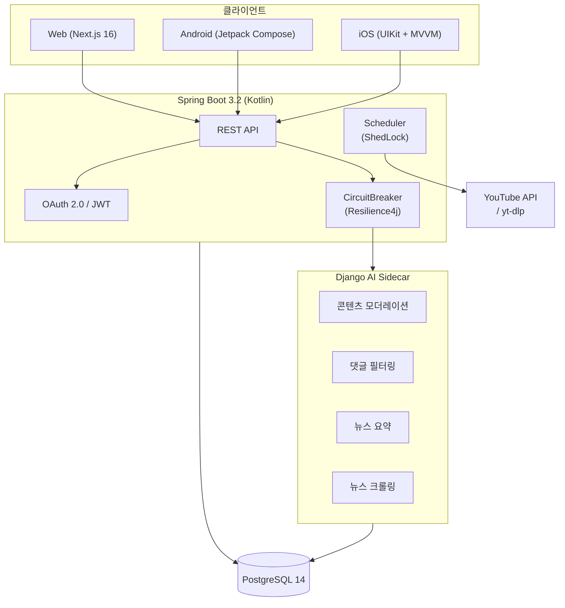
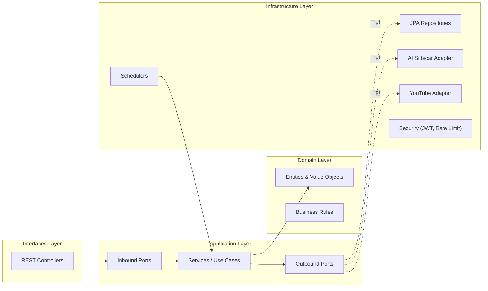
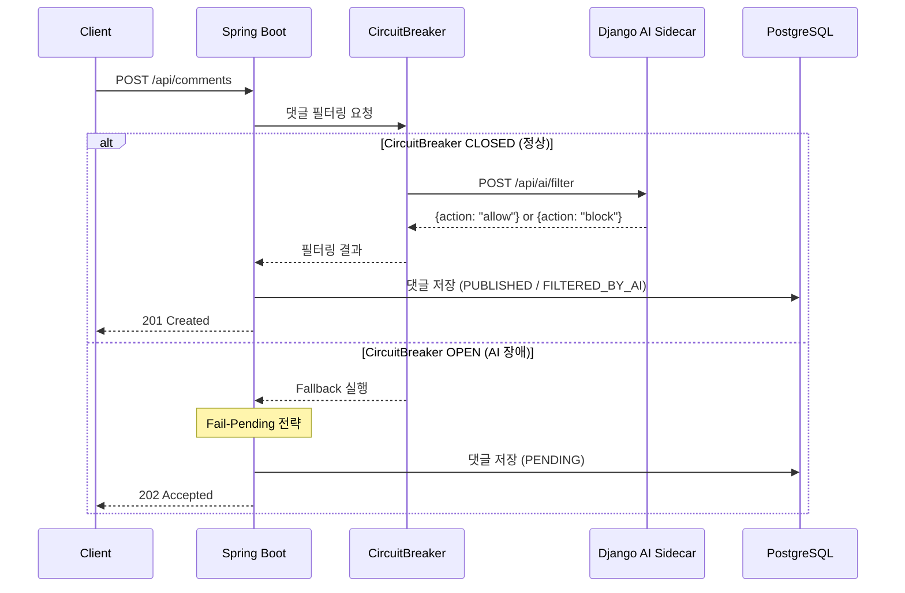
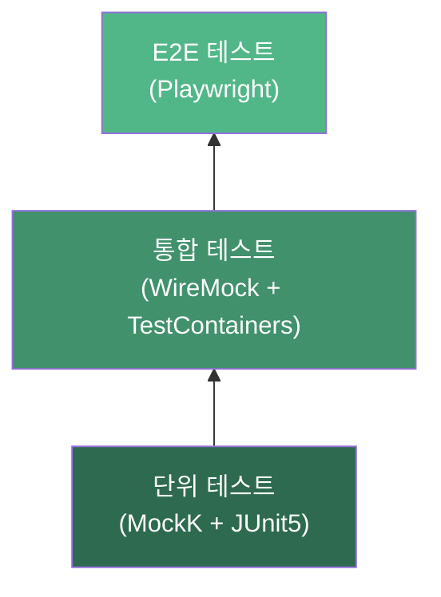
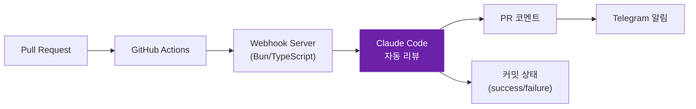

# FanPulse

글로벌 K-POP 팬들을 위한 인터랙티브 커뮤니티 플랫폼

- [Notion](https://www.notion.so/oduckprogrammer/FanPulse-1979da8ee78480939281ee7ebf60256e?source=copy_link)
- [Mockup](https://mpycns.readdy.co/community)

---

## 프로젝트 개요

**FanPulse**는 글로벌 K-POP 팬들을 위한 인터랙티브 플랫폼으로, 아티스트 커뮤니티, 라이브 스트리밍 연계, 뉴스/차트 집계, AI 기반 콘텐츠 모더레이션을 제공합니다.

### 핵심 기능

- **팬 커뮤니티**: 아티스트별 팬 페이지, 게시글/댓글, 좋아요
- **라이브 스트리밍 연계**: YouTube 라이브 자동 탐지 및 메타데이터 수집
- **뉴스 & 차트**: K-POP 뉴스 크롤링, AI 자동 요약
- **AI 콘텐츠 모더레이션**: 게시글/댓글 자동 필터링 (Fail-Open / Fail-Pending 전략)
- **다국어 지원**: i18next 기반 다국어 웹 프론트엔드

---

## 시스템 아키텍처



### 서비스 구성

- **Spring Boot (Kotlin)**: 메인 비즈니스 로직, 헥사고날 아키텍처 적용
- **Django AI Sidecar**: AI 추론 전담 (요약, 모더레이션, 댓글 필터링)
- **PostgreSQL**: 단일 관계형 DB (Flyway 마이그레이션)
- **Next.js**: 웹 프론트엔드 (App Router, i18n)

---

## 헥사고날 아키텍처 (Backend)



### 도메인 모듈

- **identity**: 사용자, OAuth 계정, JWT 인증, 사용자 설정
- **content**: 아티스트, 뉴스, 차트
- **comment**: 댓글, AI 필터링 상태 관리 (DRAFT -> PUBLISHED / FILTERED_BY_AI)
- **streaming**: 라이브 스트리밍 이벤트, 플랫폼 연동
- **discovery**: 아티스트 채널 자동 탐지 (yt-dlp)
- **ai**: 모더레이션/필터링 포트 (도메인 추상화)

---

## AI Sidecar 연동 패턴



### 장애 대응 전략

- **Fail-Open** (모더레이션, 뉴스 요약): AI 서비스 장애 시 콘텐츠 허용 -- 가용성 우선
- **Fail-Pending** (댓글 필터링): AI 서비스 장애 시 PENDING 상태 -- 안전성 우선
- **CircuitBreaker 설정**: 실패율 60% 이상 -> 회로 개방, 30초 대기 후 Half-Open
- **Retry**: 최대 2회, 500ms 간격, 지수 백오프
- **TimeLimiter**: AI 응답 5초 제한 (요약은 30초)

---

## 기술 스택

### Backend (Spring Boot)

- **언어/프레임워크**: Kotlin 1.9 / Spring Boot 3.2
- **아키텍처**: 헥사고날 (Ports & Adapters)
- **ORM**: Spring Data JPA + Hibernate
- **DB 마이그레이션**: Flyway
- **인증**: Google OAuth 2.0, JWT (jjwt 0.12)
- **API 문서**: SpringDoc OpenAPI (Swagger)
- **장애 대응**: Resilience4j (CircuitBreaker, Retry, TimeLimiter)
- **Rate Limiting**: Bucket4j
- **스케줄러**: Spring Scheduler + ShedLock (분산 잠금)
- **메트릭**: Micrometer + Prometheus
- **비동기**: Kotlin Coroutines + Spring WebFlux (WebClient)

### AI Sidecar (Django)

- **언어/프레임워크**: Python 3.11 / Django 4.2 + DRF
- **AI/ML**: HuggingFace Transformers, BitsAndBytes (양자화)
- **크롤링**: BeautifulSoup4, newspaper3k
- **API 문서**: drf-yasg (Swagger)
- **테스트**: pytest + pytest-cov

### Web Frontend

- **프레임워크**: Next.js 16 (App Router)
- **언어**: TypeScript
- **UI**: React 19, Tailwind CSS 4
- **다국어**: react-i18next
- **테스트**: Vitest + Playwright (E2E)

### Mobile

- **Android**: Kotlin, Jetpack Compose, ViewModel, Retrofit, Room
- **iOS**: Swift, UIKit, MVVM + InOut, Alamofire, SwiftData

### 인프라

- **컨테이너**: Docker Compose (PostgreSQL + Spring + Django)
- **DB**: PostgreSQL 14
- **CI/CD**: GitHub Actions (PR 리뷰 자동화)
- **코드 리뷰**: Claude Code 기반 자동 PR 리뷰 (Telegram 연동)
- **모니터링**: Spring Actuator + Micrometer + Prometheus

---

## 테스트 전략



### Backend 테스트

- **단위 테스트**: MockK로 의존성 격리, 도메인/서비스 레이어
- **통합 테스트**: WireMock (AI Sidecar HTTP 스텁), TestContainers (PostgreSQL)
- **JaCoCo 커버리지 게이트**: Application 80%, Domain 50%, Infrastructure 40%
- **비동기 테스트**: Awaitility Kotlin

### Frontend 테스트

- **단위/컴포넌트**: Vitest + Testing Library
- **E2E**: Playwright

---

## 데이터베이스

PostgreSQL 단일 DB, Flyway 마이그레이션으로 스키마 관리.

### 주요 테이블

- **users / oauth_accounts / refresh_tokens**: 사용자 인증
- **user_settings**: 사용자 설정
- **comments / comment_filter_logs**: 댓글 + AI 필터링 이력
- **artists / artist_channels**: 아티스트 프로필 및 채널
- **news**: K-POP 뉴스 (AI 요약 포함)
- **charts**: 음악 차트 순위
- **streaming_events**: 라이브 스트리밍 이벤트
- **shedlock**: 분산 스케줄러 잠금

---

## 설치 및 실행

### 사전 요구사항

- Docker & Docker Compose (또는 Podman & podman-compose)
- (로컬 개발 시) JDK 17, Python 3.11, Node.js 18+

### 방법 1. Docker Compose (권장)

전체 서비스(PostgreSQL + Spring Boot + Django AI)를 한 번에 실행합니다.

```bash
# 1) 저장소 클론
git clone https://github.com/FanPulse/FanPulse.git
cd FanPulse

# 2) 환경변수 설정
cp .env.example .env
# .env 파일을 열어 실제 값으로 수정:
#   GOOGLE_CLIENT_ID  -> Google Cloud Console > 웹 애플리케이션 클라이언트 ID
#   JWT_SECRET        -> 프로덕션용 256비트 이상 비밀키
#   AI_API_KEY        -> Spring Boot <-> Django AI Sidecar 간 인증키

# 3) 전체 서비스 실행 (Docker 또는 Podman)
docker compose up -d --build    # Docker 사용 시
# podman compose up -d --build  # Podman 사용 시

# 4) 상태 확인
docker compose ps                 # Podman: podman compose ps
docker compose logs -f spring     # Spring Boot 로그
docker compose logs -f django-ai  # Django AI 로그
```

실행 후 접속:
- Spring Boot API: http://localhost:8080
- Django AI Sidecar: http://localhost:8000
- Swagger UI: http://localhost:8080/swagger-ui.html
- PostgreSQL: localhost:5432

```bash
# 서비스 중지
docker compose down               # Podman: podman compose down

# 서비스 중지 + DB 볼륨 삭제
docker compose down -v             # Podman: podman compose down -v
```

### 방법 2. 로컬 개발 (Backend)

```bash
cd backend

# 1) 환경변수 설정
cp .env.example .env
# .env 파일을 열어 실제 값으로 수정

# 2) PostgreSQL 실행 (Docker)
docker compose up -d postgres

# 3) Spring Boot 실행
./gradlew bootRun
```

### 방법 3. 로컬 개발 (AI Sidecar)

```bash
cd ai

# 1) 환경변수 설정
cp .env.example .env
# .env 파일을 열어 실제 값으로 수정

# 2) 가상환경 생성 및 의존성 설치
python -m venv venv
source venv/bin/activate
pip install -r requirements.txt

# 3) 마이그레이션 및 실행
python manage.py migrate
python manage.py runserver 0.0.0.0:8001
```

### 방법 4. 로컬 개발 (Web Frontend)

```bash
cd web
npm install
npm run dev
```

---

## 환경변수

### .env.example (Docker/Podman Compose 전체 실행용)

- `POSTGRES_DB` / `POSTGRES_USER` / `POSTGRES_PASSWORD` -- PostgreSQL 접속 정보
- `JWT_SECRET` -- JWT 서명 비밀키 (프로덕션 시 반드시 변경)
- `GOOGLE_CLIENT_ID` -- Google OAuth **웹 애플리케이션** 클라이언트 ID
- `AI_API_KEY` -- Spring Boot <-> Django AI Sidecar 간 인증키

### backend/.env.example (Spring Boot 로컬 실행용)

- `DB_HOST` / `DB_PORT` / `DB_NAME` / `DB_USERNAME` / `DB_PASSWORD` -- DB 접속 정보
- `JWT_SECRET` -- JWT 서명 비밀키
- `GOOGLE_CLIENT_ID` -- Google OAuth **웹 애플리케이션** 클라이언트 ID
- `AI_SERVICE_URL` -- Django AI Sidecar URL (기본: http://localhost:8001)
- `AI_SERVICE_API_KEY` -- AI Sidecar 인증키
- `FANPULSE_SEED_ENABLED` / `FANPULSE_SEED_DIR` -- 시드 데이터 설정 (선택)

### ai/.env.example (Django AI Sidecar 로컬 실행용)

- `SECRET_KEY` -- Django 비밀키 (프로덕션 시 반드시 변경)
- `DJANGO_DEBUG` -- 디버그 모드 (true/false)
- `ALLOWED_HOSTS` -- 허용 호스트 목록
- `AI_SERVICE_ACCEPTED_KEYS` -- 서비스 인증키
- `NAVER_CLIENT_ID` / `NAVER_CLIENT_SECRET` -- 네이버 뉴스 API (선택)
- `USE_POSTGRES` -- PostgreSQL 사용 여부
- `POSTGRES_*` -- PostgreSQL 접속 정보

---

## API 문서

Swagger UI: http://localhost:8080/swagger-ui.html

### 주요 엔드포인트 (Spring Boot)

- `POST /api/auth/google` -- Google OAuth 로그인
- `GET /api/artists` -- 아티스트 목록 조회
- `GET /api/news` -- 뉴스 목록 조회
- `GET /api/charts` -- 차트 순위 조회
- `GET /api/streaming-events` -- 라이브 스트리밍 이벤트
- `POST /api/comments` -- 댓글 작성 (AI 필터링 적용)
- `GET /api/search` -- 통합 검색

### AI Sidecar 엔드포인트 (Django)

- `POST /api/ai/moderate` -- 콘텐츠 모더레이션
- `POST /api/ai/filter` -- 댓글 필터링
- `POST /api/ai/summarize` -- 뉴스 요약
- `GET /api/news/search` -- 뉴스 검색/크롤링

---

## CI/CD



- **PR 자동 리뷰**: Pull Request 생성 시 자동 코드 리뷰 수행
- **커밋 상태 게이트**: Critical 이슈 발견 시 머지 차단 (failure 상태)
- **Telegram 연동**: 리뷰 결과 Telegram 채널 자동 알림

---

## 프로젝트 구조

```
FanPulse/
  backend/              # Spring Boot (Kotlin) - 메인 서버
    src/main/kotlin/com/fanpulse/
      domain/           # 도메인 엔티티, 비즈니스 규칙, 포트
      application/      # 서비스, 유스케이스
      infrastructure/   # DB, 외부 서비스 어댑터
      interfaces/       # REST 컨트롤러
  ai/                   # Django AI Sidecar
    api/                # 모더레이션, 필터링, 요약 서비스
  web/                  # Next.js 16 웹 프론트엔드
  webhook-channel/      # PR 리뷰 웹훅 서버 (Bun)
  FanPulse_AOS/         # Android 앱 (Jetpack Compose)
  FanPulse_iOS/         # iOS 앱 (UIKit + MVVM)
  docker-compose.yml    # 전체 서비스 오케스트레이션
```

---

## 팀

- **PM / Backend / DevOps**: 정지원
- **기획**: 정지원, 이승구
- **Android**: 나유성
- **iOS**: 김송
- **AI**: 장종화, 나영민
- **Crawler**: 정지원, 나영민

---

## 라이선스

This project is source-available for reference only. All rights are reserved.
